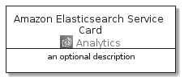

# AmazonElasticsearchService


```text
aws-20210131/Architecture/Analytics/AmazonElasticsearchService
```

```text
include('aws-20210131/Architecture/Analytics/AmazonElasticsearchService')
```


| Illustration | AmazonElasticsearchService | AmazonElasticsearchServiceCard | AmazonElasticsearchServiceGroup |
| :---: | :---: | :---: | :---: |
|  |  |  |  |


## AmazonElasticsearchService

### Load remotely
```plantuml
@startuml
' configures the library
!global $LIB_BASE_LOCATION="https://github.com/tmorin/plantuml-libs/distribution"

' loads the library's bootstrap
!include $LIB_BASE_LOCATION/bootstrap.puml

' loads the package bootstrap
include('aws-20210131/bootstrap')

' loads the Item which embeds the element AmazonElasticsearchService
include('aws-20210131/Architecture/Analytics/AmazonElasticsearchService')

' renders the element
AmazonElasticsearchService('AmazonElasticsearchService', 'Amazon Elasticsearch Service', 'an optional tech label')
@enduml
```

### Load locally
```plantuml
@startuml
' configures the library
!global $INCLUSION_MODE="local"
!global $LIB_BASE_LOCATION="../../.."

' loads the library's bootstrap
!include $LIB_BASE_LOCATION/bootstrap.puml

' loads the package bootstrap
include('aws-20210131/bootstrap')

' loads the Item which embeds the element AmazonElasticsearchService
include('aws-20210131/Architecture/Analytics/AmazonElasticsearchService')

' renders the element
AmazonElasticsearchService('AmazonElasticsearchService', 'Amazon Elasticsearch Service', 'an optional tech label')
@enduml
```

## AmazonElasticsearchServiceCard

### Load remotely
```plantuml
@startuml
' configures the library
!global $LIB_BASE_LOCATION="https://github.com/tmorin/plantuml-libs/distribution"

' loads the library's bootstrap
!include $LIB_BASE_LOCATION/bootstrap.puml

' loads the package bootstrap
include('aws-20210131/bootstrap')

' loads the Item which embeds the element AmazonElasticsearchServiceCard
include('aws-20210131/Architecture/Analytics/AmazonElasticsearchService')

' renders the element
AmazonElasticsearchServiceCard('AmazonElasticsearchServiceCard', 'Amazon Elasticsearch Service Card', 'an optional description')
@enduml
```

### Load locally
```plantuml
@startuml
' configures the library
!global $INCLUSION_MODE="local"
!global $LIB_BASE_LOCATION="../../.."

' loads the library's bootstrap
!include $LIB_BASE_LOCATION/bootstrap.puml

' loads the package bootstrap
include('aws-20210131/bootstrap')

' loads the Item which embeds the element AmazonElasticsearchServiceCard
include('aws-20210131/Architecture/Analytics/AmazonElasticsearchService')

' renders the element
AmazonElasticsearchServiceCard('AmazonElasticsearchServiceCard', 'Amazon Elasticsearch Service Card', 'an optional description')
@enduml
```

## AmazonElasticsearchServiceGroup

### Load remotely
```plantuml
@startuml
' configures the library
!global $LIB_BASE_LOCATION="https://github.com/tmorin/plantuml-libs/distribution"

' loads the library's bootstrap
!include $LIB_BASE_LOCATION/bootstrap.puml

' loads the package bootstrap
include('aws-20210131/bootstrap')

' loads the Item which embeds the element AmazonElasticsearchServiceGroup
include('aws-20210131/Architecture/Analytics/AmazonElasticsearchService')

' renders the element
AmazonElasticsearchServiceGroup('AmazonElasticsearchServiceGroup', 'Amazon Elasticsearch Service Group', 'an optional tech label') {
    note as note
        the content of the group
    end note
}
@enduml
```

### Load locally
```plantuml
@startuml
' configures the library
!global $INCLUSION_MODE="local"
!global $LIB_BASE_LOCATION="../../.."

' loads the library's bootstrap
!include $LIB_BASE_LOCATION/bootstrap.puml

' loads the package bootstrap
include('aws-20210131/bootstrap')

' loads the Item which embeds the element AmazonElasticsearchServiceGroup
include('aws-20210131/Architecture/Analytics/AmazonElasticsearchService')

' renders the element
AmazonElasticsearchServiceGroup('AmazonElasticsearchServiceGroup', 'Amazon Elasticsearch Service Group', 'an optional tech label') {
    note as note
        the content of the group
    end note
}
@enduml
```

