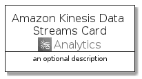
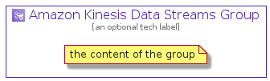

# AmazonKinesisDataStreams


```text
aws-20210131/Architecture/Analytics/AmazonKinesisDataStreams
```

```text
include('aws-20210131/Architecture/Analytics/AmazonKinesisDataStreams')
```


| Illustration | AmazonKinesisDataStreams | AmazonKinesisDataStreamsCard | AmazonKinesisDataStreamsGroup |
| :---: | :---: | :---: | :---: |
|  |  |  |  |


## AmazonKinesisDataStreams

### Load remotely
```plantuml
@startuml
' configures the library
!global $LIB_BASE_LOCATION="https://github.com/tmorin/plantuml-libs/distribution"

' loads the library's bootstrap
!include $LIB_BASE_LOCATION/bootstrap.puml

' loads the package bootstrap
include('aws-20210131/bootstrap')

' loads the Item which embeds the element AmazonKinesisDataStreams
include('aws-20210131/Architecture/Analytics/AmazonKinesisDataStreams')

' renders the element
AmazonKinesisDataStreams('AmazonKinesisDataStreams', 'Amazon Kinesis Data Streams', 'an optional tech label')
@enduml
```

### Load locally
```plantuml
@startuml
' configures the library
!global $INCLUSION_MODE="local"
!global $LIB_BASE_LOCATION="../../.."

' loads the library's bootstrap
!include $LIB_BASE_LOCATION/bootstrap.puml

' loads the package bootstrap
include('aws-20210131/bootstrap')

' loads the Item which embeds the element AmazonKinesisDataStreams
include('aws-20210131/Architecture/Analytics/AmazonKinesisDataStreams')

' renders the element
AmazonKinesisDataStreams('AmazonKinesisDataStreams', 'Amazon Kinesis Data Streams', 'an optional tech label')
@enduml
```

## AmazonKinesisDataStreamsCard

### Load remotely
```plantuml
@startuml
' configures the library
!global $LIB_BASE_LOCATION="https://github.com/tmorin/plantuml-libs/distribution"

' loads the library's bootstrap
!include $LIB_BASE_LOCATION/bootstrap.puml

' loads the package bootstrap
include('aws-20210131/bootstrap')

' loads the Item which embeds the element AmazonKinesisDataStreamsCard
include('aws-20210131/Architecture/Analytics/AmazonKinesisDataStreams')

' renders the element
AmazonKinesisDataStreamsCard('AmazonKinesisDataStreamsCard', 'Amazon Kinesis Data Streams Card', 'an optional description')
@enduml
```

### Load locally
```plantuml
@startuml
' configures the library
!global $INCLUSION_MODE="local"
!global $LIB_BASE_LOCATION="../../.."

' loads the library's bootstrap
!include $LIB_BASE_LOCATION/bootstrap.puml

' loads the package bootstrap
include('aws-20210131/bootstrap')

' loads the Item which embeds the element AmazonKinesisDataStreamsCard
include('aws-20210131/Architecture/Analytics/AmazonKinesisDataStreams')

' renders the element
AmazonKinesisDataStreamsCard('AmazonKinesisDataStreamsCard', 'Amazon Kinesis Data Streams Card', 'an optional description')
@enduml
```

## AmazonKinesisDataStreamsGroup

### Load remotely
```plantuml
@startuml
' configures the library
!global $LIB_BASE_LOCATION="https://github.com/tmorin/plantuml-libs/distribution"

' loads the library's bootstrap
!include $LIB_BASE_LOCATION/bootstrap.puml

' loads the package bootstrap
include('aws-20210131/bootstrap')

' loads the Item which embeds the element AmazonKinesisDataStreamsGroup
include('aws-20210131/Architecture/Analytics/AmazonKinesisDataStreams')

' renders the element
AmazonKinesisDataStreamsGroup('AmazonKinesisDataStreamsGroup', 'Amazon Kinesis Data Streams Group', 'an optional tech label') {
    note as note
        the content of the group
    end note
}
@enduml
```

### Load locally
```plantuml
@startuml
' configures the library
!global $INCLUSION_MODE="local"
!global $LIB_BASE_LOCATION="../../.."

' loads the library's bootstrap
!include $LIB_BASE_LOCATION/bootstrap.puml

' loads the package bootstrap
include('aws-20210131/bootstrap')

' loads the Item which embeds the element AmazonKinesisDataStreamsGroup
include('aws-20210131/Architecture/Analytics/AmazonKinesisDataStreams')

' renders the element
AmazonKinesisDataStreamsGroup('AmazonKinesisDataStreamsGroup', 'Amazon Kinesis Data Streams Group', 'an optional tech label') {
    note as note
        the content of the group
    end note
}
@enduml
```

