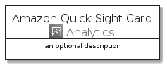
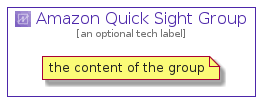

# AmazonQuickSight


```text
aws-20210131/Architecture/Analytics/AmazonQuickSight
```

```text
include('aws-20210131/Architecture/Analytics/AmazonQuickSight')
```


| Illustration | AmazonQuickSight | AmazonQuickSightCard | AmazonQuickSightGroup |
| :---: | :---: | :---: | :---: |
|  |  |  |  |


## AmazonQuickSight

### Load remotely
```plantuml
@startuml
' configures the library
!global $LIB_BASE_LOCATION="https://github.com/tmorin/plantuml-libs/distribution"

' loads the library's bootstrap
!include $LIB_BASE_LOCATION/bootstrap.puml

' loads the package bootstrap
include('aws-20210131/bootstrap')

' loads the Item which embeds the element AmazonQuickSight
include('aws-20210131/Architecture/Analytics/AmazonQuickSight')

' renders the element
AmazonQuickSight('AmazonQuickSight', 'Amazon Quick Sight', 'an optional tech label')
@enduml
```

### Load locally
```plantuml
@startuml
' configures the library
!global $INCLUSION_MODE="local"
!global $LIB_BASE_LOCATION="../../.."

' loads the library's bootstrap
!include $LIB_BASE_LOCATION/bootstrap.puml

' loads the package bootstrap
include('aws-20210131/bootstrap')

' loads the Item which embeds the element AmazonQuickSight
include('aws-20210131/Architecture/Analytics/AmazonQuickSight')

' renders the element
AmazonQuickSight('AmazonQuickSight', 'Amazon Quick Sight', 'an optional tech label')
@enduml
```

## AmazonQuickSightCard

### Load remotely
```plantuml
@startuml
' configures the library
!global $LIB_BASE_LOCATION="https://github.com/tmorin/plantuml-libs/distribution"

' loads the library's bootstrap
!include $LIB_BASE_LOCATION/bootstrap.puml

' loads the package bootstrap
include('aws-20210131/bootstrap')

' loads the Item which embeds the element AmazonQuickSightCard
include('aws-20210131/Architecture/Analytics/AmazonQuickSight')

' renders the element
AmazonQuickSightCard('AmazonQuickSightCard', 'Amazon Quick Sight Card', 'an optional description')
@enduml
```

### Load locally
```plantuml
@startuml
' configures the library
!global $INCLUSION_MODE="local"
!global $LIB_BASE_LOCATION="../../.."

' loads the library's bootstrap
!include $LIB_BASE_LOCATION/bootstrap.puml

' loads the package bootstrap
include('aws-20210131/bootstrap')

' loads the Item which embeds the element AmazonQuickSightCard
include('aws-20210131/Architecture/Analytics/AmazonQuickSight')

' renders the element
AmazonQuickSightCard('AmazonQuickSightCard', 'Amazon Quick Sight Card', 'an optional description')
@enduml
```

## AmazonQuickSightGroup

### Load remotely
```plantuml
@startuml
' configures the library
!global $LIB_BASE_LOCATION="https://github.com/tmorin/plantuml-libs/distribution"

' loads the library's bootstrap
!include $LIB_BASE_LOCATION/bootstrap.puml

' loads the package bootstrap
include('aws-20210131/bootstrap')

' loads the Item which embeds the element AmazonQuickSightGroup
include('aws-20210131/Architecture/Analytics/AmazonQuickSight')

' renders the element
AmazonQuickSightGroup('AmazonQuickSightGroup', 'Amazon Quick Sight Group', 'an optional tech label') {
    note as note
        the content of the group
    end note
}
@enduml
```

### Load locally
```plantuml
@startuml
' configures the library
!global $INCLUSION_MODE="local"
!global $LIB_BASE_LOCATION="../../.."

' loads the library's bootstrap
!include $LIB_BASE_LOCATION/bootstrap.puml

' loads the package bootstrap
include('aws-20210131/bootstrap')

' loads the Item which embeds the element AmazonQuickSightGroup
include('aws-20210131/Architecture/Analytics/AmazonQuickSight')

' renders the element
AmazonQuickSightGroup('AmazonQuickSightGroup', 'Amazon Quick Sight Group', 'an optional tech label') {
    note as note
        the content of the group
    end note
}
@enduml
```

