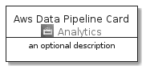
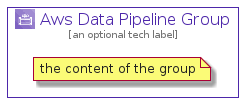

# AwsDataPipeline


```text
aws-20210131/Architecture/Analytics/AwsDataPipeline
```

```text
include('aws-20210131/Architecture/Analytics/AwsDataPipeline')
```


| Illustration | AwsDataPipeline | AwsDataPipelineCard | AwsDataPipelineGroup |
| :---: | :---: | :---: | :---: |
|  |  |  |  |


## AwsDataPipeline

### Load remotely
```plantuml
@startuml
' configures the library
!global $LIB_BASE_LOCATION="https://github.com/tmorin/plantuml-libs/distribution"

' loads the library's bootstrap
!include $LIB_BASE_LOCATION/bootstrap.puml

' loads the package bootstrap
include('aws-20210131/bootstrap')

' loads the Item which embeds the element AwsDataPipeline
include('aws-20210131/Architecture/Analytics/AwsDataPipeline')

' renders the element
AwsDataPipeline('AwsDataPipeline', 'Aws Data Pipeline', 'an optional tech label')
@enduml
```

### Load locally
```plantuml
@startuml
' configures the library
!global $INCLUSION_MODE="local"
!global $LIB_BASE_LOCATION="../../.."

' loads the library's bootstrap
!include $LIB_BASE_LOCATION/bootstrap.puml

' loads the package bootstrap
include('aws-20210131/bootstrap')

' loads the Item which embeds the element AwsDataPipeline
include('aws-20210131/Architecture/Analytics/AwsDataPipeline')

' renders the element
AwsDataPipeline('AwsDataPipeline', 'Aws Data Pipeline', 'an optional tech label')
@enduml
```

## AwsDataPipelineCard

### Load remotely
```plantuml
@startuml
' configures the library
!global $LIB_BASE_LOCATION="https://github.com/tmorin/plantuml-libs/distribution"

' loads the library's bootstrap
!include $LIB_BASE_LOCATION/bootstrap.puml

' loads the package bootstrap
include('aws-20210131/bootstrap')

' loads the Item which embeds the element AwsDataPipelineCard
include('aws-20210131/Architecture/Analytics/AwsDataPipeline')

' renders the element
AwsDataPipelineCard('AwsDataPipelineCard', 'Aws Data Pipeline Card', 'an optional description')
@enduml
```

### Load locally
```plantuml
@startuml
' configures the library
!global $INCLUSION_MODE="local"
!global $LIB_BASE_LOCATION="../../.."

' loads the library's bootstrap
!include $LIB_BASE_LOCATION/bootstrap.puml

' loads the package bootstrap
include('aws-20210131/bootstrap')

' loads the Item which embeds the element AwsDataPipelineCard
include('aws-20210131/Architecture/Analytics/AwsDataPipeline')

' renders the element
AwsDataPipelineCard('AwsDataPipelineCard', 'Aws Data Pipeline Card', 'an optional description')
@enduml
```

## AwsDataPipelineGroup

### Load remotely
```plantuml
@startuml
' configures the library
!global $LIB_BASE_LOCATION="https://github.com/tmorin/plantuml-libs/distribution"

' loads the library's bootstrap
!include $LIB_BASE_LOCATION/bootstrap.puml

' loads the package bootstrap
include('aws-20210131/bootstrap')

' loads the Item which embeds the element AwsDataPipelineGroup
include('aws-20210131/Architecture/Analytics/AwsDataPipeline')

' renders the element
AwsDataPipelineGroup('AwsDataPipelineGroup', 'Aws Data Pipeline Group', 'an optional tech label') {
    note as note
        the content of the group
    end note
}
@enduml
```

### Load locally
```plantuml
@startuml
' configures the library
!global $INCLUSION_MODE="local"
!global $LIB_BASE_LOCATION="../../.."

' loads the library's bootstrap
!include $LIB_BASE_LOCATION/bootstrap.puml

' loads the package bootstrap
include('aws-20210131/bootstrap')

' loads the Item which embeds the element AwsDataPipelineGroup
include('aws-20210131/Architecture/Analytics/AwsDataPipeline')

' renders the element
AwsDataPipelineGroup('AwsDataPipelineGroup', 'Aws Data Pipeline Group', 'an optional tech label') {
    note as note
        the content of the group
    end note
}
@enduml
```

