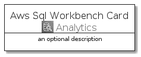
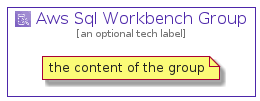

# AwsSqlWorkbench


```text
aws-20210131/Architecture/Analytics/AwsSqlWorkbench
```

```text
include('aws-20210131/Architecture/Analytics/AwsSqlWorkbench')
```


| Illustration | AwsSqlWorkbench | AwsSqlWorkbenchCard | AwsSqlWorkbenchGroup |
| :---: | :---: | :---: | :---: |
|  |  |  |  |


## AwsSqlWorkbench

### Load remotely
```plantuml
@startuml
' configures the library
!global $LIB_BASE_LOCATION="https://github.com/tmorin/plantuml-libs/distribution"

' loads the library's bootstrap
!include $LIB_BASE_LOCATION/bootstrap.puml

' loads the package bootstrap
include('aws-20210131/bootstrap')

' loads the Item which embeds the element AwsSqlWorkbench
include('aws-20210131/Architecture/Analytics/AwsSqlWorkbench')

' renders the element
AwsSqlWorkbench('AwsSqlWorkbench', 'Aws Sql Workbench', 'an optional tech label')
@enduml
```

### Load locally
```plantuml
@startuml
' configures the library
!global $INCLUSION_MODE="local"
!global $LIB_BASE_LOCATION="../../.."

' loads the library's bootstrap
!include $LIB_BASE_LOCATION/bootstrap.puml

' loads the package bootstrap
include('aws-20210131/bootstrap')

' loads the Item which embeds the element AwsSqlWorkbench
include('aws-20210131/Architecture/Analytics/AwsSqlWorkbench')

' renders the element
AwsSqlWorkbench('AwsSqlWorkbench', 'Aws Sql Workbench', 'an optional tech label')
@enduml
```

## AwsSqlWorkbenchCard

### Load remotely
```plantuml
@startuml
' configures the library
!global $LIB_BASE_LOCATION="https://github.com/tmorin/plantuml-libs/distribution"

' loads the library's bootstrap
!include $LIB_BASE_LOCATION/bootstrap.puml

' loads the package bootstrap
include('aws-20210131/bootstrap')

' loads the Item which embeds the element AwsSqlWorkbenchCard
include('aws-20210131/Architecture/Analytics/AwsSqlWorkbench')

' renders the element
AwsSqlWorkbenchCard('AwsSqlWorkbenchCard', 'Aws Sql Workbench Card', 'an optional description')
@enduml
```

### Load locally
```plantuml
@startuml
' configures the library
!global $INCLUSION_MODE="local"
!global $LIB_BASE_LOCATION="../../.."

' loads the library's bootstrap
!include $LIB_BASE_LOCATION/bootstrap.puml

' loads the package bootstrap
include('aws-20210131/bootstrap')

' loads the Item which embeds the element AwsSqlWorkbenchCard
include('aws-20210131/Architecture/Analytics/AwsSqlWorkbench')

' renders the element
AwsSqlWorkbenchCard('AwsSqlWorkbenchCard', 'Aws Sql Workbench Card', 'an optional description')
@enduml
```

## AwsSqlWorkbenchGroup

### Load remotely
```plantuml
@startuml
' configures the library
!global $LIB_BASE_LOCATION="https://github.com/tmorin/plantuml-libs/distribution"

' loads the library's bootstrap
!include $LIB_BASE_LOCATION/bootstrap.puml

' loads the package bootstrap
include('aws-20210131/bootstrap')

' loads the Item which embeds the element AwsSqlWorkbenchGroup
include('aws-20210131/Architecture/Analytics/AwsSqlWorkbench')

' renders the element
AwsSqlWorkbenchGroup('AwsSqlWorkbenchGroup', 'Aws Sql Workbench Group', 'an optional tech label') {
    note as note
        the content of the group
    end note
}
@enduml
```

### Load locally
```plantuml
@startuml
' configures the library
!global $INCLUSION_MODE="local"
!global $LIB_BASE_LOCATION="../../.."

' loads the library's bootstrap
!include $LIB_BASE_LOCATION/bootstrap.puml

' loads the package bootstrap
include('aws-20210131/bootstrap')

' loads the Item which embeds the element AwsSqlWorkbenchGroup
include('aws-20210131/Architecture/Analytics/AwsSqlWorkbench')

' renders the element
AwsSqlWorkbenchGroup('AwsSqlWorkbenchGroup', 'Aws Sql Workbench Group', 'an optional tech label') {
    note as note
        the content of the group
    end note
}
@enduml
```

