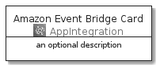
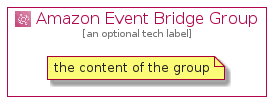

# AmazonEventBridge


```text
aws-20210131/Architecture/AppIntegration/AmazonEventBridge
```

```text
include('aws-20210131/Architecture/AppIntegration/AmazonEventBridge')
```


| Illustration | AmazonEventBridge | AmazonEventBridgeCard | AmazonEventBridgeGroup |
| :---: | :---: | :---: | :---: |
|  |  |  |  |


## AmazonEventBridge

### Load remotely
```plantuml
@startuml
' configures the library
!global $LIB_BASE_LOCATION="https://github.com/tmorin/plantuml-libs/distribution"

' loads the library's bootstrap
!include $LIB_BASE_LOCATION/bootstrap.puml

' loads the package bootstrap
include('aws-20210131/bootstrap')

' loads the Item which embeds the element AmazonEventBridge
include('aws-20210131/Architecture/AppIntegration/AmazonEventBridge')

' renders the element
AmazonEventBridge('AmazonEventBridge', 'Amazon Event Bridge', 'an optional tech label')
@enduml
```

### Load locally
```plantuml
@startuml
' configures the library
!global $INCLUSION_MODE="local"
!global $LIB_BASE_LOCATION="../../.."

' loads the library's bootstrap
!include $LIB_BASE_LOCATION/bootstrap.puml

' loads the package bootstrap
include('aws-20210131/bootstrap')

' loads the Item which embeds the element AmazonEventBridge
include('aws-20210131/Architecture/AppIntegration/AmazonEventBridge')

' renders the element
AmazonEventBridge('AmazonEventBridge', 'Amazon Event Bridge', 'an optional tech label')
@enduml
```

## AmazonEventBridgeCard

### Load remotely
```plantuml
@startuml
' configures the library
!global $LIB_BASE_LOCATION="https://github.com/tmorin/plantuml-libs/distribution"

' loads the library's bootstrap
!include $LIB_BASE_LOCATION/bootstrap.puml

' loads the package bootstrap
include('aws-20210131/bootstrap')

' loads the Item which embeds the element AmazonEventBridgeCard
include('aws-20210131/Architecture/AppIntegration/AmazonEventBridge')

' renders the element
AmazonEventBridgeCard('AmazonEventBridgeCard', 'Amazon Event Bridge Card', 'an optional description')
@enduml
```

### Load locally
```plantuml
@startuml
' configures the library
!global $INCLUSION_MODE="local"
!global $LIB_BASE_LOCATION="../../.."

' loads the library's bootstrap
!include $LIB_BASE_LOCATION/bootstrap.puml

' loads the package bootstrap
include('aws-20210131/bootstrap')

' loads the Item which embeds the element AmazonEventBridgeCard
include('aws-20210131/Architecture/AppIntegration/AmazonEventBridge')

' renders the element
AmazonEventBridgeCard('AmazonEventBridgeCard', 'Amazon Event Bridge Card', 'an optional description')
@enduml
```

## AmazonEventBridgeGroup

### Load remotely
```plantuml
@startuml
' configures the library
!global $LIB_BASE_LOCATION="https://github.com/tmorin/plantuml-libs/distribution"

' loads the library's bootstrap
!include $LIB_BASE_LOCATION/bootstrap.puml

' loads the package bootstrap
include('aws-20210131/bootstrap')

' loads the Item which embeds the element AmazonEventBridgeGroup
include('aws-20210131/Architecture/AppIntegration/AmazonEventBridge')

' renders the element
AmazonEventBridgeGroup('AmazonEventBridgeGroup', 'Amazon Event Bridge Group', 'an optional tech label') {
    note as note
        the content of the group
    end note
}
@enduml
```

### Load locally
```plantuml
@startuml
' configures the library
!global $INCLUSION_MODE="local"
!global $LIB_BASE_LOCATION="../../.."

' loads the library's bootstrap
!include $LIB_BASE_LOCATION/bootstrap.puml

' loads the package bootstrap
include('aws-20210131/bootstrap')

' loads the Item which embeds the element AmazonEventBridgeGroup
include('aws-20210131/Architecture/AppIntegration/AmazonEventBridge')

' renders the element
AmazonEventBridgeGroup('AmazonEventBridgeGroup', 'Amazon Event Bridge Group', 'an optional tech label') {
    note as note
        the content of the group
    end note
}
@enduml
```

