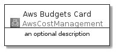
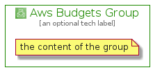

# AwsBudgets


```text
aws-20210131/Architecture/AwsCostManagement/AwsBudgets
```

```text
include('aws-20210131/Architecture/AwsCostManagement/AwsBudgets')
```


| Illustration | AwsBudgets | AwsBudgetsCard | AwsBudgetsGroup |
| :---: | :---: | :---: | :---: |
|  |  |  |  |


## AwsBudgets

### Load remotely
```plantuml
@startuml
' configures the library
!global $LIB_BASE_LOCATION="https://github.com/tmorin/plantuml-libs/distribution"

' loads the library's bootstrap
!include $LIB_BASE_LOCATION/bootstrap.puml

' loads the package bootstrap
include('aws-20210131/bootstrap')

' loads the Item which embeds the element AwsBudgets
include('aws-20210131/Architecture/AwsCostManagement/AwsBudgets')

' renders the element
AwsBudgets('AwsBudgets', 'Aws Budgets', 'an optional tech label')
@enduml
```

### Load locally
```plantuml
@startuml
' configures the library
!global $INCLUSION_MODE="local"
!global $LIB_BASE_LOCATION="../../.."

' loads the library's bootstrap
!include $LIB_BASE_LOCATION/bootstrap.puml

' loads the package bootstrap
include('aws-20210131/bootstrap')

' loads the Item which embeds the element AwsBudgets
include('aws-20210131/Architecture/AwsCostManagement/AwsBudgets')

' renders the element
AwsBudgets('AwsBudgets', 'Aws Budgets', 'an optional tech label')
@enduml
```

## AwsBudgetsCard

### Load remotely
```plantuml
@startuml
' configures the library
!global $LIB_BASE_LOCATION="https://github.com/tmorin/plantuml-libs/distribution"

' loads the library's bootstrap
!include $LIB_BASE_LOCATION/bootstrap.puml

' loads the package bootstrap
include('aws-20210131/bootstrap')

' loads the Item which embeds the element AwsBudgetsCard
include('aws-20210131/Architecture/AwsCostManagement/AwsBudgets')

' renders the element
AwsBudgetsCard('AwsBudgetsCard', 'Aws Budgets Card', 'an optional description')
@enduml
```

### Load locally
```plantuml
@startuml
' configures the library
!global $INCLUSION_MODE="local"
!global $LIB_BASE_LOCATION="../../.."

' loads the library's bootstrap
!include $LIB_BASE_LOCATION/bootstrap.puml

' loads the package bootstrap
include('aws-20210131/bootstrap')

' loads the Item which embeds the element AwsBudgetsCard
include('aws-20210131/Architecture/AwsCostManagement/AwsBudgets')

' renders the element
AwsBudgetsCard('AwsBudgetsCard', 'Aws Budgets Card', 'an optional description')
@enduml
```

## AwsBudgetsGroup

### Load remotely
```plantuml
@startuml
' configures the library
!global $LIB_BASE_LOCATION="https://github.com/tmorin/plantuml-libs/distribution"

' loads the library's bootstrap
!include $LIB_BASE_LOCATION/bootstrap.puml

' loads the package bootstrap
include('aws-20210131/bootstrap')

' loads the Item which embeds the element AwsBudgetsGroup
include('aws-20210131/Architecture/AwsCostManagement/AwsBudgets')

' renders the element
AwsBudgetsGroup('AwsBudgetsGroup', 'Aws Budgets Group', 'an optional tech label') {
    note as note
        the content of the group
    end note
}
@enduml
```

### Load locally
```plantuml
@startuml
' configures the library
!global $INCLUSION_MODE="local"
!global $LIB_BASE_LOCATION="../../.."

' loads the library's bootstrap
!include $LIB_BASE_LOCATION/bootstrap.puml

' loads the package bootstrap
include('aws-20210131/bootstrap')

' loads the Item which embeds the element AwsBudgetsGroup
include('aws-20210131/Architecture/AwsCostManagement/AwsBudgets')

' renders the element
AwsBudgetsGroup('AwsBudgetsGroup', 'Aws Budgets Group', 'an optional tech label') {
    note as note
        the content of the group
    end note
}
@enduml
```

