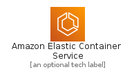
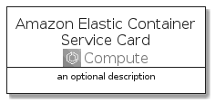

# AmazonElasticContainerService


```text
aws-20210131/Architecture/Compute/AmazonElasticContainerService
```

```text
include('aws-20210131/Architecture/Compute/AmazonElasticContainerService')
```


| Illustration | AmazonElasticContainerService | AmazonElasticContainerServiceCard | AmazonElasticContainerServiceGroup |
| :---: | :---: | :---: | :---: |
|  |  |  |  |


## AmazonElasticContainerService

### Load remotely
```plantuml
@startuml
' configures the library
!global $LIB_BASE_LOCATION="https://github.com/tmorin/plantuml-libs/distribution"

' loads the library's bootstrap
!include $LIB_BASE_LOCATION/bootstrap.puml

' loads the package bootstrap
include('aws-20210131/bootstrap')

' loads the Item which embeds the element AmazonElasticContainerService
include('aws-20210131/Architecture/Compute/AmazonElasticContainerService')

' renders the element
AmazonElasticContainerService('AmazonElasticContainerService', 'Amazon Elastic Container Service', 'an optional tech label')
@enduml
```

### Load locally
```plantuml
@startuml
' configures the library
!global $INCLUSION_MODE="local"
!global $LIB_BASE_LOCATION="../../.."

' loads the library's bootstrap
!include $LIB_BASE_LOCATION/bootstrap.puml

' loads the package bootstrap
include('aws-20210131/bootstrap')

' loads the Item which embeds the element AmazonElasticContainerService
include('aws-20210131/Architecture/Compute/AmazonElasticContainerService')

' renders the element
AmazonElasticContainerService('AmazonElasticContainerService', 'Amazon Elastic Container Service', 'an optional tech label')
@enduml
```

## AmazonElasticContainerServiceCard

### Load remotely
```plantuml
@startuml
' configures the library
!global $LIB_BASE_LOCATION="https://github.com/tmorin/plantuml-libs/distribution"

' loads the library's bootstrap
!include $LIB_BASE_LOCATION/bootstrap.puml

' loads the package bootstrap
include('aws-20210131/bootstrap')

' loads the Item which embeds the element AmazonElasticContainerServiceCard
include('aws-20210131/Architecture/Compute/AmazonElasticContainerService')

' renders the element
AmazonElasticContainerServiceCard('AmazonElasticContainerServiceCard', 'Amazon Elastic Container Service Card', 'an optional description')
@enduml
```

### Load locally
```plantuml
@startuml
' configures the library
!global $INCLUSION_MODE="local"
!global $LIB_BASE_LOCATION="../../.."

' loads the library's bootstrap
!include $LIB_BASE_LOCATION/bootstrap.puml

' loads the package bootstrap
include('aws-20210131/bootstrap')

' loads the Item which embeds the element AmazonElasticContainerServiceCard
include('aws-20210131/Architecture/Compute/AmazonElasticContainerService')

' renders the element
AmazonElasticContainerServiceCard('AmazonElasticContainerServiceCard', 'Amazon Elastic Container Service Card', 'an optional description')
@enduml
```

## AmazonElasticContainerServiceGroup

### Load remotely
```plantuml
@startuml
' configures the library
!global $LIB_BASE_LOCATION="https://github.com/tmorin/plantuml-libs/distribution"

' loads the library's bootstrap
!include $LIB_BASE_LOCATION/bootstrap.puml

' loads the package bootstrap
include('aws-20210131/bootstrap')

' loads the Item which embeds the element AmazonElasticContainerServiceGroup
include('aws-20210131/Architecture/Compute/AmazonElasticContainerService')

' renders the element
AmazonElasticContainerServiceGroup('AmazonElasticContainerServiceGroup', 'Amazon Elastic Container Service Group', 'an optional tech label') {
    note as note
        the content of the group
    end note
}
@enduml
```

### Load locally
```plantuml
@startuml
' configures the library
!global $INCLUSION_MODE="local"
!global $LIB_BASE_LOCATION="../../.."

' loads the library's bootstrap
!include $LIB_BASE_LOCATION/bootstrap.puml

' loads the package bootstrap
include('aws-20210131/bootstrap')

' loads the Item which embeds the element AmazonElasticContainerServiceGroup
include('aws-20210131/Architecture/Compute/AmazonElasticContainerService')

' renders the element
AmazonElasticContainerServiceGroup('AmazonElasticContainerServiceGroup', 'Amazon Elastic Container Service Group', 'an optional tech label') {
    note as note
        the content of the group
    end note
}
@enduml
```

