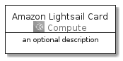

# AmazonLightsail


```text
aws-20210131/Architecture/Compute/AmazonLightsail
```

```text
include('aws-20210131/Architecture/Compute/AmazonLightsail')
```


| Illustration | AmazonLightsail | AmazonLightsailCard | AmazonLightsailGroup |
| :---: | :---: | :---: | :---: |
|  |  |  |  |


## AmazonLightsail

### Load remotely
```plantuml
@startuml
' configures the library
!global $LIB_BASE_LOCATION="https://github.com/tmorin/plantuml-libs/distribution"

' loads the library's bootstrap
!include $LIB_BASE_LOCATION/bootstrap.puml

' loads the package bootstrap
include('aws-20210131/bootstrap')

' loads the Item which embeds the element AmazonLightsail
include('aws-20210131/Architecture/Compute/AmazonLightsail')

' renders the element
AmazonLightsail('AmazonLightsail', 'Amazon Lightsail', 'an optional tech label')
@enduml
```

### Load locally
```plantuml
@startuml
' configures the library
!global $INCLUSION_MODE="local"
!global $LIB_BASE_LOCATION="../../.."

' loads the library's bootstrap
!include $LIB_BASE_LOCATION/bootstrap.puml

' loads the package bootstrap
include('aws-20210131/bootstrap')

' loads the Item which embeds the element AmazonLightsail
include('aws-20210131/Architecture/Compute/AmazonLightsail')

' renders the element
AmazonLightsail('AmazonLightsail', 'Amazon Lightsail', 'an optional tech label')
@enduml
```

## AmazonLightsailCard

### Load remotely
```plantuml
@startuml
' configures the library
!global $LIB_BASE_LOCATION="https://github.com/tmorin/plantuml-libs/distribution"

' loads the library's bootstrap
!include $LIB_BASE_LOCATION/bootstrap.puml

' loads the package bootstrap
include('aws-20210131/bootstrap')

' loads the Item which embeds the element AmazonLightsailCard
include('aws-20210131/Architecture/Compute/AmazonLightsail')

' renders the element
AmazonLightsailCard('AmazonLightsailCard', 'Amazon Lightsail Card', 'an optional description')
@enduml
```

### Load locally
```plantuml
@startuml
' configures the library
!global $INCLUSION_MODE="local"
!global $LIB_BASE_LOCATION="../../.."

' loads the library's bootstrap
!include $LIB_BASE_LOCATION/bootstrap.puml

' loads the package bootstrap
include('aws-20210131/bootstrap')

' loads the Item which embeds the element AmazonLightsailCard
include('aws-20210131/Architecture/Compute/AmazonLightsail')

' renders the element
AmazonLightsailCard('AmazonLightsailCard', 'Amazon Lightsail Card', 'an optional description')
@enduml
```

## AmazonLightsailGroup

### Load remotely
```plantuml
@startuml
' configures the library
!global $LIB_BASE_LOCATION="https://github.com/tmorin/plantuml-libs/distribution"

' loads the library's bootstrap
!include $LIB_BASE_LOCATION/bootstrap.puml

' loads the package bootstrap
include('aws-20210131/bootstrap')

' loads the Item which embeds the element AmazonLightsailGroup
include('aws-20210131/Architecture/Compute/AmazonLightsail')

' renders the element
AmazonLightsailGroup('AmazonLightsailGroup', 'Amazon Lightsail Group', 'an optional tech label') {
    note as note
        the content of the group
    end note
}
@enduml
```

### Load locally
```plantuml
@startuml
' configures the library
!global $INCLUSION_MODE="local"
!global $LIB_BASE_LOCATION="../../.."

' loads the library's bootstrap
!include $LIB_BASE_LOCATION/bootstrap.puml

' loads the package bootstrap
include('aws-20210131/bootstrap')

' loads the Item which embeds the element AmazonLightsailGroup
include('aws-20210131/Architecture/Compute/AmazonLightsail')

' renders the element
AmazonLightsailGroup('AmazonLightsailGroup', 'Amazon Lightsail Group', 'an optional tech label') {
    note as note
        the content of the group
    end note
}
@enduml
```

