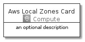
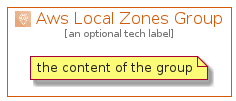

# AwsLocalZones


```text
aws-20210131/Architecture/Compute/AwsLocalZones
```

```text
include('aws-20210131/Architecture/Compute/AwsLocalZones')
```


| Illustration | AwsLocalZones | AwsLocalZonesCard | AwsLocalZonesGroup |
| :---: | :---: | :---: | :---: |
|  |  |  |  |


## AwsLocalZones

### Load remotely
```plantuml
@startuml
' configures the library
!global $LIB_BASE_LOCATION="https://github.com/tmorin/plantuml-libs/distribution"

' loads the library's bootstrap
!include $LIB_BASE_LOCATION/bootstrap.puml

' loads the package bootstrap
include('aws-20210131/bootstrap')

' loads the Item which embeds the element AwsLocalZones
include('aws-20210131/Architecture/Compute/AwsLocalZones')

' renders the element
AwsLocalZones('AwsLocalZones', 'Aws Local Zones', 'an optional tech label')
@enduml
```

### Load locally
```plantuml
@startuml
' configures the library
!global $INCLUSION_MODE="local"
!global $LIB_BASE_LOCATION="../../.."

' loads the library's bootstrap
!include $LIB_BASE_LOCATION/bootstrap.puml

' loads the package bootstrap
include('aws-20210131/bootstrap')

' loads the Item which embeds the element AwsLocalZones
include('aws-20210131/Architecture/Compute/AwsLocalZones')

' renders the element
AwsLocalZones('AwsLocalZones', 'Aws Local Zones', 'an optional tech label')
@enduml
```

## AwsLocalZonesCard

### Load remotely
```plantuml
@startuml
' configures the library
!global $LIB_BASE_LOCATION="https://github.com/tmorin/plantuml-libs/distribution"

' loads the library's bootstrap
!include $LIB_BASE_LOCATION/bootstrap.puml

' loads the package bootstrap
include('aws-20210131/bootstrap')

' loads the Item which embeds the element AwsLocalZonesCard
include('aws-20210131/Architecture/Compute/AwsLocalZones')

' renders the element
AwsLocalZonesCard('AwsLocalZonesCard', 'Aws Local Zones Card', 'an optional description')
@enduml
```

### Load locally
```plantuml
@startuml
' configures the library
!global $INCLUSION_MODE="local"
!global $LIB_BASE_LOCATION="../../.."

' loads the library's bootstrap
!include $LIB_BASE_LOCATION/bootstrap.puml

' loads the package bootstrap
include('aws-20210131/bootstrap')

' loads the Item which embeds the element AwsLocalZonesCard
include('aws-20210131/Architecture/Compute/AwsLocalZones')

' renders the element
AwsLocalZonesCard('AwsLocalZonesCard', 'Aws Local Zones Card', 'an optional description')
@enduml
```

## AwsLocalZonesGroup

### Load remotely
```plantuml
@startuml
' configures the library
!global $LIB_BASE_LOCATION="https://github.com/tmorin/plantuml-libs/distribution"

' loads the library's bootstrap
!include $LIB_BASE_LOCATION/bootstrap.puml

' loads the package bootstrap
include('aws-20210131/bootstrap')

' loads the Item which embeds the element AwsLocalZonesGroup
include('aws-20210131/Architecture/Compute/AwsLocalZones')

' renders the element
AwsLocalZonesGroup('AwsLocalZonesGroup', 'Aws Local Zones Group', 'an optional tech label') {
    note as note
        the content of the group
    end note
}
@enduml
```

### Load locally
```plantuml
@startuml
' configures the library
!global $INCLUSION_MODE="local"
!global $LIB_BASE_LOCATION="../../.."

' loads the library's bootstrap
!include $LIB_BASE_LOCATION/bootstrap.puml

' loads the package bootstrap
include('aws-20210131/bootstrap')

' loads the Item which embeds the element AwsLocalZonesGroup
include('aws-20210131/Architecture/Compute/AwsLocalZones')

' renders the element
AwsLocalZonesGroup('AwsLocalZonesGroup', 'Aws Local Zones Group', 'an optional tech label') {
    note as note
        the content of the group
    end note
}
@enduml
```

