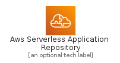
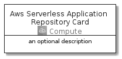

# AwsServerlessApplicationRepository


```text
aws-20210131/Architecture/Compute/AwsServerlessApplicationRepository
```

```text
include('aws-20210131/Architecture/Compute/AwsServerlessApplicationRepository')
```


| Illustration | AwsServerlessApplicationRepository | AwsServerlessApplicationRepositoryCard | AwsServerlessApplicationRepositoryGroup |
| :---: | :---: | :---: | :---: |
|  |  |  |  |


## AwsServerlessApplicationRepository

### Load remotely
```plantuml
@startuml
' configures the library
!global $LIB_BASE_LOCATION="https://github.com/tmorin/plantuml-libs/distribution"

' loads the library's bootstrap
!include $LIB_BASE_LOCATION/bootstrap.puml

' loads the package bootstrap
include('aws-20210131/bootstrap')

' loads the Item which embeds the element AwsServerlessApplicationRepository
include('aws-20210131/Architecture/Compute/AwsServerlessApplicationRepository')

' renders the element
AwsServerlessApplicationRepository('AwsServerlessApplicationRepository', 'Aws Serverless Application Repository', 'an optional tech label')
@enduml
```

### Load locally
```plantuml
@startuml
' configures the library
!global $INCLUSION_MODE="local"
!global $LIB_BASE_LOCATION="../../.."

' loads the library's bootstrap
!include $LIB_BASE_LOCATION/bootstrap.puml

' loads the package bootstrap
include('aws-20210131/bootstrap')

' loads the Item which embeds the element AwsServerlessApplicationRepository
include('aws-20210131/Architecture/Compute/AwsServerlessApplicationRepository')

' renders the element
AwsServerlessApplicationRepository('AwsServerlessApplicationRepository', 'Aws Serverless Application Repository', 'an optional tech label')
@enduml
```

## AwsServerlessApplicationRepositoryCard

### Load remotely
```plantuml
@startuml
' configures the library
!global $LIB_BASE_LOCATION="https://github.com/tmorin/plantuml-libs/distribution"

' loads the library's bootstrap
!include $LIB_BASE_LOCATION/bootstrap.puml

' loads the package bootstrap
include('aws-20210131/bootstrap')

' loads the Item which embeds the element AwsServerlessApplicationRepositoryCard
include('aws-20210131/Architecture/Compute/AwsServerlessApplicationRepository')

' renders the element
AwsServerlessApplicationRepositoryCard('AwsServerlessApplicationRepositoryCard', 'Aws Serverless Application Repository Card', 'an optional description')
@enduml
```

### Load locally
```plantuml
@startuml
' configures the library
!global $INCLUSION_MODE="local"
!global $LIB_BASE_LOCATION="../../.."

' loads the library's bootstrap
!include $LIB_BASE_LOCATION/bootstrap.puml

' loads the package bootstrap
include('aws-20210131/bootstrap')

' loads the Item which embeds the element AwsServerlessApplicationRepositoryCard
include('aws-20210131/Architecture/Compute/AwsServerlessApplicationRepository')

' renders the element
AwsServerlessApplicationRepositoryCard('AwsServerlessApplicationRepositoryCard', 'Aws Serverless Application Repository Card', 'an optional description')
@enduml
```

## AwsServerlessApplicationRepositoryGroup

### Load remotely
```plantuml
@startuml
' configures the library
!global $LIB_BASE_LOCATION="https://github.com/tmorin/plantuml-libs/distribution"

' loads the library's bootstrap
!include $LIB_BASE_LOCATION/bootstrap.puml

' loads the package bootstrap
include('aws-20210131/bootstrap')

' loads the Item which embeds the element AwsServerlessApplicationRepositoryGroup
include('aws-20210131/Architecture/Compute/AwsServerlessApplicationRepository')

' renders the element
AwsServerlessApplicationRepositoryGroup('AwsServerlessApplicationRepositoryGroup', 'Aws Serverless Application Repository Group', 'an optional tech label') {
    note as note
        the content of the group
    end note
}
@enduml
```

### Load locally
```plantuml
@startuml
' configures the library
!global $INCLUSION_MODE="local"
!global $LIB_BASE_LOCATION="../../.."

' loads the library's bootstrap
!include $LIB_BASE_LOCATION/bootstrap.puml

' loads the package bootstrap
include('aws-20210131/bootstrap')

' loads the Item which embeds the element AwsServerlessApplicationRepositoryGroup
include('aws-20210131/Architecture/Compute/AwsServerlessApplicationRepository')

' renders the element
AwsServerlessApplicationRepositoryGroup('AwsServerlessApplicationRepositoryGroup', 'Aws Serverless Application Repository Group', 'an optional tech label') {
    note as note
        the content of the group
    end note
}
@enduml
```

