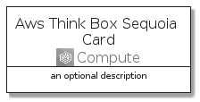
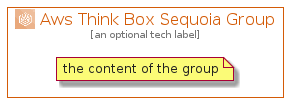

# AwsThinkBoxSequoia


```text
aws-20210131/Architecture/Compute/AwsThinkBoxSequoia
```

```text
include('aws-20210131/Architecture/Compute/AwsThinkBoxSequoia')
```


| Illustration | AwsThinkBoxSequoia | AwsThinkBoxSequoiaCard | AwsThinkBoxSequoiaGroup |
| :---: | :---: | :---: | :---: |
|  |  |  |  |


## AwsThinkBoxSequoia

### Load remotely
```plantuml
@startuml
' configures the library
!global $LIB_BASE_LOCATION="https://github.com/tmorin/plantuml-libs/distribution"

' loads the library's bootstrap
!include $LIB_BASE_LOCATION/bootstrap.puml

' loads the package bootstrap
include('aws-20210131/bootstrap')

' loads the Item which embeds the element AwsThinkBoxSequoia
include('aws-20210131/Architecture/Compute/AwsThinkBoxSequoia')

' renders the element
AwsThinkBoxSequoia('AwsThinkBoxSequoia', 'Aws Think Box Sequoia', 'an optional tech label')
@enduml
```

### Load locally
```plantuml
@startuml
' configures the library
!global $INCLUSION_MODE="local"
!global $LIB_BASE_LOCATION="../../.."

' loads the library's bootstrap
!include $LIB_BASE_LOCATION/bootstrap.puml

' loads the package bootstrap
include('aws-20210131/bootstrap')

' loads the Item which embeds the element AwsThinkBoxSequoia
include('aws-20210131/Architecture/Compute/AwsThinkBoxSequoia')

' renders the element
AwsThinkBoxSequoia('AwsThinkBoxSequoia', 'Aws Think Box Sequoia', 'an optional tech label')
@enduml
```

## AwsThinkBoxSequoiaCard

### Load remotely
```plantuml
@startuml
' configures the library
!global $LIB_BASE_LOCATION="https://github.com/tmorin/plantuml-libs/distribution"

' loads the library's bootstrap
!include $LIB_BASE_LOCATION/bootstrap.puml

' loads the package bootstrap
include('aws-20210131/bootstrap')

' loads the Item which embeds the element AwsThinkBoxSequoiaCard
include('aws-20210131/Architecture/Compute/AwsThinkBoxSequoia')

' renders the element
AwsThinkBoxSequoiaCard('AwsThinkBoxSequoiaCard', 'Aws Think Box Sequoia Card', 'an optional description')
@enduml
```

### Load locally
```plantuml
@startuml
' configures the library
!global $INCLUSION_MODE="local"
!global $LIB_BASE_LOCATION="../../.."

' loads the library's bootstrap
!include $LIB_BASE_LOCATION/bootstrap.puml

' loads the package bootstrap
include('aws-20210131/bootstrap')

' loads the Item which embeds the element AwsThinkBoxSequoiaCard
include('aws-20210131/Architecture/Compute/AwsThinkBoxSequoia')

' renders the element
AwsThinkBoxSequoiaCard('AwsThinkBoxSequoiaCard', 'Aws Think Box Sequoia Card', 'an optional description')
@enduml
```

## AwsThinkBoxSequoiaGroup

### Load remotely
```plantuml
@startuml
' configures the library
!global $LIB_BASE_LOCATION="https://github.com/tmorin/plantuml-libs/distribution"

' loads the library's bootstrap
!include $LIB_BASE_LOCATION/bootstrap.puml

' loads the package bootstrap
include('aws-20210131/bootstrap')

' loads the Item which embeds the element AwsThinkBoxSequoiaGroup
include('aws-20210131/Architecture/Compute/AwsThinkBoxSequoia')

' renders the element
AwsThinkBoxSequoiaGroup('AwsThinkBoxSequoiaGroup', 'Aws Think Box Sequoia Group', 'an optional tech label') {
    note as note
        the content of the group
    end note
}
@enduml
```

### Load locally
```plantuml
@startuml
' configures the library
!global $INCLUSION_MODE="local"
!global $LIB_BASE_LOCATION="../../.."

' loads the library's bootstrap
!include $LIB_BASE_LOCATION/bootstrap.puml

' loads the package bootstrap
include('aws-20210131/bootstrap')

' loads the Item which embeds the element AwsThinkBoxSequoiaGroup
include('aws-20210131/Architecture/Compute/AwsThinkBoxSequoia')

' renders the element
AwsThinkBoxSequoiaGroup('AwsThinkBoxSequoiaGroup', 'Aws Think Box Sequoia Group', 'an optional tech label') {
    note as note
        the content of the group
    end note
}
@enduml
```

