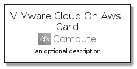
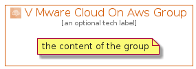

# VMwareCloudOnAws


```text
aws-20210131/Architecture/Compute/VMwareCloudOnAws
```

```text
include('aws-20210131/Architecture/Compute/VMwareCloudOnAws')
```


| Illustration | VMwareCloudOnAws | VMwareCloudOnAwsCard | VMwareCloudOnAwsGroup |
| :---: | :---: | :---: | :---: |
|  |  |  |  |


## VMwareCloudOnAws

### Load remotely
```plantuml
@startuml
' configures the library
!global $LIB_BASE_LOCATION="https://github.com/tmorin/plantuml-libs/distribution"

' loads the library's bootstrap
!include $LIB_BASE_LOCATION/bootstrap.puml

' loads the package bootstrap
include('aws-20210131/bootstrap')

' loads the Item which embeds the element VMwareCloudOnAws
include('aws-20210131/Architecture/Compute/VMwareCloudOnAws')

' renders the element
VMwareCloudOnAws('VMwareCloudOnAws', 'V Mware Cloud On Aws', 'an optional tech label')
@enduml
```

### Load locally
```plantuml
@startuml
' configures the library
!global $INCLUSION_MODE="local"
!global $LIB_BASE_LOCATION="../../.."

' loads the library's bootstrap
!include $LIB_BASE_LOCATION/bootstrap.puml

' loads the package bootstrap
include('aws-20210131/bootstrap')

' loads the Item which embeds the element VMwareCloudOnAws
include('aws-20210131/Architecture/Compute/VMwareCloudOnAws')

' renders the element
VMwareCloudOnAws('VMwareCloudOnAws', 'V Mware Cloud On Aws', 'an optional tech label')
@enduml
```

## VMwareCloudOnAwsCard

### Load remotely
```plantuml
@startuml
' configures the library
!global $LIB_BASE_LOCATION="https://github.com/tmorin/plantuml-libs/distribution"

' loads the library's bootstrap
!include $LIB_BASE_LOCATION/bootstrap.puml

' loads the package bootstrap
include('aws-20210131/bootstrap')

' loads the Item which embeds the element VMwareCloudOnAwsCard
include('aws-20210131/Architecture/Compute/VMwareCloudOnAws')

' renders the element
VMwareCloudOnAwsCard('VMwareCloudOnAwsCard', 'V Mware Cloud On Aws Card', 'an optional description')
@enduml
```

### Load locally
```plantuml
@startuml
' configures the library
!global $INCLUSION_MODE="local"
!global $LIB_BASE_LOCATION="../../.."

' loads the library's bootstrap
!include $LIB_BASE_LOCATION/bootstrap.puml

' loads the package bootstrap
include('aws-20210131/bootstrap')

' loads the Item which embeds the element VMwareCloudOnAwsCard
include('aws-20210131/Architecture/Compute/VMwareCloudOnAws')

' renders the element
VMwareCloudOnAwsCard('VMwareCloudOnAwsCard', 'V Mware Cloud On Aws Card', 'an optional description')
@enduml
```

## VMwareCloudOnAwsGroup

### Load remotely
```plantuml
@startuml
' configures the library
!global $LIB_BASE_LOCATION="https://github.com/tmorin/plantuml-libs/distribution"

' loads the library's bootstrap
!include $LIB_BASE_LOCATION/bootstrap.puml

' loads the package bootstrap
include('aws-20210131/bootstrap')

' loads the Item which embeds the element VMwareCloudOnAwsGroup
include('aws-20210131/Architecture/Compute/VMwareCloudOnAws')

' renders the element
VMwareCloudOnAwsGroup('VMwareCloudOnAwsGroup', 'V Mware Cloud On Aws Group', 'an optional tech label') {
    note as note
        the content of the group
    end note
}
@enduml
```

### Load locally
```plantuml
@startuml
' configures the library
!global $INCLUSION_MODE="local"
!global $LIB_BASE_LOCATION="../../.."

' loads the library's bootstrap
!include $LIB_BASE_LOCATION/bootstrap.puml

' loads the package bootstrap
include('aws-20210131/bootstrap')

' loads the Item which embeds the element VMwareCloudOnAwsGroup
include('aws-20210131/Architecture/Compute/VMwareCloudOnAws')

' renders the element
VMwareCloudOnAwsGroup('VMwareCloudOnAwsGroup', 'V Mware Cloud On Aws Group', 'an optional tech label') {
    note as note
        the content of the group
    end note
}
@enduml
```

