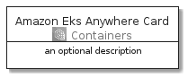
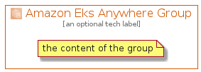

# AmazonEksAnywhere


```text
aws-20210131/Architecture/Containers/AmazonEksAnywhere
```

```text
include('aws-20210131/Architecture/Containers/AmazonEksAnywhere')
```


| Illustration | AmazonEksAnywhere | AmazonEksAnywhereCard | AmazonEksAnywhereGroup |
| :---: | :---: | :---: | :---: |
|  |  |  |  |


## AmazonEksAnywhere

### Load remotely
```plantuml
@startuml
' configures the library
!global $LIB_BASE_LOCATION="https://github.com/tmorin/plantuml-libs/distribution"

' loads the library's bootstrap
!include $LIB_BASE_LOCATION/bootstrap.puml

' loads the package bootstrap
include('aws-20210131/bootstrap')

' loads the Item which embeds the element AmazonEksAnywhere
include('aws-20210131/Architecture/Containers/AmazonEksAnywhere')

' renders the element
AmazonEksAnywhere('AmazonEksAnywhere', 'Amazon Eks Anywhere', 'an optional tech label')
@enduml
```

### Load locally
```plantuml
@startuml
' configures the library
!global $INCLUSION_MODE="local"
!global $LIB_BASE_LOCATION="../../.."

' loads the library's bootstrap
!include $LIB_BASE_LOCATION/bootstrap.puml

' loads the package bootstrap
include('aws-20210131/bootstrap')

' loads the Item which embeds the element AmazonEksAnywhere
include('aws-20210131/Architecture/Containers/AmazonEksAnywhere')

' renders the element
AmazonEksAnywhere('AmazonEksAnywhere', 'Amazon Eks Anywhere', 'an optional tech label')
@enduml
```

## AmazonEksAnywhereCard

### Load remotely
```plantuml
@startuml
' configures the library
!global $LIB_BASE_LOCATION="https://github.com/tmorin/plantuml-libs/distribution"

' loads the library's bootstrap
!include $LIB_BASE_LOCATION/bootstrap.puml

' loads the package bootstrap
include('aws-20210131/bootstrap')

' loads the Item which embeds the element AmazonEksAnywhereCard
include('aws-20210131/Architecture/Containers/AmazonEksAnywhere')

' renders the element
AmazonEksAnywhereCard('AmazonEksAnywhereCard', 'Amazon Eks Anywhere Card', 'an optional description')
@enduml
```

### Load locally
```plantuml
@startuml
' configures the library
!global $INCLUSION_MODE="local"
!global $LIB_BASE_LOCATION="../../.."

' loads the library's bootstrap
!include $LIB_BASE_LOCATION/bootstrap.puml

' loads the package bootstrap
include('aws-20210131/bootstrap')

' loads the Item which embeds the element AmazonEksAnywhereCard
include('aws-20210131/Architecture/Containers/AmazonEksAnywhere')

' renders the element
AmazonEksAnywhereCard('AmazonEksAnywhereCard', 'Amazon Eks Anywhere Card', 'an optional description')
@enduml
```

## AmazonEksAnywhereGroup

### Load remotely
```plantuml
@startuml
' configures the library
!global $LIB_BASE_LOCATION="https://github.com/tmorin/plantuml-libs/distribution"

' loads the library's bootstrap
!include $LIB_BASE_LOCATION/bootstrap.puml

' loads the package bootstrap
include('aws-20210131/bootstrap')

' loads the Item which embeds the element AmazonEksAnywhereGroup
include('aws-20210131/Architecture/Containers/AmazonEksAnywhere')

' renders the element
AmazonEksAnywhereGroup('AmazonEksAnywhereGroup', 'Amazon Eks Anywhere Group', 'an optional tech label') {
    note as note
        the content of the group
    end note
}
@enduml
```

### Load locally
```plantuml
@startuml
' configures the library
!global $INCLUSION_MODE="local"
!global $LIB_BASE_LOCATION="../../.."

' loads the library's bootstrap
!include $LIB_BASE_LOCATION/bootstrap.puml

' loads the package bootstrap
include('aws-20210131/bootstrap')

' loads the Item which embeds the element AmazonEksAnywhereGroup
include('aws-20210131/Architecture/Containers/AmazonEksAnywhere')

' renders the element
AmazonEksAnywhereGroup('AmazonEksAnywhereGroup', 'Amazon Eks Anywhere Group', 'an optional tech label') {
    note as note
        the content of the group
    end note
}
@enduml
```

