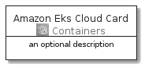
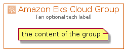

# AmazonEksCloud


```text
aws-20210131/Architecture/Containers/AmazonEksCloud
```

```text
include('aws-20210131/Architecture/Containers/AmazonEksCloud')
```


| Illustration | AmazonEksCloud | AmazonEksCloudCard | AmazonEksCloudGroup |
| :---: | :---: | :---: | :---: |
|  |  |  |  |


## AmazonEksCloud

### Load remotely
```plantuml
@startuml
' configures the library
!global $LIB_BASE_LOCATION="https://github.com/tmorin/plantuml-libs/distribution"

' loads the library's bootstrap
!include $LIB_BASE_LOCATION/bootstrap.puml

' loads the package bootstrap
include('aws-20210131/bootstrap')

' loads the Item which embeds the element AmazonEksCloud
include('aws-20210131/Architecture/Containers/AmazonEksCloud')

' renders the element
AmazonEksCloud('AmazonEksCloud', 'Amazon Eks Cloud', 'an optional tech label')
@enduml
```

### Load locally
```plantuml
@startuml
' configures the library
!global $INCLUSION_MODE="local"
!global $LIB_BASE_LOCATION="../../.."

' loads the library's bootstrap
!include $LIB_BASE_LOCATION/bootstrap.puml

' loads the package bootstrap
include('aws-20210131/bootstrap')

' loads the Item which embeds the element AmazonEksCloud
include('aws-20210131/Architecture/Containers/AmazonEksCloud')

' renders the element
AmazonEksCloud('AmazonEksCloud', 'Amazon Eks Cloud', 'an optional tech label')
@enduml
```

## AmazonEksCloudCard

### Load remotely
```plantuml
@startuml
' configures the library
!global $LIB_BASE_LOCATION="https://github.com/tmorin/plantuml-libs/distribution"

' loads the library's bootstrap
!include $LIB_BASE_LOCATION/bootstrap.puml

' loads the package bootstrap
include('aws-20210131/bootstrap')

' loads the Item which embeds the element AmazonEksCloudCard
include('aws-20210131/Architecture/Containers/AmazonEksCloud')

' renders the element
AmazonEksCloudCard('AmazonEksCloudCard', 'Amazon Eks Cloud Card', 'an optional description')
@enduml
```

### Load locally
```plantuml
@startuml
' configures the library
!global $INCLUSION_MODE="local"
!global $LIB_BASE_LOCATION="../../.."

' loads the library's bootstrap
!include $LIB_BASE_LOCATION/bootstrap.puml

' loads the package bootstrap
include('aws-20210131/bootstrap')

' loads the Item which embeds the element AmazonEksCloudCard
include('aws-20210131/Architecture/Containers/AmazonEksCloud')

' renders the element
AmazonEksCloudCard('AmazonEksCloudCard', 'Amazon Eks Cloud Card', 'an optional description')
@enduml
```

## AmazonEksCloudGroup

### Load remotely
```plantuml
@startuml
' configures the library
!global $LIB_BASE_LOCATION="https://github.com/tmorin/plantuml-libs/distribution"

' loads the library's bootstrap
!include $LIB_BASE_LOCATION/bootstrap.puml

' loads the package bootstrap
include('aws-20210131/bootstrap')

' loads the Item which embeds the element AmazonEksCloudGroup
include('aws-20210131/Architecture/Containers/AmazonEksCloud')

' renders the element
AmazonEksCloudGroup('AmazonEksCloudGroup', 'Amazon Eks Cloud Group', 'an optional tech label') {
    note as note
        the content of the group
    end note
}
@enduml
```

### Load locally
```plantuml
@startuml
' configures the library
!global $INCLUSION_MODE="local"
!global $LIB_BASE_LOCATION="../../.."

' loads the library's bootstrap
!include $LIB_BASE_LOCATION/bootstrap.puml

' loads the package bootstrap
include('aws-20210131/bootstrap')

' loads the Item which embeds the element AmazonEksCloudGroup
include('aws-20210131/Architecture/Containers/AmazonEksCloud')

' renders the element
AmazonEksCloudGroup('AmazonEksCloudGroup', 'Amazon Eks Cloud Group', 'an optional tech label') {
    note as note
        the content of the group
    end note
}
@enduml
```

