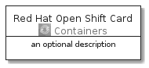
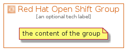

# RedHatOpenShift


```text
aws-20210131/Architecture/Containers/RedHatOpenShift
```

```text
include('aws-20210131/Architecture/Containers/RedHatOpenShift')
```


| Illustration | RedHatOpenShift | RedHatOpenShiftCard | RedHatOpenShiftGroup |
| :---: | :---: | :---: | :---: |
|  |  |  |  |


## RedHatOpenShift

### Load remotely
```plantuml
@startuml
' configures the library
!global $LIB_BASE_LOCATION="https://github.com/tmorin/plantuml-libs/distribution"

' loads the library's bootstrap
!include $LIB_BASE_LOCATION/bootstrap.puml

' loads the package bootstrap
include('aws-20210131/bootstrap')

' loads the Item which embeds the element RedHatOpenShift
include('aws-20210131/Architecture/Containers/RedHatOpenShift')

' renders the element
RedHatOpenShift('RedHatOpenShift', 'Red Hat Open Shift', 'an optional tech label')
@enduml
```

### Load locally
```plantuml
@startuml
' configures the library
!global $INCLUSION_MODE="local"
!global $LIB_BASE_LOCATION="../../.."

' loads the library's bootstrap
!include $LIB_BASE_LOCATION/bootstrap.puml

' loads the package bootstrap
include('aws-20210131/bootstrap')

' loads the Item which embeds the element RedHatOpenShift
include('aws-20210131/Architecture/Containers/RedHatOpenShift')

' renders the element
RedHatOpenShift('RedHatOpenShift', 'Red Hat Open Shift', 'an optional tech label')
@enduml
```

## RedHatOpenShiftCard

### Load remotely
```plantuml
@startuml
' configures the library
!global $LIB_BASE_LOCATION="https://github.com/tmorin/plantuml-libs/distribution"

' loads the library's bootstrap
!include $LIB_BASE_LOCATION/bootstrap.puml

' loads the package bootstrap
include('aws-20210131/bootstrap')

' loads the Item which embeds the element RedHatOpenShiftCard
include('aws-20210131/Architecture/Containers/RedHatOpenShift')

' renders the element
RedHatOpenShiftCard('RedHatOpenShiftCard', 'Red Hat Open Shift Card', 'an optional description')
@enduml
```

### Load locally
```plantuml
@startuml
' configures the library
!global $INCLUSION_MODE="local"
!global $LIB_BASE_LOCATION="../../.."

' loads the library's bootstrap
!include $LIB_BASE_LOCATION/bootstrap.puml

' loads the package bootstrap
include('aws-20210131/bootstrap')

' loads the Item which embeds the element RedHatOpenShiftCard
include('aws-20210131/Architecture/Containers/RedHatOpenShift')

' renders the element
RedHatOpenShiftCard('RedHatOpenShiftCard', 'Red Hat Open Shift Card', 'an optional description')
@enduml
```

## RedHatOpenShiftGroup

### Load remotely
```plantuml
@startuml
' configures the library
!global $LIB_BASE_LOCATION="https://github.com/tmorin/plantuml-libs/distribution"

' loads the library's bootstrap
!include $LIB_BASE_LOCATION/bootstrap.puml

' loads the package bootstrap
include('aws-20210131/bootstrap')

' loads the Item which embeds the element RedHatOpenShiftGroup
include('aws-20210131/Architecture/Containers/RedHatOpenShift')

' renders the element
RedHatOpenShiftGroup('RedHatOpenShiftGroup', 'Red Hat Open Shift Group', 'an optional tech label') {
    note as note
        the content of the group
    end note
}
@enduml
```

### Load locally
```plantuml
@startuml
' configures the library
!global $INCLUSION_MODE="local"
!global $LIB_BASE_LOCATION="../../.."

' loads the library's bootstrap
!include $LIB_BASE_LOCATION/bootstrap.puml

' loads the package bootstrap
include('aws-20210131/bootstrap')

' loads the Item which embeds the element RedHatOpenShiftGroup
include('aws-20210131/Architecture/Containers/RedHatOpenShift')

' renders the element
RedHatOpenShiftGroup('RedHatOpenShiftGroup', 'Red Hat Open Shift Group', 'an optional tech label') {
    note as note
        the content of the group
    end note
}
@enduml
```

