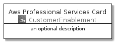
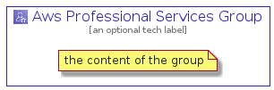

# AwsProfessionalServices


```text
aws-20210131/Architecture/CustomerEnablement/AwsProfessionalServices
```

```text
include('aws-20210131/Architecture/CustomerEnablement/AwsProfessionalServices')
```


| Illustration | AwsProfessionalServices | AwsProfessionalServicesCard | AwsProfessionalServicesGroup |
| :---: | :---: | :---: | :---: |
|  |  |  |  |


## AwsProfessionalServices

### Load remotely
```plantuml
@startuml
' configures the library
!global $LIB_BASE_LOCATION="https://github.com/tmorin/plantuml-libs/distribution"

' loads the library's bootstrap
!include $LIB_BASE_LOCATION/bootstrap.puml

' loads the package bootstrap
include('aws-20210131/bootstrap')

' loads the Item which embeds the element AwsProfessionalServices
include('aws-20210131/Architecture/CustomerEnablement/AwsProfessionalServices')

' renders the element
AwsProfessionalServices('AwsProfessionalServices', 'Aws Professional Services', 'an optional tech label')
@enduml
```

### Load locally
```plantuml
@startuml
' configures the library
!global $INCLUSION_MODE="local"
!global $LIB_BASE_LOCATION="../../.."

' loads the library's bootstrap
!include $LIB_BASE_LOCATION/bootstrap.puml

' loads the package bootstrap
include('aws-20210131/bootstrap')

' loads the Item which embeds the element AwsProfessionalServices
include('aws-20210131/Architecture/CustomerEnablement/AwsProfessionalServices')

' renders the element
AwsProfessionalServices('AwsProfessionalServices', 'Aws Professional Services', 'an optional tech label')
@enduml
```

## AwsProfessionalServicesCard

### Load remotely
```plantuml
@startuml
' configures the library
!global $LIB_BASE_LOCATION="https://github.com/tmorin/plantuml-libs/distribution"

' loads the library's bootstrap
!include $LIB_BASE_LOCATION/bootstrap.puml

' loads the package bootstrap
include('aws-20210131/bootstrap')

' loads the Item which embeds the element AwsProfessionalServicesCard
include('aws-20210131/Architecture/CustomerEnablement/AwsProfessionalServices')

' renders the element
AwsProfessionalServicesCard('AwsProfessionalServicesCard', 'Aws Professional Services Card', 'an optional description')
@enduml
```

### Load locally
```plantuml
@startuml
' configures the library
!global $INCLUSION_MODE="local"
!global $LIB_BASE_LOCATION="../../.."

' loads the library's bootstrap
!include $LIB_BASE_LOCATION/bootstrap.puml

' loads the package bootstrap
include('aws-20210131/bootstrap')

' loads the Item which embeds the element AwsProfessionalServicesCard
include('aws-20210131/Architecture/CustomerEnablement/AwsProfessionalServices')

' renders the element
AwsProfessionalServicesCard('AwsProfessionalServicesCard', 'Aws Professional Services Card', 'an optional description')
@enduml
```

## AwsProfessionalServicesGroup

### Load remotely
```plantuml
@startuml
' configures the library
!global $LIB_BASE_LOCATION="https://github.com/tmorin/plantuml-libs/distribution"

' loads the library's bootstrap
!include $LIB_BASE_LOCATION/bootstrap.puml

' loads the package bootstrap
include('aws-20210131/bootstrap')

' loads the Item which embeds the element AwsProfessionalServicesGroup
include('aws-20210131/Architecture/CustomerEnablement/AwsProfessionalServices')

' renders the element
AwsProfessionalServicesGroup('AwsProfessionalServicesGroup', 'Aws Professional Services Group', 'an optional tech label') {
    note as note
        the content of the group
    end note
}
@enduml
```

### Load locally
```plantuml
@startuml
' configures the library
!global $INCLUSION_MODE="local"
!global $LIB_BASE_LOCATION="../../.."

' loads the library's bootstrap
!include $LIB_BASE_LOCATION/bootstrap.puml

' loads the package bootstrap
include('aws-20210131/bootstrap')

' loads the Item which embeds the element AwsProfessionalServicesGroup
include('aws-20210131/Architecture/CustomerEnablement/AwsProfessionalServices')

' renders the element
AwsProfessionalServicesGroup('AwsProfessionalServicesGroup', 'Aws Professional Services Group', 'an optional tech label') {
    note as note
        the content of the group
    end note
}
@enduml
```

