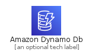
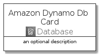
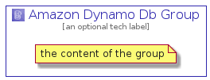

# AmazonDynamoDb


```text
aws-20210131/Architecture/Database/AmazonDynamoDb
```

```text
include('aws-20210131/Architecture/Database/AmazonDynamoDb')
```


| Illustration | AmazonDynamoDb | AmazonDynamoDbCard | AmazonDynamoDbGroup |
| :---: | :---: | :---: | :---: |
|  |  |  |  |


## AmazonDynamoDb

### Load remotely
```plantuml
@startuml
' configures the library
!global $LIB_BASE_LOCATION="https://github.com/tmorin/plantuml-libs/distribution"

' loads the library's bootstrap
!include $LIB_BASE_LOCATION/bootstrap.puml

' loads the package bootstrap
include('aws-20210131/bootstrap')

' loads the Item which embeds the element AmazonDynamoDb
include('aws-20210131/Architecture/Database/AmazonDynamoDb')

' renders the element
AmazonDynamoDb('AmazonDynamoDb', 'Amazon Dynamo Db', 'an optional tech label')
@enduml
```

### Load locally
```plantuml
@startuml
' configures the library
!global $INCLUSION_MODE="local"
!global $LIB_BASE_LOCATION="../../.."

' loads the library's bootstrap
!include $LIB_BASE_LOCATION/bootstrap.puml

' loads the package bootstrap
include('aws-20210131/bootstrap')

' loads the Item which embeds the element AmazonDynamoDb
include('aws-20210131/Architecture/Database/AmazonDynamoDb')

' renders the element
AmazonDynamoDb('AmazonDynamoDb', 'Amazon Dynamo Db', 'an optional tech label')
@enduml
```

## AmazonDynamoDbCard

### Load remotely
```plantuml
@startuml
' configures the library
!global $LIB_BASE_LOCATION="https://github.com/tmorin/plantuml-libs/distribution"

' loads the library's bootstrap
!include $LIB_BASE_LOCATION/bootstrap.puml

' loads the package bootstrap
include('aws-20210131/bootstrap')

' loads the Item which embeds the element AmazonDynamoDbCard
include('aws-20210131/Architecture/Database/AmazonDynamoDb')

' renders the element
AmazonDynamoDbCard('AmazonDynamoDbCard', 'Amazon Dynamo Db Card', 'an optional description')
@enduml
```

### Load locally
```plantuml
@startuml
' configures the library
!global $INCLUSION_MODE="local"
!global $LIB_BASE_LOCATION="../../.."

' loads the library's bootstrap
!include $LIB_BASE_LOCATION/bootstrap.puml

' loads the package bootstrap
include('aws-20210131/bootstrap')

' loads the Item which embeds the element AmazonDynamoDbCard
include('aws-20210131/Architecture/Database/AmazonDynamoDb')

' renders the element
AmazonDynamoDbCard('AmazonDynamoDbCard', 'Amazon Dynamo Db Card', 'an optional description')
@enduml
```

## AmazonDynamoDbGroup

### Load remotely
```plantuml
@startuml
' configures the library
!global $LIB_BASE_LOCATION="https://github.com/tmorin/plantuml-libs/distribution"

' loads the library's bootstrap
!include $LIB_BASE_LOCATION/bootstrap.puml

' loads the package bootstrap
include('aws-20210131/bootstrap')

' loads the Item which embeds the element AmazonDynamoDbGroup
include('aws-20210131/Architecture/Database/AmazonDynamoDb')

' renders the element
AmazonDynamoDbGroup('AmazonDynamoDbGroup', 'Amazon Dynamo Db Group', 'an optional tech label') {
    note as note
        the content of the group
    end note
}
@enduml
```

### Load locally
```plantuml
@startuml
' configures the library
!global $INCLUSION_MODE="local"
!global $LIB_BASE_LOCATION="../../.."

' loads the library's bootstrap
!include $LIB_BASE_LOCATION/bootstrap.puml

' loads the package bootstrap
include('aws-20210131/bootstrap')

' loads the Item which embeds the element AmazonDynamoDbGroup
include('aws-20210131/Architecture/Database/AmazonDynamoDb')

' renders the element
AmazonDynamoDbGroup('AmazonDynamoDbGroup', 'Amazon Dynamo Db Group', 'an optional tech label') {
    note as note
        the content of the group
    end note
}
@enduml
```

