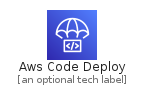
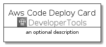
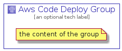

# AwsCodeDeploy


```text
aws-20210131/Architecture/DeveloperTools/AwsCodeDeploy
```

```text
include('aws-20210131/Architecture/DeveloperTools/AwsCodeDeploy')
```


| Illustration | AwsCodeDeploy | AwsCodeDeployCard | AwsCodeDeployGroup |
| :---: | :---: | :---: | :---: |
|  |  |  |  |


## AwsCodeDeploy

### Load remotely
```plantuml
@startuml
' configures the library
!global $LIB_BASE_LOCATION="https://github.com/tmorin/plantuml-libs/distribution"

' loads the library's bootstrap
!include $LIB_BASE_LOCATION/bootstrap.puml

' loads the package bootstrap
include('aws-20210131/bootstrap')

' loads the Item which embeds the element AwsCodeDeploy
include('aws-20210131/Architecture/DeveloperTools/AwsCodeDeploy')

' renders the element
AwsCodeDeploy('AwsCodeDeploy', 'Aws Code Deploy', 'an optional tech label')
@enduml
```

### Load locally
```plantuml
@startuml
' configures the library
!global $INCLUSION_MODE="local"
!global $LIB_BASE_LOCATION="../../.."

' loads the library's bootstrap
!include $LIB_BASE_LOCATION/bootstrap.puml

' loads the package bootstrap
include('aws-20210131/bootstrap')

' loads the Item which embeds the element AwsCodeDeploy
include('aws-20210131/Architecture/DeveloperTools/AwsCodeDeploy')

' renders the element
AwsCodeDeploy('AwsCodeDeploy', 'Aws Code Deploy', 'an optional tech label')
@enduml
```

## AwsCodeDeployCard

### Load remotely
```plantuml
@startuml
' configures the library
!global $LIB_BASE_LOCATION="https://github.com/tmorin/plantuml-libs/distribution"

' loads the library's bootstrap
!include $LIB_BASE_LOCATION/bootstrap.puml

' loads the package bootstrap
include('aws-20210131/bootstrap')

' loads the Item which embeds the element AwsCodeDeployCard
include('aws-20210131/Architecture/DeveloperTools/AwsCodeDeploy')

' renders the element
AwsCodeDeployCard('AwsCodeDeployCard', 'Aws Code Deploy Card', 'an optional description')
@enduml
```

### Load locally
```plantuml
@startuml
' configures the library
!global $INCLUSION_MODE="local"
!global $LIB_BASE_LOCATION="../../.."

' loads the library's bootstrap
!include $LIB_BASE_LOCATION/bootstrap.puml

' loads the package bootstrap
include('aws-20210131/bootstrap')

' loads the Item which embeds the element AwsCodeDeployCard
include('aws-20210131/Architecture/DeveloperTools/AwsCodeDeploy')

' renders the element
AwsCodeDeployCard('AwsCodeDeployCard', 'Aws Code Deploy Card', 'an optional description')
@enduml
```

## AwsCodeDeployGroup

### Load remotely
```plantuml
@startuml
' configures the library
!global $LIB_BASE_LOCATION="https://github.com/tmorin/plantuml-libs/distribution"

' loads the library's bootstrap
!include $LIB_BASE_LOCATION/bootstrap.puml

' loads the package bootstrap
include('aws-20210131/bootstrap')

' loads the Item which embeds the element AwsCodeDeployGroup
include('aws-20210131/Architecture/DeveloperTools/AwsCodeDeploy')

' renders the element
AwsCodeDeployGroup('AwsCodeDeployGroup', 'Aws Code Deploy Group', 'an optional tech label') {
    note as note
        the content of the group
    end note
}
@enduml
```

### Load locally
```plantuml
@startuml
' configures the library
!global $INCLUSION_MODE="local"
!global $LIB_BASE_LOCATION="../../.."

' loads the library's bootstrap
!include $LIB_BASE_LOCATION/bootstrap.puml

' loads the package bootstrap
include('aws-20210131/bootstrap')

' loads the Item which embeds the element AwsCodeDeployGroup
include('aws-20210131/Architecture/DeveloperTools/AwsCodeDeploy')

' renders the element
AwsCodeDeployGroup('AwsCodeDeployGroup', 'Aws Code Deploy Group', 'an optional tech label') {
    note as note
        the content of the group
    end note
}
@enduml
```

