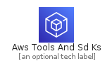
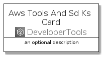
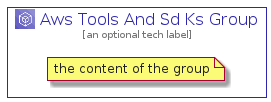

# AwsToolsAndSdKs


```text
aws-20210131/Architecture/DeveloperTools/AwsToolsAndSdKs
```

```text
include('aws-20210131/Architecture/DeveloperTools/AwsToolsAndSdKs')
```


| Illustration | AwsToolsAndSdKs | AwsToolsAndSdKsCard | AwsToolsAndSdKsGroup |
| :---: | :---: | :---: | :---: |
|  |  |  |  |


## AwsToolsAndSdKs

### Load remotely
```plantuml
@startuml
' configures the library
!global $LIB_BASE_LOCATION="https://github.com/tmorin/plantuml-libs/distribution"

' loads the library's bootstrap
!include $LIB_BASE_LOCATION/bootstrap.puml

' loads the package bootstrap
include('aws-20210131/bootstrap')

' loads the Item which embeds the element AwsToolsAndSdKs
include('aws-20210131/Architecture/DeveloperTools/AwsToolsAndSdKs')

' renders the element
AwsToolsAndSdKs('AwsToolsAndSdKs', 'Aws Tools And Sd Ks', 'an optional tech label')
@enduml
```

### Load locally
```plantuml
@startuml
' configures the library
!global $INCLUSION_MODE="local"
!global $LIB_BASE_LOCATION="../../.."

' loads the library's bootstrap
!include $LIB_BASE_LOCATION/bootstrap.puml

' loads the package bootstrap
include('aws-20210131/bootstrap')

' loads the Item which embeds the element AwsToolsAndSdKs
include('aws-20210131/Architecture/DeveloperTools/AwsToolsAndSdKs')

' renders the element
AwsToolsAndSdKs('AwsToolsAndSdKs', 'Aws Tools And Sd Ks', 'an optional tech label')
@enduml
```

## AwsToolsAndSdKsCard

### Load remotely
```plantuml
@startuml
' configures the library
!global $LIB_BASE_LOCATION="https://github.com/tmorin/plantuml-libs/distribution"

' loads the library's bootstrap
!include $LIB_BASE_LOCATION/bootstrap.puml

' loads the package bootstrap
include('aws-20210131/bootstrap')

' loads the Item which embeds the element AwsToolsAndSdKsCard
include('aws-20210131/Architecture/DeveloperTools/AwsToolsAndSdKs')

' renders the element
AwsToolsAndSdKsCard('AwsToolsAndSdKsCard', 'Aws Tools And Sd Ks Card', 'an optional description')
@enduml
```

### Load locally
```plantuml
@startuml
' configures the library
!global $INCLUSION_MODE="local"
!global $LIB_BASE_LOCATION="../../.."

' loads the library's bootstrap
!include $LIB_BASE_LOCATION/bootstrap.puml

' loads the package bootstrap
include('aws-20210131/bootstrap')

' loads the Item which embeds the element AwsToolsAndSdKsCard
include('aws-20210131/Architecture/DeveloperTools/AwsToolsAndSdKs')

' renders the element
AwsToolsAndSdKsCard('AwsToolsAndSdKsCard', 'Aws Tools And Sd Ks Card', 'an optional description')
@enduml
```

## AwsToolsAndSdKsGroup

### Load remotely
```plantuml
@startuml
' configures the library
!global $LIB_BASE_LOCATION="https://github.com/tmorin/plantuml-libs/distribution"

' loads the library's bootstrap
!include $LIB_BASE_LOCATION/bootstrap.puml

' loads the package bootstrap
include('aws-20210131/bootstrap')

' loads the Item which embeds the element AwsToolsAndSdKsGroup
include('aws-20210131/Architecture/DeveloperTools/AwsToolsAndSdKs')

' renders the element
AwsToolsAndSdKsGroup('AwsToolsAndSdKsGroup', 'Aws Tools And Sd Ks Group', 'an optional tech label') {
    note as note
        the content of the group
    end note
}
@enduml
```

### Load locally
```plantuml
@startuml
' configures the library
!global $INCLUSION_MODE="local"
!global $LIB_BASE_LOCATION="../../.."

' loads the library's bootstrap
!include $LIB_BASE_LOCATION/bootstrap.puml

' loads the package bootstrap
include('aws-20210131/bootstrap')

' loads the Item which embeds the element AwsToolsAndSdKsGroup
include('aws-20210131/Architecture/DeveloperTools/AwsToolsAndSdKs')

' renders the element
AwsToolsAndSdKsGroup('AwsToolsAndSdKsGroup', 'Aws Tools And Sd Ks Group', 'an optional tech label') {
    note as note
        the content of the group
    end note
}
@enduml
```

