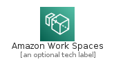
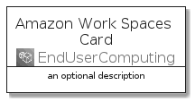
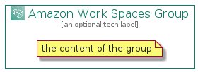

# AmazonWorkSpaces


```text
aws-20210131/Architecture/EndUserComputing/AmazonWorkSpaces
```

```text
include('aws-20210131/Architecture/EndUserComputing/AmazonWorkSpaces')
```


| Illustration | AmazonWorkSpaces | AmazonWorkSpacesCard | AmazonWorkSpacesGroup |
| :---: | :---: | :---: | :---: |
|  |  |  |  |


## AmazonWorkSpaces

### Load remotely
```plantuml
@startuml
' configures the library
!global $LIB_BASE_LOCATION="https://github.com/tmorin/plantuml-libs/distribution"

' loads the library's bootstrap
!include $LIB_BASE_LOCATION/bootstrap.puml

' loads the package bootstrap
include('aws-20210131/bootstrap')

' loads the Item which embeds the element AmazonWorkSpaces
include('aws-20210131/Architecture/EndUserComputing/AmazonWorkSpaces')

' renders the element
AmazonWorkSpaces('AmazonWorkSpaces', 'Amazon Work Spaces', 'an optional tech label')
@enduml
```

### Load locally
```plantuml
@startuml
' configures the library
!global $INCLUSION_MODE="local"
!global $LIB_BASE_LOCATION="../../.."

' loads the library's bootstrap
!include $LIB_BASE_LOCATION/bootstrap.puml

' loads the package bootstrap
include('aws-20210131/bootstrap')

' loads the Item which embeds the element AmazonWorkSpaces
include('aws-20210131/Architecture/EndUserComputing/AmazonWorkSpaces')

' renders the element
AmazonWorkSpaces('AmazonWorkSpaces', 'Amazon Work Spaces', 'an optional tech label')
@enduml
```

## AmazonWorkSpacesCard

### Load remotely
```plantuml
@startuml
' configures the library
!global $LIB_BASE_LOCATION="https://github.com/tmorin/plantuml-libs/distribution"

' loads the library's bootstrap
!include $LIB_BASE_LOCATION/bootstrap.puml

' loads the package bootstrap
include('aws-20210131/bootstrap')

' loads the Item which embeds the element AmazonWorkSpacesCard
include('aws-20210131/Architecture/EndUserComputing/AmazonWorkSpaces')

' renders the element
AmazonWorkSpacesCard('AmazonWorkSpacesCard', 'Amazon Work Spaces Card', 'an optional description')
@enduml
```

### Load locally
```plantuml
@startuml
' configures the library
!global $INCLUSION_MODE="local"
!global $LIB_BASE_LOCATION="../../.."

' loads the library's bootstrap
!include $LIB_BASE_LOCATION/bootstrap.puml

' loads the package bootstrap
include('aws-20210131/bootstrap')

' loads the Item which embeds the element AmazonWorkSpacesCard
include('aws-20210131/Architecture/EndUserComputing/AmazonWorkSpaces')

' renders the element
AmazonWorkSpacesCard('AmazonWorkSpacesCard', 'Amazon Work Spaces Card', 'an optional description')
@enduml
```

## AmazonWorkSpacesGroup

### Load remotely
```plantuml
@startuml
' configures the library
!global $LIB_BASE_LOCATION="https://github.com/tmorin/plantuml-libs/distribution"

' loads the library's bootstrap
!include $LIB_BASE_LOCATION/bootstrap.puml

' loads the package bootstrap
include('aws-20210131/bootstrap')

' loads the Item which embeds the element AmazonWorkSpacesGroup
include('aws-20210131/Architecture/EndUserComputing/AmazonWorkSpaces')

' renders the element
AmazonWorkSpacesGroup('AmazonWorkSpacesGroup', 'Amazon Work Spaces Group', 'an optional tech label') {
    note as note
        the content of the group
    end note
}
@enduml
```

### Load locally
```plantuml
@startuml
' configures the library
!global $INCLUSION_MODE="local"
!global $LIB_BASE_LOCATION="../../.."

' loads the library's bootstrap
!include $LIB_BASE_LOCATION/bootstrap.puml

' loads the package bootstrap
include('aws-20210131/bootstrap')

' loads the Item which embeds the element AmazonWorkSpacesGroup
include('aws-20210131/Architecture/EndUserComputing/AmazonWorkSpaces')

' renders the element
AmazonWorkSpacesGroup('AmazonWorkSpacesGroup', 'Amazon Work Spaces Group', 'an optional tech label') {
    note as note
        the content of the group
    end note
}
@enduml
```

