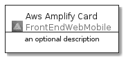

# AwsAmplify


```text
aws-20210131/Architecture/FrontEndWebMobile/AwsAmplify
```

```text
include('aws-20210131/Architecture/FrontEndWebMobile/AwsAmplify')
```


| Illustration | AwsAmplify | AwsAmplifyCard | AwsAmplifyGroup |
| :---: | :---: | :---: | :---: |
|  |  |  |  |


## AwsAmplify

### Load remotely
```plantuml
@startuml
' configures the library
!global $LIB_BASE_LOCATION="https://github.com/tmorin/plantuml-libs/distribution"

' loads the library's bootstrap
!include $LIB_BASE_LOCATION/bootstrap.puml

' loads the package bootstrap
include('aws-20210131/bootstrap')

' loads the Item which embeds the element AwsAmplify
include('aws-20210131/Architecture/FrontEndWebMobile/AwsAmplify')

' renders the element
AwsAmplify('AwsAmplify', 'Aws Amplify', 'an optional tech label')
@enduml
```

### Load locally
```plantuml
@startuml
' configures the library
!global $INCLUSION_MODE="local"
!global $LIB_BASE_LOCATION="../../.."

' loads the library's bootstrap
!include $LIB_BASE_LOCATION/bootstrap.puml

' loads the package bootstrap
include('aws-20210131/bootstrap')

' loads the Item which embeds the element AwsAmplify
include('aws-20210131/Architecture/FrontEndWebMobile/AwsAmplify')

' renders the element
AwsAmplify('AwsAmplify', 'Aws Amplify', 'an optional tech label')
@enduml
```

## AwsAmplifyCard

### Load remotely
```plantuml
@startuml
' configures the library
!global $LIB_BASE_LOCATION="https://github.com/tmorin/plantuml-libs/distribution"

' loads the library's bootstrap
!include $LIB_BASE_LOCATION/bootstrap.puml

' loads the package bootstrap
include('aws-20210131/bootstrap')

' loads the Item which embeds the element AwsAmplifyCard
include('aws-20210131/Architecture/FrontEndWebMobile/AwsAmplify')

' renders the element
AwsAmplifyCard('AwsAmplifyCard', 'Aws Amplify Card', 'an optional description')
@enduml
```

### Load locally
```plantuml
@startuml
' configures the library
!global $INCLUSION_MODE="local"
!global $LIB_BASE_LOCATION="../../.."

' loads the library's bootstrap
!include $LIB_BASE_LOCATION/bootstrap.puml

' loads the package bootstrap
include('aws-20210131/bootstrap')

' loads the Item which embeds the element AwsAmplifyCard
include('aws-20210131/Architecture/FrontEndWebMobile/AwsAmplify')

' renders the element
AwsAmplifyCard('AwsAmplifyCard', 'Aws Amplify Card', 'an optional description')
@enduml
```

## AwsAmplifyGroup

### Load remotely
```plantuml
@startuml
' configures the library
!global $LIB_BASE_LOCATION="https://github.com/tmorin/plantuml-libs/distribution"

' loads the library's bootstrap
!include $LIB_BASE_LOCATION/bootstrap.puml

' loads the package bootstrap
include('aws-20210131/bootstrap')

' loads the Item which embeds the element AwsAmplifyGroup
include('aws-20210131/Architecture/FrontEndWebMobile/AwsAmplify')

' renders the element
AwsAmplifyGroup('AwsAmplifyGroup', 'Aws Amplify Group', 'an optional tech label') {
    note as note
        the content of the group
    end note
}
@enduml
```

### Load locally
```plantuml
@startuml
' configures the library
!global $INCLUSION_MODE="local"
!global $LIB_BASE_LOCATION="../../.."

' loads the library's bootstrap
!include $LIB_BASE_LOCATION/bootstrap.puml

' loads the package bootstrap
include('aws-20210131/bootstrap')

' loads the Item which embeds the element AwsAmplifyGroup
include('aws-20210131/Architecture/FrontEndWebMobile/AwsAmplify')

' renders the element
AwsAmplifyGroup('AwsAmplifyGroup', 'Aws Amplify Group', 'an optional tech label') {
    note as note
        the content of the group
    end note
}
@enduml
```

