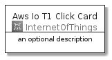
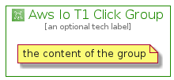

# AwsIoT1Click


```text
aws-20210131/Architecture/InternetOfThings/AwsIoT1Click
```

```text
include('aws-20210131/Architecture/InternetOfThings/AwsIoT1Click')
```


| Illustration | AwsIoT1Click | AwsIoT1ClickCard | AwsIoT1ClickGroup |
| :---: | :---: | :---: | :---: |
|  |  |  |  |


## AwsIoT1Click

### Load remotely
```plantuml
@startuml
' configures the library
!global $LIB_BASE_LOCATION="https://github.com/tmorin/plantuml-libs/distribution"

' loads the library's bootstrap
!include $LIB_BASE_LOCATION/bootstrap.puml

' loads the package bootstrap
include('aws-20210131/bootstrap')

' loads the Item which embeds the element AwsIoT1Click
include('aws-20210131/Architecture/InternetOfThings/AwsIoT1Click')

' renders the element
AwsIoT1Click('AwsIoT1Click', 'Aws Io T1 Click', 'an optional tech label')
@enduml
```

### Load locally
```plantuml
@startuml
' configures the library
!global $INCLUSION_MODE="local"
!global $LIB_BASE_LOCATION="../../.."

' loads the library's bootstrap
!include $LIB_BASE_LOCATION/bootstrap.puml

' loads the package bootstrap
include('aws-20210131/bootstrap')

' loads the Item which embeds the element AwsIoT1Click
include('aws-20210131/Architecture/InternetOfThings/AwsIoT1Click')

' renders the element
AwsIoT1Click('AwsIoT1Click', 'Aws Io T1 Click', 'an optional tech label')
@enduml
```

## AwsIoT1ClickCard

### Load remotely
```plantuml
@startuml
' configures the library
!global $LIB_BASE_LOCATION="https://github.com/tmorin/plantuml-libs/distribution"

' loads the library's bootstrap
!include $LIB_BASE_LOCATION/bootstrap.puml

' loads the package bootstrap
include('aws-20210131/bootstrap')

' loads the Item which embeds the element AwsIoT1ClickCard
include('aws-20210131/Architecture/InternetOfThings/AwsIoT1Click')

' renders the element
AwsIoT1ClickCard('AwsIoT1ClickCard', 'Aws Io T1 Click Card', 'an optional description')
@enduml
```

### Load locally
```plantuml
@startuml
' configures the library
!global $INCLUSION_MODE="local"
!global $LIB_BASE_LOCATION="../../.."

' loads the library's bootstrap
!include $LIB_BASE_LOCATION/bootstrap.puml

' loads the package bootstrap
include('aws-20210131/bootstrap')

' loads the Item which embeds the element AwsIoT1ClickCard
include('aws-20210131/Architecture/InternetOfThings/AwsIoT1Click')

' renders the element
AwsIoT1ClickCard('AwsIoT1ClickCard', 'Aws Io T1 Click Card', 'an optional description')
@enduml
```

## AwsIoT1ClickGroup

### Load remotely
```plantuml
@startuml
' configures the library
!global $LIB_BASE_LOCATION="https://github.com/tmorin/plantuml-libs/distribution"

' loads the library's bootstrap
!include $LIB_BASE_LOCATION/bootstrap.puml

' loads the package bootstrap
include('aws-20210131/bootstrap')

' loads the Item which embeds the element AwsIoT1ClickGroup
include('aws-20210131/Architecture/InternetOfThings/AwsIoT1Click')

' renders the element
AwsIoT1ClickGroup('AwsIoT1ClickGroup', 'Aws Io T1 Click Group', 'an optional tech label') {
    note as note
        the content of the group
    end note
}
@enduml
```

### Load locally
```plantuml
@startuml
' configures the library
!global $INCLUSION_MODE="local"
!global $LIB_BASE_LOCATION="../../.."

' loads the library's bootstrap
!include $LIB_BASE_LOCATION/bootstrap.puml

' loads the package bootstrap
include('aws-20210131/bootstrap')

' loads the Item which embeds the element AwsIoT1ClickGroup
include('aws-20210131/Architecture/InternetOfThings/AwsIoT1Click')

' renders the element
AwsIoT1ClickGroup('AwsIoT1ClickGroup', 'Aws Io T1 Click Group', 'an optional tech label') {
    note as note
        the content of the group
    end note
}
@enduml
```

