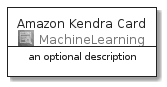
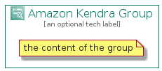

# AmazonKendra


```text
aws-20210131/Architecture/MachineLearning/AmazonKendra
```

```text
include('aws-20210131/Architecture/MachineLearning/AmazonKendra')
```


| Illustration | AmazonKendra | AmazonKendraCard | AmazonKendraGroup |
| :---: | :---: | :---: | :---: |
|  |  |  |  |


## AmazonKendra

### Load remotely
```plantuml
@startuml
' configures the library
!global $LIB_BASE_LOCATION="https://github.com/tmorin/plantuml-libs/distribution"

' loads the library's bootstrap
!include $LIB_BASE_LOCATION/bootstrap.puml

' loads the package bootstrap
include('aws-20210131/bootstrap')

' loads the Item which embeds the element AmazonKendra
include('aws-20210131/Architecture/MachineLearning/AmazonKendra')

' renders the element
AmazonKendra('AmazonKendra', 'Amazon Kendra', 'an optional tech label')
@enduml
```

### Load locally
```plantuml
@startuml
' configures the library
!global $INCLUSION_MODE="local"
!global $LIB_BASE_LOCATION="../../.."

' loads the library's bootstrap
!include $LIB_BASE_LOCATION/bootstrap.puml

' loads the package bootstrap
include('aws-20210131/bootstrap')

' loads the Item which embeds the element AmazonKendra
include('aws-20210131/Architecture/MachineLearning/AmazonKendra')

' renders the element
AmazonKendra('AmazonKendra', 'Amazon Kendra', 'an optional tech label')
@enduml
```

## AmazonKendraCard

### Load remotely
```plantuml
@startuml
' configures the library
!global $LIB_BASE_LOCATION="https://github.com/tmorin/plantuml-libs/distribution"

' loads the library's bootstrap
!include $LIB_BASE_LOCATION/bootstrap.puml

' loads the package bootstrap
include('aws-20210131/bootstrap')

' loads the Item which embeds the element AmazonKendraCard
include('aws-20210131/Architecture/MachineLearning/AmazonKendra')

' renders the element
AmazonKendraCard('AmazonKendraCard', 'Amazon Kendra Card', 'an optional description')
@enduml
```

### Load locally
```plantuml
@startuml
' configures the library
!global $INCLUSION_MODE="local"
!global $LIB_BASE_LOCATION="../../.."

' loads the library's bootstrap
!include $LIB_BASE_LOCATION/bootstrap.puml

' loads the package bootstrap
include('aws-20210131/bootstrap')

' loads the Item which embeds the element AmazonKendraCard
include('aws-20210131/Architecture/MachineLearning/AmazonKendra')

' renders the element
AmazonKendraCard('AmazonKendraCard', 'Amazon Kendra Card', 'an optional description')
@enduml
```

## AmazonKendraGroup

### Load remotely
```plantuml
@startuml
' configures the library
!global $LIB_BASE_LOCATION="https://github.com/tmorin/plantuml-libs/distribution"

' loads the library's bootstrap
!include $LIB_BASE_LOCATION/bootstrap.puml

' loads the package bootstrap
include('aws-20210131/bootstrap')

' loads the Item which embeds the element AmazonKendraGroup
include('aws-20210131/Architecture/MachineLearning/AmazonKendra')

' renders the element
AmazonKendraGroup('AmazonKendraGroup', 'Amazon Kendra Group', 'an optional tech label') {
    note as note
        the content of the group
    end note
}
@enduml
```

### Load locally
```plantuml
@startuml
' configures the library
!global $INCLUSION_MODE="local"
!global $LIB_BASE_LOCATION="../../.."

' loads the library's bootstrap
!include $LIB_BASE_LOCATION/bootstrap.puml

' loads the package bootstrap
include('aws-20210131/bootstrap')

' loads the Item which embeds the element AmazonKendraGroup
include('aws-20210131/Architecture/MachineLearning/AmazonKendra')

' renders the element
AmazonKendraGroup('AmazonKendraGroup', 'Amazon Kendra Group', 'an optional tech label') {
    note as note
        the content of the group
    end note
}
@enduml
```

