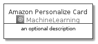
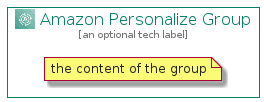

# AmazonPersonalize


```text
aws-20210131/Architecture/MachineLearning/AmazonPersonalize
```

```text
include('aws-20210131/Architecture/MachineLearning/AmazonPersonalize')
```


| Illustration | AmazonPersonalize | AmazonPersonalizeCard | AmazonPersonalizeGroup |
| :---: | :---: | :---: | :---: |
|  |  |  |  |


## AmazonPersonalize

### Load remotely
```plantuml
@startuml
' configures the library
!global $LIB_BASE_LOCATION="https://github.com/tmorin/plantuml-libs/distribution"

' loads the library's bootstrap
!include $LIB_BASE_LOCATION/bootstrap.puml

' loads the package bootstrap
include('aws-20210131/bootstrap')

' loads the Item which embeds the element AmazonPersonalize
include('aws-20210131/Architecture/MachineLearning/AmazonPersonalize')

' renders the element
AmazonPersonalize('AmazonPersonalize', 'Amazon Personalize', 'an optional tech label')
@enduml
```

### Load locally
```plantuml
@startuml
' configures the library
!global $INCLUSION_MODE="local"
!global $LIB_BASE_LOCATION="../../.."

' loads the library's bootstrap
!include $LIB_BASE_LOCATION/bootstrap.puml

' loads the package bootstrap
include('aws-20210131/bootstrap')

' loads the Item which embeds the element AmazonPersonalize
include('aws-20210131/Architecture/MachineLearning/AmazonPersonalize')

' renders the element
AmazonPersonalize('AmazonPersonalize', 'Amazon Personalize', 'an optional tech label')
@enduml
```

## AmazonPersonalizeCard

### Load remotely
```plantuml
@startuml
' configures the library
!global $LIB_BASE_LOCATION="https://github.com/tmorin/plantuml-libs/distribution"

' loads the library's bootstrap
!include $LIB_BASE_LOCATION/bootstrap.puml

' loads the package bootstrap
include('aws-20210131/bootstrap')

' loads the Item which embeds the element AmazonPersonalizeCard
include('aws-20210131/Architecture/MachineLearning/AmazonPersonalize')

' renders the element
AmazonPersonalizeCard('AmazonPersonalizeCard', 'Amazon Personalize Card', 'an optional description')
@enduml
```

### Load locally
```plantuml
@startuml
' configures the library
!global $INCLUSION_MODE="local"
!global $LIB_BASE_LOCATION="../../.."

' loads the library's bootstrap
!include $LIB_BASE_LOCATION/bootstrap.puml

' loads the package bootstrap
include('aws-20210131/bootstrap')

' loads the Item which embeds the element AmazonPersonalizeCard
include('aws-20210131/Architecture/MachineLearning/AmazonPersonalize')

' renders the element
AmazonPersonalizeCard('AmazonPersonalizeCard', 'Amazon Personalize Card', 'an optional description')
@enduml
```

## AmazonPersonalizeGroup

### Load remotely
```plantuml
@startuml
' configures the library
!global $LIB_BASE_LOCATION="https://github.com/tmorin/plantuml-libs/distribution"

' loads the library's bootstrap
!include $LIB_BASE_LOCATION/bootstrap.puml

' loads the package bootstrap
include('aws-20210131/bootstrap')

' loads the Item which embeds the element AmazonPersonalizeGroup
include('aws-20210131/Architecture/MachineLearning/AmazonPersonalize')

' renders the element
AmazonPersonalizeGroup('AmazonPersonalizeGroup', 'Amazon Personalize Group', 'an optional tech label') {
    note as note
        the content of the group
    end note
}
@enduml
```

### Load locally
```plantuml
@startuml
' configures the library
!global $INCLUSION_MODE="local"
!global $LIB_BASE_LOCATION="../../.."

' loads the library's bootstrap
!include $LIB_BASE_LOCATION/bootstrap.puml

' loads the package bootstrap
include('aws-20210131/bootstrap')

' loads the Item which embeds the element AmazonPersonalizeGroup
include('aws-20210131/Architecture/MachineLearning/AmazonPersonalize')

' renders the element
AmazonPersonalizeGroup('AmazonPersonalizeGroup', 'Amazon Personalize Group', 'an optional tech label') {
    note as note
        the content of the group
    end note
}
@enduml
```

