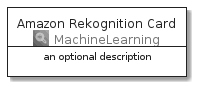
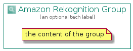

# AmazonRekognition


```text
aws-20210131/Architecture/MachineLearning/AmazonRekognition
```

```text
include('aws-20210131/Architecture/MachineLearning/AmazonRekognition')
```


| Illustration | AmazonRekognition | AmazonRekognitionCard | AmazonRekognitionGroup |
| :---: | :---: | :---: | :---: |
|  |  |  |  |


## AmazonRekognition

### Load remotely
```plantuml
@startuml
' configures the library
!global $LIB_BASE_LOCATION="https://github.com/tmorin/plantuml-libs/distribution"

' loads the library's bootstrap
!include $LIB_BASE_LOCATION/bootstrap.puml

' loads the package bootstrap
include('aws-20210131/bootstrap')

' loads the Item which embeds the element AmazonRekognition
include('aws-20210131/Architecture/MachineLearning/AmazonRekognition')

' renders the element
AmazonRekognition('AmazonRekognition', 'Amazon Rekognition', 'an optional tech label')
@enduml
```

### Load locally
```plantuml
@startuml
' configures the library
!global $INCLUSION_MODE="local"
!global $LIB_BASE_LOCATION="../../.."

' loads the library's bootstrap
!include $LIB_BASE_LOCATION/bootstrap.puml

' loads the package bootstrap
include('aws-20210131/bootstrap')

' loads the Item which embeds the element AmazonRekognition
include('aws-20210131/Architecture/MachineLearning/AmazonRekognition')

' renders the element
AmazonRekognition('AmazonRekognition', 'Amazon Rekognition', 'an optional tech label')
@enduml
```

## AmazonRekognitionCard

### Load remotely
```plantuml
@startuml
' configures the library
!global $LIB_BASE_LOCATION="https://github.com/tmorin/plantuml-libs/distribution"

' loads the library's bootstrap
!include $LIB_BASE_LOCATION/bootstrap.puml

' loads the package bootstrap
include('aws-20210131/bootstrap')

' loads the Item which embeds the element AmazonRekognitionCard
include('aws-20210131/Architecture/MachineLearning/AmazonRekognition')

' renders the element
AmazonRekognitionCard('AmazonRekognitionCard', 'Amazon Rekognition Card', 'an optional description')
@enduml
```

### Load locally
```plantuml
@startuml
' configures the library
!global $INCLUSION_MODE="local"
!global $LIB_BASE_LOCATION="../../.."

' loads the library's bootstrap
!include $LIB_BASE_LOCATION/bootstrap.puml

' loads the package bootstrap
include('aws-20210131/bootstrap')

' loads the Item which embeds the element AmazonRekognitionCard
include('aws-20210131/Architecture/MachineLearning/AmazonRekognition')

' renders the element
AmazonRekognitionCard('AmazonRekognitionCard', 'Amazon Rekognition Card', 'an optional description')
@enduml
```

## AmazonRekognitionGroup

### Load remotely
```plantuml
@startuml
' configures the library
!global $LIB_BASE_LOCATION="https://github.com/tmorin/plantuml-libs/distribution"

' loads the library's bootstrap
!include $LIB_BASE_LOCATION/bootstrap.puml

' loads the package bootstrap
include('aws-20210131/bootstrap')

' loads the Item which embeds the element AmazonRekognitionGroup
include('aws-20210131/Architecture/MachineLearning/AmazonRekognition')

' renders the element
AmazonRekognitionGroup('AmazonRekognitionGroup', 'Amazon Rekognition Group', 'an optional tech label') {
    note as note
        the content of the group
    end note
}
@enduml
```

### Load locally
```plantuml
@startuml
' configures the library
!global $INCLUSION_MODE="local"
!global $LIB_BASE_LOCATION="../../.."

' loads the library's bootstrap
!include $LIB_BASE_LOCATION/bootstrap.puml

' loads the package bootstrap
include('aws-20210131/bootstrap')

' loads the Item which embeds the element AmazonRekognitionGroup
include('aws-20210131/Architecture/MachineLearning/AmazonRekognition')

' renders the element
AmazonRekognitionGroup('AmazonRekognitionGroup', 'Amazon Rekognition Group', 'an optional tech label') {
    note as note
        the content of the group
    end note
}
@enduml
```

