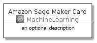
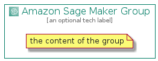

# AmazonSageMaker


```text
aws-20210131/Architecture/MachineLearning/AmazonSageMaker
```

```text
include('aws-20210131/Architecture/MachineLearning/AmazonSageMaker')
```


| Illustration | AmazonSageMaker | AmazonSageMakerCard | AmazonSageMakerGroup |
| :---: | :---: | :---: | :---: |
|  |  |  |  |


## AmazonSageMaker

### Load remotely
```plantuml
@startuml
' configures the library
!global $LIB_BASE_LOCATION="https://github.com/tmorin/plantuml-libs/distribution"

' loads the library's bootstrap
!include $LIB_BASE_LOCATION/bootstrap.puml

' loads the package bootstrap
include('aws-20210131/bootstrap')

' loads the Item which embeds the element AmazonSageMaker
include('aws-20210131/Architecture/MachineLearning/AmazonSageMaker')

' renders the element
AmazonSageMaker('AmazonSageMaker', 'Amazon Sage Maker', 'an optional tech label')
@enduml
```

### Load locally
```plantuml
@startuml
' configures the library
!global $INCLUSION_MODE="local"
!global $LIB_BASE_LOCATION="../../.."

' loads the library's bootstrap
!include $LIB_BASE_LOCATION/bootstrap.puml

' loads the package bootstrap
include('aws-20210131/bootstrap')

' loads the Item which embeds the element AmazonSageMaker
include('aws-20210131/Architecture/MachineLearning/AmazonSageMaker')

' renders the element
AmazonSageMaker('AmazonSageMaker', 'Amazon Sage Maker', 'an optional tech label')
@enduml
```

## AmazonSageMakerCard

### Load remotely
```plantuml
@startuml
' configures the library
!global $LIB_BASE_LOCATION="https://github.com/tmorin/plantuml-libs/distribution"

' loads the library's bootstrap
!include $LIB_BASE_LOCATION/bootstrap.puml

' loads the package bootstrap
include('aws-20210131/bootstrap')

' loads the Item which embeds the element AmazonSageMakerCard
include('aws-20210131/Architecture/MachineLearning/AmazonSageMaker')

' renders the element
AmazonSageMakerCard('AmazonSageMakerCard', 'Amazon Sage Maker Card', 'an optional description')
@enduml
```

### Load locally
```plantuml
@startuml
' configures the library
!global $INCLUSION_MODE="local"
!global $LIB_BASE_LOCATION="../../.."

' loads the library's bootstrap
!include $LIB_BASE_LOCATION/bootstrap.puml

' loads the package bootstrap
include('aws-20210131/bootstrap')

' loads the Item which embeds the element AmazonSageMakerCard
include('aws-20210131/Architecture/MachineLearning/AmazonSageMaker')

' renders the element
AmazonSageMakerCard('AmazonSageMakerCard', 'Amazon Sage Maker Card', 'an optional description')
@enduml
```

## AmazonSageMakerGroup

### Load remotely
```plantuml
@startuml
' configures the library
!global $LIB_BASE_LOCATION="https://github.com/tmorin/plantuml-libs/distribution"

' loads the library's bootstrap
!include $LIB_BASE_LOCATION/bootstrap.puml

' loads the package bootstrap
include('aws-20210131/bootstrap')

' loads the Item which embeds the element AmazonSageMakerGroup
include('aws-20210131/Architecture/MachineLearning/AmazonSageMaker')

' renders the element
AmazonSageMakerGroup('AmazonSageMakerGroup', 'Amazon Sage Maker Group', 'an optional tech label') {
    note as note
        the content of the group
    end note
}
@enduml
```

### Load locally
```plantuml
@startuml
' configures the library
!global $INCLUSION_MODE="local"
!global $LIB_BASE_LOCATION="../../.."

' loads the library's bootstrap
!include $LIB_BASE_LOCATION/bootstrap.puml

' loads the package bootstrap
include('aws-20210131/bootstrap')

' loads the Item which embeds the element AmazonSageMakerGroup
include('aws-20210131/Architecture/MachineLearning/AmazonSageMaker')

' renders the element
AmazonSageMakerGroup('AmazonSageMakerGroup', 'Amazon Sage Maker Group', 'an optional tech label') {
    note as note
        the content of the group
    end note
}
@enduml
```

