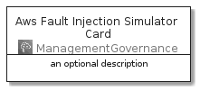
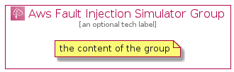

# AwsFaultInjectionSimulator


```text
aws-20210131/Architecture/ManagementGovernance/AwsFaultInjectionSimulator
```

```text
include('aws-20210131/Architecture/ManagementGovernance/AwsFaultInjectionSimulator')
```


| Illustration | AwsFaultInjectionSimulator | AwsFaultInjectionSimulatorCard | AwsFaultInjectionSimulatorGroup |
| :---: | :---: | :---: | :---: |
|  |  |  |  |


## AwsFaultInjectionSimulator

### Load remotely
```plantuml
@startuml
' configures the library
!global $LIB_BASE_LOCATION="https://github.com/tmorin/plantuml-libs/distribution"

' loads the library's bootstrap
!include $LIB_BASE_LOCATION/bootstrap.puml

' loads the package bootstrap
include('aws-20210131/bootstrap')

' loads the Item which embeds the element AwsFaultInjectionSimulator
include('aws-20210131/Architecture/ManagementGovernance/AwsFaultInjectionSimulator')

' renders the element
AwsFaultInjectionSimulator('AwsFaultInjectionSimulator', 'Aws Fault Injection Simulator', 'an optional tech label')
@enduml
```

### Load locally
```plantuml
@startuml
' configures the library
!global $INCLUSION_MODE="local"
!global $LIB_BASE_LOCATION="../../.."

' loads the library's bootstrap
!include $LIB_BASE_LOCATION/bootstrap.puml

' loads the package bootstrap
include('aws-20210131/bootstrap')

' loads the Item which embeds the element AwsFaultInjectionSimulator
include('aws-20210131/Architecture/ManagementGovernance/AwsFaultInjectionSimulator')

' renders the element
AwsFaultInjectionSimulator('AwsFaultInjectionSimulator', 'Aws Fault Injection Simulator', 'an optional tech label')
@enduml
```

## AwsFaultInjectionSimulatorCard

### Load remotely
```plantuml
@startuml
' configures the library
!global $LIB_BASE_LOCATION="https://github.com/tmorin/plantuml-libs/distribution"

' loads the library's bootstrap
!include $LIB_BASE_LOCATION/bootstrap.puml

' loads the package bootstrap
include('aws-20210131/bootstrap')

' loads the Item which embeds the element AwsFaultInjectionSimulatorCard
include('aws-20210131/Architecture/ManagementGovernance/AwsFaultInjectionSimulator')

' renders the element
AwsFaultInjectionSimulatorCard('AwsFaultInjectionSimulatorCard', 'Aws Fault Injection Simulator Card', 'an optional description')
@enduml
```

### Load locally
```plantuml
@startuml
' configures the library
!global $INCLUSION_MODE="local"
!global $LIB_BASE_LOCATION="../../.."

' loads the library's bootstrap
!include $LIB_BASE_LOCATION/bootstrap.puml

' loads the package bootstrap
include('aws-20210131/bootstrap')

' loads the Item which embeds the element AwsFaultInjectionSimulatorCard
include('aws-20210131/Architecture/ManagementGovernance/AwsFaultInjectionSimulator')

' renders the element
AwsFaultInjectionSimulatorCard('AwsFaultInjectionSimulatorCard', 'Aws Fault Injection Simulator Card', 'an optional description')
@enduml
```

## AwsFaultInjectionSimulatorGroup

### Load remotely
```plantuml
@startuml
' configures the library
!global $LIB_BASE_LOCATION="https://github.com/tmorin/plantuml-libs/distribution"

' loads the library's bootstrap
!include $LIB_BASE_LOCATION/bootstrap.puml

' loads the package bootstrap
include('aws-20210131/bootstrap')

' loads the Item which embeds the element AwsFaultInjectionSimulatorGroup
include('aws-20210131/Architecture/ManagementGovernance/AwsFaultInjectionSimulator')

' renders the element
AwsFaultInjectionSimulatorGroup('AwsFaultInjectionSimulatorGroup', 'Aws Fault Injection Simulator Group', 'an optional tech label') {
    note as note
        the content of the group
    end note
}
@enduml
```

### Load locally
```plantuml
@startuml
' configures the library
!global $INCLUSION_MODE="local"
!global $LIB_BASE_LOCATION="../../.."

' loads the library's bootstrap
!include $LIB_BASE_LOCATION/bootstrap.puml

' loads the package bootstrap
include('aws-20210131/bootstrap')

' loads the Item which embeds the element AwsFaultInjectionSimulatorGroup
include('aws-20210131/Architecture/ManagementGovernance/AwsFaultInjectionSimulator')

' renders the element
AwsFaultInjectionSimulatorGroup('AwsFaultInjectionSimulatorGroup', 'Aws Fault Injection Simulator Group', 'an optional tech label') {
    note as note
        the content of the group
    end note
}
@enduml
```

