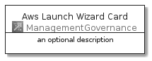
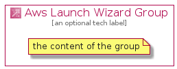

# AwsLaunchWizard


```text
aws-20210131/Architecture/ManagementGovernance/AwsLaunchWizard
```

```text
include('aws-20210131/Architecture/ManagementGovernance/AwsLaunchWizard')
```


| Illustration | AwsLaunchWizard | AwsLaunchWizardCard | AwsLaunchWizardGroup |
| :---: | :---: | :---: | :---: |
|  |  |  |  |


## AwsLaunchWizard

### Load remotely
```plantuml
@startuml
' configures the library
!global $LIB_BASE_LOCATION="https://github.com/tmorin/plantuml-libs/distribution"

' loads the library's bootstrap
!include $LIB_BASE_LOCATION/bootstrap.puml

' loads the package bootstrap
include('aws-20210131/bootstrap')

' loads the Item which embeds the element AwsLaunchWizard
include('aws-20210131/Architecture/ManagementGovernance/AwsLaunchWizard')

' renders the element
AwsLaunchWizard('AwsLaunchWizard', 'Aws Launch Wizard', 'an optional tech label')
@enduml
```

### Load locally
```plantuml
@startuml
' configures the library
!global $INCLUSION_MODE="local"
!global $LIB_BASE_LOCATION="../../.."

' loads the library's bootstrap
!include $LIB_BASE_LOCATION/bootstrap.puml

' loads the package bootstrap
include('aws-20210131/bootstrap')

' loads the Item which embeds the element AwsLaunchWizard
include('aws-20210131/Architecture/ManagementGovernance/AwsLaunchWizard')

' renders the element
AwsLaunchWizard('AwsLaunchWizard', 'Aws Launch Wizard', 'an optional tech label')
@enduml
```

## AwsLaunchWizardCard

### Load remotely
```plantuml
@startuml
' configures the library
!global $LIB_BASE_LOCATION="https://github.com/tmorin/plantuml-libs/distribution"

' loads the library's bootstrap
!include $LIB_BASE_LOCATION/bootstrap.puml

' loads the package bootstrap
include('aws-20210131/bootstrap')

' loads the Item which embeds the element AwsLaunchWizardCard
include('aws-20210131/Architecture/ManagementGovernance/AwsLaunchWizard')

' renders the element
AwsLaunchWizardCard('AwsLaunchWizardCard', 'Aws Launch Wizard Card', 'an optional description')
@enduml
```

### Load locally
```plantuml
@startuml
' configures the library
!global $INCLUSION_MODE="local"
!global $LIB_BASE_LOCATION="../../.."

' loads the library's bootstrap
!include $LIB_BASE_LOCATION/bootstrap.puml

' loads the package bootstrap
include('aws-20210131/bootstrap')

' loads the Item which embeds the element AwsLaunchWizardCard
include('aws-20210131/Architecture/ManagementGovernance/AwsLaunchWizard')

' renders the element
AwsLaunchWizardCard('AwsLaunchWizardCard', 'Aws Launch Wizard Card', 'an optional description')
@enduml
```

## AwsLaunchWizardGroup

### Load remotely
```plantuml
@startuml
' configures the library
!global $LIB_BASE_LOCATION="https://github.com/tmorin/plantuml-libs/distribution"

' loads the library's bootstrap
!include $LIB_BASE_LOCATION/bootstrap.puml

' loads the package bootstrap
include('aws-20210131/bootstrap')

' loads the Item which embeds the element AwsLaunchWizardGroup
include('aws-20210131/Architecture/ManagementGovernance/AwsLaunchWizard')

' renders the element
AwsLaunchWizardGroup('AwsLaunchWizardGroup', 'Aws Launch Wizard Group', 'an optional tech label') {
    note as note
        the content of the group
    end note
}
@enduml
```

### Load locally
```plantuml
@startuml
' configures the library
!global $INCLUSION_MODE="local"
!global $LIB_BASE_LOCATION="../../.."

' loads the library's bootstrap
!include $LIB_BASE_LOCATION/bootstrap.puml

' loads the package bootstrap
include('aws-20210131/bootstrap')

' loads the Item which embeds the element AwsLaunchWizardGroup
include('aws-20210131/Architecture/ManagementGovernance/AwsLaunchWizard')

' renders the element
AwsLaunchWizardGroup('AwsLaunchWizardGroup', 'Aws Launch Wizard Group', 'an optional tech label') {
    note as note
        the content of the group
    end note
}
@enduml
```

