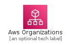
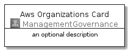
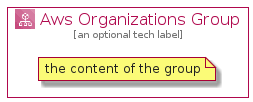

# AwsOrganizations


```text
aws-20210131/Architecture/ManagementGovernance/AwsOrganizations
```

```text
include('aws-20210131/Architecture/ManagementGovernance/AwsOrganizations')
```


| Illustration | AwsOrganizations | AwsOrganizationsCard | AwsOrganizationsGroup |
| :---: | :---: | :---: | :---: |
|  |  |  |  |


## AwsOrganizations

### Load remotely
```plantuml
@startuml
' configures the library
!global $LIB_BASE_LOCATION="https://github.com/tmorin/plantuml-libs/distribution"

' loads the library's bootstrap
!include $LIB_BASE_LOCATION/bootstrap.puml

' loads the package bootstrap
include('aws-20210131/bootstrap')

' loads the Item which embeds the element AwsOrganizations
include('aws-20210131/Architecture/ManagementGovernance/AwsOrganizations')

' renders the element
AwsOrganizations('AwsOrganizations', 'Aws Organizations', 'an optional tech label')
@enduml
```

### Load locally
```plantuml
@startuml
' configures the library
!global $INCLUSION_MODE="local"
!global $LIB_BASE_LOCATION="../../.."

' loads the library's bootstrap
!include $LIB_BASE_LOCATION/bootstrap.puml

' loads the package bootstrap
include('aws-20210131/bootstrap')

' loads the Item which embeds the element AwsOrganizations
include('aws-20210131/Architecture/ManagementGovernance/AwsOrganizations')

' renders the element
AwsOrganizations('AwsOrganizations', 'Aws Organizations', 'an optional tech label')
@enduml
```

## AwsOrganizationsCard

### Load remotely
```plantuml
@startuml
' configures the library
!global $LIB_BASE_LOCATION="https://github.com/tmorin/plantuml-libs/distribution"

' loads the library's bootstrap
!include $LIB_BASE_LOCATION/bootstrap.puml

' loads the package bootstrap
include('aws-20210131/bootstrap')

' loads the Item which embeds the element AwsOrganizationsCard
include('aws-20210131/Architecture/ManagementGovernance/AwsOrganizations')

' renders the element
AwsOrganizationsCard('AwsOrganizationsCard', 'Aws Organizations Card', 'an optional description')
@enduml
```

### Load locally
```plantuml
@startuml
' configures the library
!global $INCLUSION_MODE="local"
!global $LIB_BASE_LOCATION="../../.."

' loads the library's bootstrap
!include $LIB_BASE_LOCATION/bootstrap.puml

' loads the package bootstrap
include('aws-20210131/bootstrap')

' loads the Item which embeds the element AwsOrganizationsCard
include('aws-20210131/Architecture/ManagementGovernance/AwsOrganizations')

' renders the element
AwsOrganizationsCard('AwsOrganizationsCard', 'Aws Organizations Card', 'an optional description')
@enduml
```

## AwsOrganizationsGroup

### Load remotely
```plantuml
@startuml
' configures the library
!global $LIB_BASE_LOCATION="https://github.com/tmorin/plantuml-libs/distribution"

' loads the library's bootstrap
!include $LIB_BASE_LOCATION/bootstrap.puml

' loads the package bootstrap
include('aws-20210131/bootstrap')

' loads the Item which embeds the element AwsOrganizationsGroup
include('aws-20210131/Architecture/ManagementGovernance/AwsOrganizations')

' renders the element
AwsOrganizationsGroup('AwsOrganizationsGroup', 'Aws Organizations Group', 'an optional tech label') {
    note as note
        the content of the group
    end note
}
@enduml
```

### Load locally
```plantuml
@startuml
' configures the library
!global $INCLUSION_MODE="local"
!global $LIB_BASE_LOCATION="../../.."

' loads the library's bootstrap
!include $LIB_BASE_LOCATION/bootstrap.puml

' loads the package bootstrap
include('aws-20210131/bootstrap')

' loads the Item which embeds the element AwsOrganizationsGroup
include('aws-20210131/Architecture/ManagementGovernance/AwsOrganizations')

' renders the element
AwsOrganizationsGroup('AwsOrganizationsGroup', 'Aws Organizations Group', 'an optional tech label') {
    note as note
        the content of the group
    end note
}
@enduml
```

