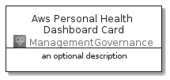
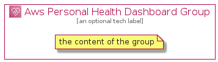

# AwsPersonalHealthDashboard


```text
aws-20210131/Architecture/ManagementGovernance/AwsPersonalHealthDashboard
```

```text
include('aws-20210131/Architecture/ManagementGovernance/AwsPersonalHealthDashboard')
```


| Illustration | AwsPersonalHealthDashboard | AwsPersonalHealthDashboardCard | AwsPersonalHealthDashboardGroup |
| :---: | :---: | :---: | :---: |
|  |  |  |  |


## AwsPersonalHealthDashboard

### Load remotely
```plantuml
@startuml
' configures the library
!global $LIB_BASE_LOCATION="https://github.com/tmorin/plantuml-libs/distribution"

' loads the library's bootstrap
!include $LIB_BASE_LOCATION/bootstrap.puml

' loads the package bootstrap
include('aws-20210131/bootstrap')

' loads the Item which embeds the element AwsPersonalHealthDashboard
include('aws-20210131/Architecture/ManagementGovernance/AwsPersonalHealthDashboard')

' renders the element
AwsPersonalHealthDashboard('AwsPersonalHealthDashboard', 'Aws Personal Health Dashboard', 'an optional tech label')
@enduml
```

### Load locally
```plantuml
@startuml
' configures the library
!global $INCLUSION_MODE="local"
!global $LIB_BASE_LOCATION="../../.."

' loads the library's bootstrap
!include $LIB_BASE_LOCATION/bootstrap.puml

' loads the package bootstrap
include('aws-20210131/bootstrap')

' loads the Item which embeds the element AwsPersonalHealthDashboard
include('aws-20210131/Architecture/ManagementGovernance/AwsPersonalHealthDashboard')

' renders the element
AwsPersonalHealthDashboard('AwsPersonalHealthDashboard', 'Aws Personal Health Dashboard', 'an optional tech label')
@enduml
```

## AwsPersonalHealthDashboardCard

### Load remotely
```plantuml
@startuml
' configures the library
!global $LIB_BASE_LOCATION="https://github.com/tmorin/plantuml-libs/distribution"

' loads the library's bootstrap
!include $LIB_BASE_LOCATION/bootstrap.puml

' loads the package bootstrap
include('aws-20210131/bootstrap')

' loads the Item which embeds the element AwsPersonalHealthDashboardCard
include('aws-20210131/Architecture/ManagementGovernance/AwsPersonalHealthDashboard')

' renders the element
AwsPersonalHealthDashboardCard('AwsPersonalHealthDashboardCard', 'Aws Personal Health Dashboard Card', 'an optional description')
@enduml
```

### Load locally
```plantuml
@startuml
' configures the library
!global $INCLUSION_MODE="local"
!global $LIB_BASE_LOCATION="../../.."

' loads the library's bootstrap
!include $LIB_BASE_LOCATION/bootstrap.puml

' loads the package bootstrap
include('aws-20210131/bootstrap')

' loads the Item which embeds the element AwsPersonalHealthDashboardCard
include('aws-20210131/Architecture/ManagementGovernance/AwsPersonalHealthDashboard')

' renders the element
AwsPersonalHealthDashboardCard('AwsPersonalHealthDashboardCard', 'Aws Personal Health Dashboard Card', 'an optional description')
@enduml
```

## AwsPersonalHealthDashboardGroup

### Load remotely
```plantuml
@startuml
' configures the library
!global $LIB_BASE_LOCATION="https://github.com/tmorin/plantuml-libs/distribution"

' loads the library's bootstrap
!include $LIB_BASE_LOCATION/bootstrap.puml

' loads the package bootstrap
include('aws-20210131/bootstrap')

' loads the Item which embeds the element AwsPersonalHealthDashboardGroup
include('aws-20210131/Architecture/ManagementGovernance/AwsPersonalHealthDashboard')

' renders the element
AwsPersonalHealthDashboardGroup('AwsPersonalHealthDashboardGroup', 'Aws Personal Health Dashboard Group', 'an optional tech label') {
    note as note
        the content of the group
    end note
}
@enduml
```

### Load locally
```plantuml
@startuml
' configures the library
!global $INCLUSION_MODE="local"
!global $LIB_BASE_LOCATION="../../.."

' loads the library's bootstrap
!include $LIB_BASE_LOCATION/bootstrap.puml

' loads the package bootstrap
include('aws-20210131/bootstrap')

' loads the Item which embeds the element AwsPersonalHealthDashboardGroup
include('aws-20210131/Architecture/ManagementGovernance/AwsPersonalHealthDashboard')

' renders the element
AwsPersonalHealthDashboardGroup('AwsPersonalHealthDashboardGroup', 'Aws Personal Health Dashboard Group', 'an optional tech label') {
    note as note
        the content of the group
    end note
}
@enduml
```

