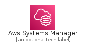
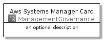
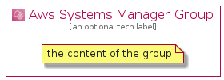

# AwsSystemsManager


```text
aws-20210131/Architecture/ManagementGovernance/AwsSystemsManager
```

```text
include('aws-20210131/Architecture/ManagementGovernance/AwsSystemsManager')
```


| Illustration | AwsSystemsManager | AwsSystemsManagerCard | AwsSystemsManagerGroup |
| :---: | :---: | :---: | :---: |
|  |  |  |  |


## AwsSystemsManager

### Load remotely
```plantuml
@startuml
' configures the library
!global $LIB_BASE_LOCATION="https://github.com/tmorin/plantuml-libs/distribution"

' loads the library's bootstrap
!include $LIB_BASE_LOCATION/bootstrap.puml

' loads the package bootstrap
include('aws-20210131/bootstrap')

' loads the Item which embeds the element AwsSystemsManager
include('aws-20210131/Architecture/ManagementGovernance/AwsSystemsManager')

' renders the element
AwsSystemsManager('AwsSystemsManager', 'Aws Systems Manager', 'an optional tech label')
@enduml
```

### Load locally
```plantuml
@startuml
' configures the library
!global $INCLUSION_MODE="local"
!global $LIB_BASE_LOCATION="../../.."

' loads the library's bootstrap
!include $LIB_BASE_LOCATION/bootstrap.puml

' loads the package bootstrap
include('aws-20210131/bootstrap')

' loads the Item which embeds the element AwsSystemsManager
include('aws-20210131/Architecture/ManagementGovernance/AwsSystemsManager')

' renders the element
AwsSystemsManager('AwsSystemsManager', 'Aws Systems Manager', 'an optional tech label')
@enduml
```

## AwsSystemsManagerCard

### Load remotely
```plantuml
@startuml
' configures the library
!global $LIB_BASE_LOCATION="https://github.com/tmorin/plantuml-libs/distribution"

' loads the library's bootstrap
!include $LIB_BASE_LOCATION/bootstrap.puml

' loads the package bootstrap
include('aws-20210131/bootstrap')

' loads the Item which embeds the element AwsSystemsManagerCard
include('aws-20210131/Architecture/ManagementGovernance/AwsSystemsManager')

' renders the element
AwsSystemsManagerCard('AwsSystemsManagerCard', 'Aws Systems Manager Card', 'an optional description')
@enduml
```

### Load locally
```plantuml
@startuml
' configures the library
!global $INCLUSION_MODE="local"
!global $LIB_BASE_LOCATION="../../.."

' loads the library's bootstrap
!include $LIB_BASE_LOCATION/bootstrap.puml

' loads the package bootstrap
include('aws-20210131/bootstrap')

' loads the Item which embeds the element AwsSystemsManagerCard
include('aws-20210131/Architecture/ManagementGovernance/AwsSystemsManager')

' renders the element
AwsSystemsManagerCard('AwsSystemsManagerCard', 'Aws Systems Manager Card', 'an optional description')
@enduml
```

## AwsSystemsManagerGroup

### Load remotely
```plantuml
@startuml
' configures the library
!global $LIB_BASE_LOCATION="https://github.com/tmorin/plantuml-libs/distribution"

' loads the library's bootstrap
!include $LIB_BASE_LOCATION/bootstrap.puml

' loads the package bootstrap
include('aws-20210131/bootstrap')

' loads the Item which embeds the element AwsSystemsManagerGroup
include('aws-20210131/Architecture/ManagementGovernance/AwsSystemsManager')

' renders the element
AwsSystemsManagerGroup('AwsSystemsManagerGroup', 'Aws Systems Manager Group', 'an optional tech label') {
    note as note
        the content of the group
    end note
}
@enduml
```

### Load locally
```plantuml
@startuml
' configures the library
!global $INCLUSION_MODE="local"
!global $LIB_BASE_LOCATION="../../.."

' loads the library's bootstrap
!include $LIB_BASE_LOCATION/bootstrap.puml

' loads the package bootstrap
include('aws-20210131/bootstrap')

' loads the Item which embeds the element AwsSystemsManagerGroup
include('aws-20210131/Architecture/ManagementGovernance/AwsSystemsManager')

' renders the element
AwsSystemsManagerGroup('AwsSystemsManagerGroup', 'Aws Systems Manager Group', 'an optional tech label') {
    note as note
        the content of the group
    end note
}
@enduml
```

