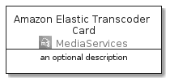
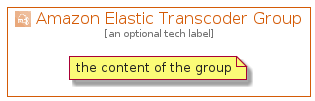

# AmazonElasticTranscoder


```text
aws-20210131/Architecture/MediaServices/AmazonElasticTranscoder
```

```text
include('aws-20210131/Architecture/MediaServices/AmazonElasticTranscoder')
```


| Illustration | AmazonElasticTranscoder | AmazonElasticTranscoderCard | AmazonElasticTranscoderGroup |
| :---: | :---: | :---: | :---: |
|  |  |  |  |


## AmazonElasticTranscoder

### Load remotely
```plantuml
@startuml
' configures the library
!global $LIB_BASE_LOCATION="https://github.com/tmorin/plantuml-libs/distribution"

' loads the library's bootstrap
!include $LIB_BASE_LOCATION/bootstrap.puml

' loads the package bootstrap
include('aws-20210131/bootstrap')

' loads the Item which embeds the element AmazonElasticTranscoder
include('aws-20210131/Architecture/MediaServices/AmazonElasticTranscoder')

' renders the element
AmazonElasticTranscoder('AmazonElasticTranscoder', 'Amazon Elastic Transcoder', 'an optional tech label')
@enduml
```

### Load locally
```plantuml
@startuml
' configures the library
!global $INCLUSION_MODE="local"
!global $LIB_BASE_LOCATION="../../.."

' loads the library's bootstrap
!include $LIB_BASE_LOCATION/bootstrap.puml

' loads the package bootstrap
include('aws-20210131/bootstrap')

' loads the Item which embeds the element AmazonElasticTranscoder
include('aws-20210131/Architecture/MediaServices/AmazonElasticTranscoder')

' renders the element
AmazonElasticTranscoder('AmazonElasticTranscoder', 'Amazon Elastic Transcoder', 'an optional tech label')
@enduml
```

## AmazonElasticTranscoderCard

### Load remotely
```plantuml
@startuml
' configures the library
!global $LIB_BASE_LOCATION="https://github.com/tmorin/plantuml-libs/distribution"

' loads the library's bootstrap
!include $LIB_BASE_LOCATION/bootstrap.puml

' loads the package bootstrap
include('aws-20210131/bootstrap')

' loads the Item which embeds the element AmazonElasticTranscoderCard
include('aws-20210131/Architecture/MediaServices/AmazonElasticTranscoder')

' renders the element
AmazonElasticTranscoderCard('AmazonElasticTranscoderCard', 'Amazon Elastic Transcoder Card', 'an optional description')
@enduml
```

### Load locally
```plantuml
@startuml
' configures the library
!global $INCLUSION_MODE="local"
!global $LIB_BASE_LOCATION="../../.."

' loads the library's bootstrap
!include $LIB_BASE_LOCATION/bootstrap.puml

' loads the package bootstrap
include('aws-20210131/bootstrap')

' loads the Item which embeds the element AmazonElasticTranscoderCard
include('aws-20210131/Architecture/MediaServices/AmazonElasticTranscoder')

' renders the element
AmazonElasticTranscoderCard('AmazonElasticTranscoderCard', 'Amazon Elastic Transcoder Card', 'an optional description')
@enduml
```

## AmazonElasticTranscoderGroup

### Load remotely
```plantuml
@startuml
' configures the library
!global $LIB_BASE_LOCATION="https://github.com/tmorin/plantuml-libs/distribution"

' loads the library's bootstrap
!include $LIB_BASE_LOCATION/bootstrap.puml

' loads the package bootstrap
include('aws-20210131/bootstrap')

' loads the Item which embeds the element AmazonElasticTranscoderGroup
include('aws-20210131/Architecture/MediaServices/AmazonElasticTranscoder')

' renders the element
AmazonElasticTranscoderGroup('AmazonElasticTranscoderGroup', 'Amazon Elastic Transcoder Group', 'an optional tech label') {
    note as note
        the content of the group
    end note
}
@enduml
```

### Load locally
```plantuml
@startuml
' configures the library
!global $INCLUSION_MODE="local"
!global $LIB_BASE_LOCATION="../../.."

' loads the library's bootstrap
!include $LIB_BASE_LOCATION/bootstrap.puml

' loads the package bootstrap
include('aws-20210131/bootstrap')

' loads the Item which embeds the element AmazonElasticTranscoderGroup
include('aws-20210131/Architecture/MediaServices/AmazonElasticTranscoder')

' renders the element
AmazonElasticTranscoderGroup('AmazonElasticTranscoderGroup', 'Amazon Elastic Transcoder Group', 'an optional tech label') {
    note as note
        the content of the group
    end note
}
@enduml
```

