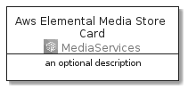
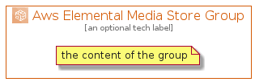

# AwsElementalMediaStore


```text
aws-20210131/Architecture/MediaServices/AwsElementalMediaStore
```

```text
include('aws-20210131/Architecture/MediaServices/AwsElementalMediaStore')
```


| Illustration | AwsElementalMediaStore | AwsElementalMediaStoreCard | AwsElementalMediaStoreGroup |
| :---: | :---: | :---: | :---: |
|  |  |  |  |


## AwsElementalMediaStore

### Load remotely
```plantuml
@startuml
' configures the library
!global $LIB_BASE_LOCATION="https://github.com/tmorin/plantuml-libs/distribution"

' loads the library's bootstrap
!include $LIB_BASE_LOCATION/bootstrap.puml

' loads the package bootstrap
include('aws-20210131/bootstrap')

' loads the Item which embeds the element AwsElementalMediaStore
include('aws-20210131/Architecture/MediaServices/AwsElementalMediaStore')

' renders the element
AwsElementalMediaStore('AwsElementalMediaStore', 'Aws Elemental Media Store', 'an optional tech label')
@enduml
```

### Load locally
```plantuml
@startuml
' configures the library
!global $INCLUSION_MODE="local"
!global $LIB_BASE_LOCATION="../../.."

' loads the library's bootstrap
!include $LIB_BASE_LOCATION/bootstrap.puml

' loads the package bootstrap
include('aws-20210131/bootstrap')

' loads the Item which embeds the element AwsElementalMediaStore
include('aws-20210131/Architecture/MediaServices/AwsElementalMediaStore')

' renders the element
AwsElementalMediaStore('AwsElementalMediaStore', 'Aws Elemental Media Store', 'an optional tech label')
@enduml
```

## AwsElementalMediaStoreCard

### Load remotely
```plantuml
@startuml
' configures the library
!global $LIB_BASE_LOCATION="https://github.com/tmorin/plantuml-libs/distribution"

' loads the library's bootstrap
!include $LIB_BASE_LOCATION/bootstrap.puml

' loads the package bootstrap
include('aws-20210131/bootstrap')

' loads the Item which embeds the element AwsElementalMediaStoreCard
include('aws-20210131/Architecture/MediaServices/AwsElementalMediaStore')

' renders the element
AwsElementalMediaStoreCard('AwsElementalMediaStoreCard', 'Aws Elemental Media Store Card', 'an optional description')
@enduml
```

### Load locally
```plantuml
@startuml
' configures the library
!global $INCLUSION_MODE="local"
!global $LIB_BASE_LOCATION="../../.."

' loads the library's bootstrap
!include $LIB_BASE_LOCATION/bootstrap.puml

' loads the package bootstrap
include('aws-20210131/bootstrap')

' loads the Item which embeds the element AwsElementalMediaStoreCard
include('aws-20210131/Architecture/MediaServices/AwsElementalMediaStore')

' renders the element
AwsElementalMediaStoreCard('AwsElementalMediaStoreCard', 'Aws Elemental Media Store Card', 'an optional description')
@enduml
```

## AwsElementalMediaStoreGroup

### Load remotely
```plantuml
@startuml
' configures the library
!global $LIB_BASE_LOCATION="https://github.com/tmorin/plantuml-libs/distribution"

' loads the library's bootstrap
!include $LIB_BASE_LOCATION/bootstrap.puml

' loads the package bootstrap
include('aws-20210131/bootstrap')

' loads the Item which embeds the element AwsElementalMediaStoreGroup
include('aws-20210131/Architecture/MediaServices/AwsElementalMediaStore')

' renders the element
AwsElementalMediaStoreGroup('AwsElementalMediaStoreGroup', 'Aws Elemental Media Store Group', 'an optional tech label') {
    note as note
        the content of the group
    end note
}
@enduml
```

### Load locally
```plantuml
@startuml
' configures the library
!global $INCLUSION_MODE="local"
!global $LIB_BASE_LOCATION="../../.."

' loads the library's bootstrap
!include $LIB_BASE_LOCATION/bootstrap.puml

' loads the package bootstrap
include('aws-20210131/bootstrap')

' loads the Item which embeds the element AwsElementalMediaStoreGroup
include('aws-20210131/Architecture/MediaServices/AwsElementalMediaStore')

' renders the element
AwsElementalMediaStoreGroup('AwsElementalMediaStoreGroup', 'Aws Elemental Media Store Group', 'an optional tech label') {
    note as note
        the content of the group
    end note
}
@enduml
```

