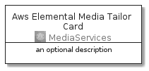
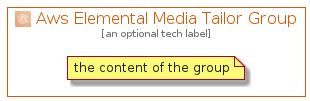

# AwsElementalMediaTailor


```text
aws-20210131/Architecture/MediaServices/AwsElementalMediaTailor
```

```text
include('aws-20210131/Architecture/MediaServices/AwsElementalMediaTailor')
```


| Illustration | AwsElementalMediaTailor | AwsElementalMediaTailorCard | AwsElementalMediaTailorGroup |
| :---: | :---: | :---: | :---: |
|  |  |  |  |


## AwsElementalMediaTailor

### Load remotely
```plantuml
@startuml
' configures the library
!global $LIB_BASE_LOCATION="https://github.com/tmorin/plantuml-libs/distribution"

' loads the library's bootstrap
!include $LIB_BASE_LOCATION/bootstrap.puml

' loads the package bootstrap
include('aws-20210131/bootstrap')

' loads the Item which embeds the element AwsElementalMediaTailor
include('aws-20210131/Architecture/MediaServices/AwsElementalMediaTailor')

' renders the element
AwsElementalMediaTailor('AwsElementalMediaTailor', 'Aws Elemental Media Tailor', 'an optional tech label')
@enduml
```

### Load locally
```plantuml
@startuml
' configures the library
!global $INCLUSION_MODE="local"
!global $LIB_BASE_LOCATION="../../.."

' loads the library's bootstrap
!include $LIB_BASE_LOCATION/bootstrap.puml

' loads the package bootstrap
include('aws-20210131/bootstrap')

' loads the Item which embeds the element AwsElementalMediaTailor
include('aws-20210131/Architecture/MediaServices/AwsElementalMediaTailor')

' renders the element
AwsElementalMediaTailor('AwsElementalMediaTailor', 'Aws Elemental Media Tailor', 'an optional tech label')
@enduml
```

## AwsElementalMediaTailorCard

### Load remotely
```plantuml
@startuml
' configures the library
!global $LIB_BASE_LOCATION="https://github.com/tmorin/plantuml-libs/distribution"

' loads the library's bootstrap
!include $LIB_BASE_LOCATION/bootstrap.puml

' loads the package bootstrap
include('aws-20210131/bootstrap')

' loads the Item which embeds the element AwsElementalMediaTailorCard
include('aws-20210131/Architecture/MediaServices/AwsElementalMediaTailor')

' renders the element
AwsElementalMediaTailorCard('AwsElementalMediaTailorCard', 'Aws Elemental Media Tailor Card', 'an optional description')
@enduml
```

### Load locally
```plantuml
@startuml
' configures the library
!global $INCLUSION_MODE="local"
!global $LIB_BASE_LOCATION="../../.."

' loads the library's bootstrap
!include $LIB_BASE_LOCATION/bootstrap.puml

' loads the package bootstrap
include('aws-20210131/bootstrap')

' loads the Item which embeds the element AwsElementalMediaTailorCard
include('aws-20210131/Architecture/MediaServices/AwsElementalMediaTailor')

' renders the element
AwsElementalMediaTailorCard('AwsElementalMediaTailorCard', 'Aws Elemental Media Tailor Card', 'an optional description')
@enduml
```

## AwsElementalMediaTailorGroup

### Load remotely
```plantuml
@startuml
' configures the library
!global $LIB_BASE_LOCATION="https://github.com/tmorin/plantuml-libs/distribution"

' loads the library's bootstrap
!include $LIB_BASE_LOCATION/bootstrap.puml

' loads the package bootstrap
include('aws-20210131/bootstrap')

' loads the Item which embeds the element AwsElementalMediaTailorGroup
include('aws-20210131/Architecture/MediaServices/AwsElementalMediaTailor')

' renders the element
AwsElementalMediaTailorGroup('AwsElementalMediaTailorGroup', 'Aws Elemental Media Tailor Group', 'an optional tech label') {
    note as note
        the content of the group
    end note
}
@enduml
```

### Load locally
```plantuml
@startuml
' configures the library
!global $INCLUSION_MODE="local"
!global $LIB_BASE_LOCATION="../../.."

' loads the library's bootstrap
!include $LIB_BASE_LOCATION/bootstrap.puml

' loads the package bootstrap
include('aws-20210131/bootstrap')

' loads the Item which embeds the element AwsElementalMediaTailorGroup
include('aws-20210131/Architecture/MediaServices/AwsElementalMediaTailor')

' renders the element
AwsElementalMediaTailorGroup('AwsElementalMediaTailorGroup', 'Aws Elemental Media Tailor Group', 'an optional tech label') {
    note as note
        the content of the group
    end note
}
@enduml
```

