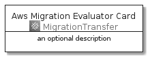
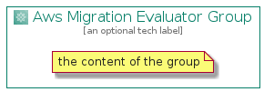

# AwsMigrationEvaluator


```text
aws-20210131/Architecture/MigrationTransfer/AwsMigrationEvaluator
```

```text
include('aws-20210131/Architecture/MigrationTransfer/AwsMigrationEvaluator')
```


| Illustration | AwsMigrationEvaluator | AwsMigrationEvaluatorCard | AwsMigrationEvaluatorGroup |
| :---: | :---: | :---: | :---: |
|  |  |  |  |


## AwsMigrationEvaluator

### Load remotely
```plantuml
@startuml
' configures the library
!global $LIB_BASE_LOCATION="https://github.com/tmorin/plantuml-libs/distribution"

' loads the library's bootstrap
!include $LIB_BASE_LOCATION/bootstrap.puml

' loads the package bootstrap
include('aws-20210131/bootstrap')

' loads the Item which embeds the element AwsMigrationEvaluator
include('aws-20210131/Architecture/MigrationTransfer/AwsMigrationEvaluator')

' renders the element
AwsMigrationEvaluator('AwsMigrationEvaluator', 'Aws Migration Evaluator', 'an optional tech label')
@enduml
```

### Load locally
```plantuml
@startuml
' configures the library
!global $INCLUSION_MODE="local"
!global $LIB_BASE_LOCATION="../../.."

' loads the library's bootstrap
!include $LIB_BASE_LOCATION/bootstrap.puml

' loads the package bootstrap
include('aws-20210131/bootstrap')

' loads the Item which embeds the element AwsMigrationEvaluator
include('aws-20210131/Architecture/MigrationTransfer/AwsMigrationEvaluator')

' renders the element
AwsMigrationEvaluator('AwsMigrationEvaluator', 'Aws Migration Evaluator', 'an optional tech label')
@enduml
```

## AwsMigrationEvaluatorCard

### Load remotely
```plantuml
@startuml
' configures the library
!global $LIB_BASE_LOCATION="https://github.com/tmorin/plantuml-libs/distribution"

' loads the library's bootstrap
!include $LIB_BASE_LOCATION/bootstrap.puml

' loads the package bootstrap
include('aws-20210131/bootstrap')

' loads the Item which embeds the element AwsMigrationEvaluatorCard
include('aws-20210131/Architecture/MigrationTransfer/AwsMigrationEvaluator')

' renders the element
AwsMigrationEvaluatorCard('AwsMigrationEvaluatorCard', 'Aws Migration Evaluator Card', 'an optional description')
@enduml
```

### Load locally
```plantuml
@startuml
' configures the library
!global $INCLUSION_MODE="local"
!global $LIB_BASE_LOCATION="../../.."

' loads the library's bootstrap
!include $LIB_BASE_LOCATION/bootstrap.puml

' loads the package bootstrap
include('aws-20210131/bootstrap')

' loads the Item which embeds the element AwsMigrationEvaluatorCard
include('aws-20210131/Architecture/MigrationTransfer/AwsMigrationEvaluator')

' renders the element
AwsMigrationEvaluatorCard('AwsMigrationEvaluatorCard', 'Aws Migration Evaluator Card', 'an optional description')
@enduml
```

## AwsMigrationEvaluatorGroup

### Load remotely
```plantuml
@startuml
' configures the library
!global $LIB_BASE_LOCATION="https://github.com/tmorin/plantuml-libs/distribution"

' loads the library's bootstrap
!include $LIB_BASE_LOCATION/bootstrap.puml

' loads the package bootstrap
include('aws-20210131/bootstrap')

' loads the Item which embeds the element AwsMigrationEvaluatorGroup
include('aws-20210131/Architecture/MigrationTransfer/AwsMigrationEvaluator')

' renders the element
AwsMigrationEvaluatorGroup('AwsMigrationEvaluatorGroup', 'Aws Migration Evaluator Group', 'an optional tech label') {
    note as note
        the content of the group
    end note
}
@enduml
```

### Load locally
```plantuml
@startuml
' configures the library
!global $INCLUSION_MODE="local"
!global $LIB_BASE_LOCATION="../../.."

' loads the library's bootstrap
!include $LIB_BASE_LOCATION/bootstrap.puml

' loads the package bootstrap
include('aws-20210131/bootstrap')

' loads the Item which embeds the element AwsMigrationEvaluatorGroup
include('aws-20210131/Architecture/MigrationTransfer/AwsMigrationEvaluator')

' renders the element
AwsMigrationEvaluatorGroup('AwsMigrationEvaluatorGroup', 'Aws Migration Evaluator Group', 'an optional tech label') {
    note as note
        the content of the group
    end note
}
@enduml
```

