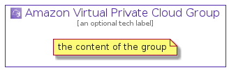

# AmazonVirtualPrivateCloud


```text
aws-20210131/Architecture/NetworkingContent/AmazonVirtualPrivateCloud
```

```text
include('aws-20210131/Architecture/NetworkingContent/AmazonVirtualPrivateCloud')
```


| Illustration | AmazonVirtualPrivateCloud | AmazonVirtualPrivateCloudCard | AmazonVirtualPrivateCloudGroup |
| :---: | :---: | :---: | :---: |
|  |  |  |  |


## AmazonVirtualPrivateCloud

### Load remotely
```plantuml
@startuml
' configures the library
!global $LIB_BASE_LOCATION="https://github.com/tmorin/plantuml-libs/distribution"

' loads the library's bootstrap
!include $LIB_BASE_LOCATION/bootstrap.puml

' loads the package bootstrap
include('aws-20210131/bootstrap')

' loads the Item which embeds the element AmazonVirtualPrivateCloud
include('aws-20210131/Architecture/NetworkingContent/AmazonVirtualPrivateCloud')

' renders the element
AmazonVirtualPrivateCloud('AmazonVirtualPrivateCloud', 'Amazon Virtual Private Cloud', 'an optional tech label')
@enduml
```

### Load locally
```plantuml
@startuml
' configures the library
!global $INCLUSION_MODE="local"
!global $LIB_BASE_LOCATION="../../.."

' loads the library's bootstrap
!include $LIB_BASE_LOCATION/bootstrap.puml

' loads the package bootstrap
include('aws-20210131/bootstrap')

' loads the Item which embeds the element AmazonVirtualPrivateCloud
include('aws-20210131/Architecture/NetworkingContent/AmazonVirtualPrivateCloud')

' renders the element
AmazonVirtualPrivateCloud('AmazonVirtualPrivateCloud', 'Amazon Virtual Private Cloud', 'an optional tech label')
@enduml
```

## AmazonVirtualPrivateCloudCard

### Load remotely
```plantuml
@startuml
' configures the library
!global $LIB_BASE_LOCATION="https://github.com/tmorin/plantuml-libs/distribution"

' loads the library's bootstrap
!include $LIB_BASE_LOCATION/bootstrap.puml

' loads the package bootstrap
include('aws-20210131/bootstrap')

' loads the Item which embeds the element AmazonVirtualPrivateCloudCard
include('aws-20210131/Architecture/NetworkingContent/AmazonVirtualPrivateCloud')

' renders the element
AmazonVirtualPrivateCloudCard('AmazonVirtualPrivateCloudCard', 'Amazon Virtual Private Cloud Card', 'an optional description')
@enduml
```

### Load locally
```plantuml
@startuml
' configures the library
!global $INCLUSION_MODE="local"
!global $LIB_BASE_LOCATION="../../.."

' loads the library's bootstrap
!include $LIB_BASE_LOCATION/bootstrap.puml

' loads the package bootstrap
include('aws-20210131/bootstrap')

' loads the Item which embeds the element AmazonVirtualPrivateCloudCard
include('aws-20210131/Architecture/NetworkingContent/AmazonVirtualPrivateCloud')

' renders the element
AmazonVirtualPrivateCloudCard('AmazonVirtualPrivateCloudCard', 'Amazon Virtual Private Cloud Card', 'an optional description')
@enduml
```

## AmazonVirtualPrivateCloudGroup

### Load remotely
```plantuml
@startuml
' configures the library
!global $LIB_BASE_LOCATION="https://github.com/tmorin/plantuml-libs/distribution"

' loads the library's bootstrap
!include $LIB_BASE_LOCATION/bootstrap.puml

' loads the package bootstrap
include('aws-20210131/bootstrap')

' loads the Item which embeds the element AmazonVirtualPrivateCloudGroup
include('aws-20210131/Architecture/NetworkingContent/AmazonVirtualPrivateCloud')

' renders the element
AmazonVirtualPrivateCloudGroup('AmazonVirtualPrivateCloudGroup', 'Amazon Virtual Private Cloud Group', 'an optional tech label') {
    note as note
        the content of the group
    end note
}
@enduml
```

### Load locally
```plantuml
@startuml
' configures the library
!global $INCLUSION_MODE="local"
!global $LIB_BASE_LOCATION="../../.."

' loads the library's bootstrap
!include $LIB_BASE_LOCATION/bootstrap.puml

' loads the package bootstrap
include('aws-20210131/bootstrap')

' loads the Item which embeds the element AmazonVirtualPrivateCloudGroup
include('aws-20210131/Architecture/NetworkingContent/AmazonVirtualPrivateCloud')

' renders the element
AmazonVirtualPrivateCloudGroup('AmazonVirtualPrivateCloudGroup', 'Amazon Virtual Private Cloud Group', 'an optional tech label') {
    note as note
        the content of the group
    end note
}
@enduml
```

