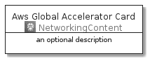
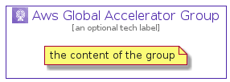

# AwsGlobalAccelerator


```text
aws-20210131/Architecture/NetworkingContent/AwsGlobalAccelerator
```

```text
include('aws-20210131/Architecture/NetworkingContent/AwsGlobalAccelerator')
```


| Illustration | AwsGlobalAccelerator | AwsGlobalAcceleratorCard | AwsGlobalAcceleratorGroup |
| :---: | :---: | :---: | :---: |
|  |  |  |  |


## AwsGlobalAccelerator

### Load remotely
```plantuml
@startuml
' configures the library
!global $LIB_BASE_LOCATION="https://github.com/tmorin/plantuml-libs/distribution"

' loads the library's bootstrap
!include $LIB_BASE_LOCATION/bootstrap.puml

' loads the package bootstrap
include('aws-20210131/bootstrap')

' loads the Item which embeds the element AwsGlobalAccelerator
include('aws-20210131/Architecture/NetworkingContent/AwsGlobalAccelerator')

' renders the element
AwsGlobalAccelerator('AwsGlobalAccelerator', 'Aws Global Accelerator', 'an optional tech label')
@enduml
```

### Load locally
```plantuml
@startuml
' configures the library
!global $INCLUSION_MODE="local"
!global $LIB_BASE_LOCATION="../../.."

' loads the library's bootstrap
!include $LIB_BASE_LOCATION/bootstrap.puml

' loads the package bootstrap
include('aws-20210131/bootstrap')

' loads the Item which embeds the element AwsGlobalAccelerator
include('aws-20210131/Architecture/NetworkingContent/AwsGlobalAccelerator')

' renders the element
AwsGlobalAccelerator('AwsGlobalAccelerator', 'Aws Global Accelerator', 'an optional tech label')
@enduml
```

## AwsGlobalAcceleratorCard

### Load remotely
```plantuml
@startuml
' configures the library
!global $LIB_BASE_LOCATION="https://github.com/tmorin/plantuml-libs/distribution"

' loads the library's bootstrap
!include $LIB_BASE_LOCATION/bootstrap.puml

' loads the package bootstrap
include('aws-20210131/bootstrap')

' loads the Item which embeds the element AwsGlobalAcceleratorCard
include('aws-20210131/Architecture/NetworkingContent/AwsGlobalAccelerator')

' renders the element
AwsGlobalAcceleratorCard('AwsGlobalAcceleratorCard', 'Aws Global Accelerator Card', 'an optional description')
@enduml
```

### Load locally
```plantuml
@startuml
' configures the library
!global $INCLUSION_MODE="local"
!global $LIB_BASE_LOCATION="../../.."

' loads the library's bootstrap
!include $LIB_BASE_LOCATION/bootstrap.puml

' loads the package bootstrap
include('aws-20210131/bootstrap')

' loads the Item which embeds the element AwsGlobalAcceleratorCard
include('aws-20210131/Architecture/NetworkingContent/AwsGlobalAccelerator')

' renders the element
AwsGlobalAcceleratorCard('AwsGlobalAcceleratorCard', 'Aws Global Accelerator Card', 'an optional description')
@enduml
```

## AwsGlobalAcceleratorGroup

### Load remotely
```plantuml
@startuml
' configures the library
!global $LIB_BASE_LOCATION="https://github.com/tmorin/plantuml-libs/distribution"

' loads the library's bootstrap
!include $LIB_BASE_LOCATION/bootstrap.puml

' loads the package bootstrap
include('aws-20210131/bootstrap')

' loads the Item which embeds the element AwsGlobalAcceleratorGroup
include('aws-20210131/Architecture/NetworkingContent/AwsGlobalAccelerator')

' renders the element
AwsGlobalAcceleratorGroup('AwsGlobalAcceleratorGroup', 'Aws Global Accelerator Group', 'an optional tech label') {
    note as note
        the content of the group
    end note
}
@enduml
```

### Load locally
```plantuml
@startuml
' configures the library
!global $INCLUSION_MODE="local"
!global $LIB_BASE_LOCATION="../../.."

' loads the library's bootstrap
!include $LIB_BASE_LOCATION/bootstrap.puml

' loads the package bootstrap
include('aws-20210131/bootstrap')

' loads the Item which embeds the element AwsGlobalAcceleratorGroup
include('aws-20210131/Architecture/NetworkingContent/AwsGlobalAccelerator')

' renders the element
AwsGlobalAcceleratorGroup('AwsGlobalAcceleratorGroup', 'Aws Global Accelerator Group', 'an optional tech label') {
    note as note
        the content of the group
    end note
}
@enduml
```

