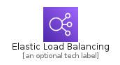
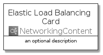
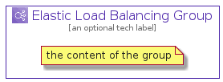

# ElasticLoadBalancing


```text
aws-20210131/Architecture/NetworkingContent/ElasticLoadBalancing
```

```text
include('aws-20210131/Architecture/NetworkingContent/ElasticLoadBalancing')
```


| Illustration | ElasticLoadBalancing | ElasticLoadBalancingCard | ElasticLoadBalancingGroup |
| :---: | :---: | :---: | :---: |
|  |  |  |  |


## ElasticLoadBalancing

### Load remotely
```plantuml
@startuml
' configures the library
!global $LIB_BASE_LOCATION="https://github.com/tmorin/plantuml-libs/distribution"

' loads the library's bootstrap
!include $LIB_BASE_LOCATION/bootstrap.puml

' loads the package bootstrap
include('aws-20210131/bootstrap')

' loads the Item which embeds the element ElasticLoadBalancing
include('aws-20210131/Architecture/NetworkingContent/ElasticLoadBalancing')

' renders the element
ElasticLoadBalancing('ElasticLoadBalancing', 'Elastic Load Balancing', 'an optional tech label')
@enduml
```

### Load locally
```plantuml
@startuml
' configures the library
!global $INCLUSION_MODE="local"
!global $LIB_BASE_LOCATION="../../.."

' loads the library's bootstrap
!include $LIB_BASE_LOCATION/bootstrap.puml

' loads the package bootstrap
include('aws-20210131/bootstrap')

' loads the Item which embeds the element ElasticLoadBalancing
include('aws-20210131/Architecture/NetworkingContent/ElasticLoadBalancing')

' renders the element
ElasticLoadBalancing('ElasticLoadBalancing', 'Elastic Load Balancing', 'an optional tech label')
@enduml
```

## ElasticLoadBalancingCard

### Load remotely
```plantuml
@startuml
' configures the library
!global $LIB_BASE_LOCATION="https://github.com/tmorin/plantuml-libs/distribution"

' loads the library's bootstrap
!include $LIB_BASE_LOCATION/bootstrap.puml

' loads the package bootstrap
include('aws-20210131/bootstrap')

' loads the Item which embeds the element ElasticLoadBalancingCard
include('aws-20210131/Architecture/NetworkingContent/ElasticLoadBalancing')

' renders the element
ElasticLoadBalancingCard('ElasticLoadBalancingCard', 'Elastic Load Balancing Card', 'an optional description')
@enduml
```

### Load locally
```plantuml
@startuml
' configures the library
!global $INCLUSION_MODE="local"
!global $LIB_BASE_LOCATION="../../.."

' loads the library's bootstrap
!include $LIB_BASE_LOCATION/bootstrap.puml

' loads the package bootstrap
include('aws-20210131/bootstrap')

' loads the Item which embeds the element ElasticLoadBalancingCard
include('aws-20210131/Architecture/NetworkingContent/ElasticLoadBalancing')

' renders the element
ElasticLoadBalancingCard('ElasticLoadBalancingCard', 'Elastic Load Balancing Card', 'an optional description')
@enduml
```

## ElasticLoadBalancingGroup

### Load remotely
```plantuml
@startuml
' configures the library
!global $LIB_BASE_LOCATION="https://github.com/tmorin/plantuml-libs/distribution"

' loads the library's bootstrap
!include $LIB_BASE_LOCATION/bootstrap.puml

' loads the package bootstrap
include('aws-20210131/bootstrap')

' loads the Item which embeds the element ElasticLoadBalancingGroup
include('aws-20210131/Architecture/NetworkingContent/ElasticLoadBalancing')

' renders the element
ElasticLoadBalancingGroup('ElasticLoadBalancingGroup', 'Elastic Load Balancing Group', 'an optional tech label') {
    note as note
        the content of the group
    end note
}
@enduml
```

### Load locally
```plantuml
@startuml
' configures the library
!global $INCLUSION_MODE="local"
!global $LIB_BASE_LOCATION="../../.."

' loads the library's bootstrap
!include $LIB_BASE_LOCATION/bootstrap.puml

' loads the package bootstrap
include('aws-20210131/bootstrap')

' loads the Item which embeds the element ElasticLoadBalancingGroup
include('aws-20210131/Architecture/NetworkingContent/ElasticLoadBalancing')

' renders the element
ElasticLoadBalancingGroup('ElasticLoadBalancingGroup', 'Elastic Load Balancing Group', 'an optional tech label') {
    note as note
        the content of the group
    end note
}
@enduml
```

