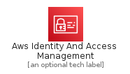
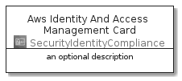
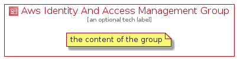

# AwsIdentityAndAccessManagement


```text
aws-20210131/Architecture/SecurityIdentityCompliance/AwsIdentityAndAccessManagement
```

```text
include('aws-20210131/Architecture/SecurityIdentityCompliance/AwsIdentityAndAccessManagement')
```


| Illustration | AwsIdentityAndAccessManagement | AwsIdentityAndAccessManagementCard | AwsIdentityAndAccessManagementGroup |
| :---: | :---: | :---: | :---: |
|  |  |  |  |


## AwsIdentityAndAccessManagement

### Load remotely
```plantuml
@startuml
' configures the library
!global $LIB_BASE_LOCATION="https://github.com/tmorin/plantuml-libs/distribution"

' loads the library's bootstrap
!include $LIB_BASE_LOCATION/bootstrap.puml

' loads the package bootstrap
include('aws-20210131/bootstrap')

' loads the Item which embeds the element AwsIdentityAndAccessManagement
include('aws-20210131/Architecture/SecurityIdentityCompliance/AwsIdentityAndAccessManagement')

' renders the element
AwsIdentityAndAccessManagement('AwsIdentityAndAccessManagement', 'Aws Identity And Access Management', 'an optional tech label')
@enduml
```

### Load locally
```plantuml
@startuml
' configures the library
!global $INCLUSION_MODE="local"
!global $LIB_BASE_LOCATION="../../.."

' loads the library's bootstrap
!include $LIB_BASE_LOCATION/bootstrap.puml

' loads the package bootstrap
include('aws-20210131/bootstrap')

' loads the Item which embeds the element AwsIdentityAndAccessManagement
include('aws-20210131/Architecture/SecurityIdentityCompliance/AwsIdentityAndAccessManagement')

' renders the element
AwsIdentityAndAccessManagement('AwsIdentityAndAccessManagement', 'Aws Identity And Access Management', 'an optional tech label')
@enduml
```

## AwsIdentityAndAccessManagementCard

### Load remotely
```plantuml
@startuml
' configures the library
!global $LIB_BASE_LOCATION="https://github.com/tmorin/plantuml-libs/distribution"

' loads the library's bootstrap
!include $LIB_BASE_LOCATION/bootstrap.puml

' loads the package bootstrap
include('aws-20210131/bootstrap')

' loads the Item which embeds the element AwsIdentityAndAccessManagementCard
include('aws-20210131/Architecture/SecurityIdentityCompliance/AwsIdentityAndAccessManagement')

' renders the element
AwsIdentityAndAccessManagementCard('AwsIdentityAndAccessManagementCard', 'Aws Identity And Access Management Card', 'an optional description')
@enduml
```

### Load locally
```plantuml
@startuml
' configures the library
!global $INCLUSION_MODE="local"
!global $LIB_BASE_LOCATION="../../.."

' loads the library's bootstrap
!include $LIB_BASE_LOCATION/bootstrap.puml

' loads the package bootstrap
include('aws-20210131/bootstrap')

' loads the Item which embeds the element AwsIdentityAndAccessManagementCard
include('aws-20210131/Architecture/SecurityIdentityCompliance/AwsIdentityAndAccessManagement')

' renders the element
AwsIdentityAndAccessManagementCard('AwsIdentityAndAccessManagementCard', 'Aws Identity And Access Management Card', 'an optional description')
@enduml
```

## AwsIdentityAndAccessManagementGroup

### Load remotely
```plantuml
@startuml
' configures the library
!global $LIB_BASE_LOCATION="https://github.com/tmorin/plantuml-libs/distribution"

' loads the library's bootstrap
!include $LIB_BASE_LOCATION/bootstrap.puml

' loads the package bootstrap
include('aws-20210131/bootstrap')

' loads the Item which embeds the element AwsIdentityAndAccessManagementGroup
include('aws-20210131/Architecture/SecurityIdentityCompliance/AwsIdentityAndAccessManagement')

' renders the element
AwsIdentityAndAccessManagementGroup('AwsIdentityAndAccessManagementGroup', 'Aws Identity And Access Management Group', 'an optional tech label') {
    note as note
        the content of the group
    end note
}
@enduml
```

### Load locally
```plantuml
@startuml
' configures the library
!global $INCLUSION_MODE="local"
!global $LIB_BASE_LOCATION="../../.."

' loads the library's bootstrap
!include $LIB_BASE_LOCATION/bootstrap.puml

' loads the package bootstrap
include('aws-20210131/bootstrap')

' loads the Item which embeds the element AwsIdentityAndAccessManagementGroup
include('aws-20210131/Architecture/SecurityIdentityCompliance/AwsIdentityAndAccessManagement')

' renders the element
AwsIdentityAndAccessManagementGroup('AwsIdentityAndAccessManagementGroup', 'Aws Identity And Access Management Group', 'an optional tech label') {
    note as note
        the content of the group
    end note
}
@enduml
```

