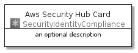
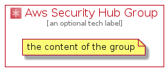

# AwsSecurityHub


```text
aws-20210131/Architecture/SecurityIdentityCompliance/AwsSecurityHub
```

```text
include('aws-20210131/Architecture/SecurityIdentityCompliance/AwsSecurityHub')
```


| Illustration | AwsSecurityHub | AwsSecurityHubCard | AwsSecurityHubGroup |
| :---: | :---: | :---: | :---: |
|  |  |  |  |


## AwsSecurityHub

### Load remotely
```plantuml
@startuml
' configures the library
!global $LIB_BASE_LOCATION="https://github.com/tmorin/plantuml-libs/distribution"

' loads the library's bootstrap
!include $LIB_BASE_LOCATION/bootstrap.puml

' loads the package bootstrap
include('aws-20210131/bootstrap')

' loads the Item which embeds the element AwsSecurityHub
include('aws-20210131/Architecture/SecurityIdentityCompliance/AwsSecurityHub')

' renders the element
AwsSecurityHub('AwsSecurityHub', 'Aws Security Hub', 'an optional tech label')
@enduml
```

### Load locally
```plantuml
@startuml
' configures the library
!global $INCLUSION_MODE="local"
!global $LIB_BASE_LOCATION="../../.."

' loads the library's bootstrap
!include $LIB_BASE_LOCATION/bootstrap.puml

' loads the package bootstrap
include('aws-20210131/bootstrap')

' loads the Item which embeds the element AwsSecurityHub
include('aws-20210131/Architecture/SecurityIdentityCompliance/AwsSecurityHub')

' renders the element
AwsSecurityHub('AwsSecurityHub', 'Aws Security Hub', 'an optional tech label')
@enduml
```

## AwsSecurityHubCard

### Load remotely
```plantuml
@startuml
' configures the library
!global $LIB_BASE_LOCATION="https://github.com/tmorin/plantuml-libs/distribution"

' loads the library's bootstrap
!include $LIB_BASE_LOCATION/bootstrap.puml

' loads the package bootstrap
include('aws-20210131/bootstrap')

' loads the Item which embeds the element AwsSecurityHubCard
include('aws-20210131/Architecture/SecurityIdentityCompliance/AwsSecurityHub')

' renders the element
AwsSecurityHubCard('AwsSecurityHubCard', 'Aws Security Hub Card', 'an optional description')
@enduml
```

### Load locally
```plantuml
@startuml
' configures the library
!global $INCLUSION_MODE="local"
!global $LIB_BASE_LOCATION="../../.."

' loads the library's bootstrap
!include $LIB_BASE_LOCATION/bootstrap.puml

' loads the package bootstrap
include('aws-20210131/bootstrap')

' loads the Item which embeds the element AwsSecurityHubCard
include('aws-20210131/Architecture/SecurityIdentityCompliance/AwsSecurityHub')

' renders the element
AwsSecurityHubCard('AwsSecurityHubCard', 'Aws Security Hub Card', 'an optional description')
@enduml
```

## AwsSecurityHubGroup

### Load remotely
```plantuml
@startuml
' configures the library
!global $LIB_BASE_LOCATION="https://github.com/tmorin/plantuml-libs/distribution"

' loads the library's bootstrap
!include $LIB_BASE_LOCATION/bootstrap.puml

' loads the package bootstrap
include('aws-20210131/bootstrap')

' loads the Item which embeds the element AwsSecurityHubGroup
include('aws-20210131/Architecture/SecurityIdentityCompliance/AwsSecurityHub')

' renders the element
AwsSecurityHubGroup('AwsSecurityHubGroup', 'Aws Security Hub Group', 'an optional tech label') {
    note as note
        the content of the group
    end note
}
@enduml
```

### Load locally
```plantuml
@startuml
' configures the library
!global $INCLUSION_MODE="local"
!global $LIB_BASE_LOCATION="../../.."

' loads the library's bootstrap
!include $LIB_BASE_LOCATION/bootstrap.puml

' loads the package bootstrap
include('aws-20210131/bootstrap')

' loads the Item which embeds the element AwsSecurityHubGroup
include('aws-20210131/Architecture/SecurityIdentityCompliance/AwsSecurityHub')

' renders the element
AwsSecurityHubGroup('AwsSecurityHubGroup', 'Aws Security Hub Group', 'an optional tech label') {
    note as note
        the content of the group
    end note
}
@enduml
```

