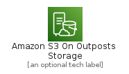
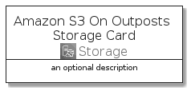
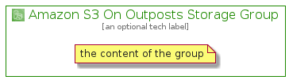

# AmazonS3OnOutpostsStorage


```text
aws-20210131/Architecture/Storage/AmazonS3OnOutpostsStorage
```

```text
include('aws-20210131/Architecture/Storage/AmazonS3OnOutpostsStorage')
```


| Illustration | AmazonS3OnOutpostsStorage | AmazonS3OnOutpostsStorageCard | AmazonS3OnOutpostsStorageGroup |
| :---: | :---: | :---: | :---: |
|  |  |  |  |


## AmazonS3OnOutpostsStorage

### Load remotely
```plantuml
@startuml
' configures the library
!global $LIB_BASE_LOCATION="https://github.com/tmorin/plantuml-libs/distribution"

' loads the library's bootstrap
!include $LIB_BASE_LOCATION/bootstrap.puml

' loads the package bootstrap
include('aws-20210131/bootstrap')

' loads the Item which embeds the element AmazonS3OnOutpostsStorage
include('aws-20210131/Architecture/Storage/AmazonS3OnOutpostsStorage')

' renders the element
AmazonS3OnOutpostsStorage('AmazonS3OnOutpostsStorage', 'Amazon S3 On Outposts Storage', 'an optional tech label')
@enduml
```

### Load locally
```plantuml
@startuml
' configures the library
!global $INCLUSION_MODE="local"
!global $LIB_BASE_LOCATION="../../.."

' loads the library's bootstrap
!include $LIB_BASE_LOCATION/bootstrap.puml

' loads the package bootstrap
include('aws-20210131/bootstrap')

' loads the Item which embeds the element AmazonS3OnOutpostsStorage
include('aws-20210131/Architecture/Storage/AmazonS3OnOutpostsStorage')

' renders the element
AmazonS3OnOutpostsStorage('AmazonS3OnOutpostsStorage', 'Amazon S3 On Outposts Storage', 'an optional tech label')
@enduml
```

## AmazonS3OnOutpostsStorageCard

### Load remotely
```plantuml
@startuml
' configures the library
!global $LIB_BASE_LOCATION="https://github.com/tmorin/plantuml-libs/distribution"

' loads the library's bootstrap
!include $LIB_BASE_LOCATION/bootstrap.puml

' loads the package bootstrap
include('aws-20210131/bootstrap')

' loads the Item which embeds the element AmazonS3OnOutpostsStorageCard
include('aws-20210131/Architecture/Storage/AmazonS3OnOutpostsStorage')

' renders the element
AmazonS3OnOutpostsStorageCard('AmazonS3OnOutpostsStorageCard', 'Amazon S3 On Outposts Storage Card', 'an optional description')
@enduml
```

### Load locally
```plantuml
@startuml
' configures the library
!global $INCLUSION_MODE="local"
!global $LIB_BASE_LOCATION="../../.."

' loads the library's bootstrap
!include $LIB_BASE_LOCATION/bootstrap.puml

' loads the package bootstrap
include('aws-20210131/bootstrap')

' loads the Item which embeds the element AmazonS3OnOutpostsStorageCard
include('aws-20210131/Architecture/Storage/AmazonS3OnOutpostsStorage')

' renders the element
AmazonS3OnOutpostsStorageCard('AmazonS3OnOutpostsStorageCard', 'Amazon S3 On Outposts Storage Card', 'an optional description')
@enduml
```

## AmazonS3OnOutpostsStorageGroup

### Load remotely
```plantuml
@startuml
' configures the library
!global $LIB_BASE_LOCATION="https://github.com/tmorin/plantuml-libs/distribution"

' loads the library's bootstrap
!include $LIB_BASE_LOCATION/bootstrap.puml

' loads the package bootstrap
include('aws-20210131/bootstrap')

' loads the Item which embeds the element AmazonS3OnOutpostsStorageGroup
include('aws-20210131/Architecture/Storage/AmazonS3OnOutpostsStorage')

' renders the element
AmazonS3OnOutpostsStorageGroup('AmazonS3OnOutpostsStorageGroup', 'Amazon S3 On Outposts Storage Group', 'an optional tech label') {
    note as note
        the content of the group
    end note
}
@enduml
```

### Load locally
```plantuml
@startuml
' configures the library
!global $INCLUSION_MODE="local"
!global $LIB_BASE_LOCATION="../../.."

' loads the library's bootstrap
!include $LIB_BASE_LOCATION/bootstrap.puml

' loads the package bootstrap
include('aws-20210131/bootstrap')

' loads the Item which embeds the element AmazonS3OnOutpostsStorageGroup
include('aws-20210131/Architecture/Storage/AmazonS3OnOutpostsStorage')

' renders the element
AmazonS3OnOutpostsStorageGroup('AmazonS3OnOutpostsStorageGroup', 'Amazon S3 On Outposts Storage Group', 'an optional tech label') {
    note as note
        the content of the group
    end note
}
@enduml
```

