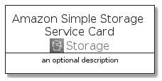

# AmazonSimpleStorageService


```text
aws-20210131/Architecture/Storage/AmazonSimpleStorageService
```

```text
include('aws-20210131/Architecture/Storage/AmazonSimpleStorageService')
```


| Illustration | AmazonSimpleStorageService | AmazonSimpleStorageServiceCard | AmazonSimpleStorageServiceGroup |
| :---: | :---: | :---: | :---: |
|  |  |  |  |


## AmazonSimpleStorageService

### Load remotely
```plantuml
@startuml
' configures the library
!global $LIB_BASE_LOCATION="https://github.com/tmorin/plantuml-libs/distribution"

' loads the library's bootstrap
!include $LIB_BASE_LOCATION/bootstrap.puml

' loads the package bootstrap
include('aws-20210131/bootstrap')

' loads the Item which embeds the element AmazonSimpleStorageService
include('aws-20210131/Architecture/Storage/AmazonSimpleStorageService')

' renders the element
AmazonSimpleStorageService('AmazonSimpleStorageService', 'Amazon Simple Storage Service', 'an optional tech label')
@enduml
```

### Load locally
```plantuml
@startuml
' configures the library
!global $INCLUSION_MODE="local"
!global $LIB_BASE_LOCATION="../../.."

' loads the library's bootstrap
!include $LIB_BASE_LOCATION/bootstrap.puml

' loads the package bootstrap
include('aws-20210131/bootstrap')

' loads the Item which embeds the element AmazonSimpleStorageService
include('aws-20210131/Architecture/Storage/AmazonSimpleStorageService')

' renders the element
AmazonSimpleStorageService('AmazonSimpleStorageService', 'Amazon Simple Storage Service', 'an optional tech label')
@enduml
```

## AmazonSimpleStorageServiceCard

### Load remotely
```plantuml
@startuml
' configures the library
!global $LIB_BASE_LOCATION="https://github.com/tmorin/plantuml-libs/distribution"

' loads the library's bootstrap
!include $LIB_BASE_LOCATION/bootstrap.puml

' loads the package bootstrap
include('aws-20210131/bootstrap')

' loads the Item which embeds the element AmazonSimpleStorageServiceCard
include('aws-20210131/Architecture/Storage/AmazonSimpleStorageService')

' renders the element
AmazonSimpleStorageServiceCard('AmazonSimpleStorageServiceCard', 'Amazon Simple Storage Service Card', 'an optional description')
@enduml
```

### Load locally
```plantuml
@startuml
' configures the library
!global $INCLUSION_MODE="local"
!global $LIB_BASE_LOCATION="../../.."

' loads the library's bootstrap
!include $LIB_BASE_LOCATION/bootstrap.puml

' loads the package bootstrap
include('aws-20210131/bootstrap')

' loads the Item which embeds the element AmazonSimpleStorageServiceCard
include('aws-20210131/Architecture/Storage/AmazonSimpleStorageService')

' renders the element
AmazonSimpleStorageServiceCard('AmazonSimpleStorageServiceCard', 'Amazon Simple Storage Service Card', 'an optional description')
@enduml
```

## AmazonSimpleStorageServiceGroup

### Load remotely
```plantuml
@startuml
' configures the library
!global $LIB_BASE_LOCATION="https://github.com/tmorin/plantuml-libs/distribution"

' loads the library's bootstrap
!include $LIB_BASE_LOCATION/bootstrap.puml

' loads the package bootstrap
include('aws-20210131/bootstrap')

' loads the Item which embeds the element AmazonSimpleStorageServiceGroup
include('aws-20210131/Architecture/Storage/AmazonSimpleStorageService')

' renders the element
AmazonSimpleStorageServiceGroup('AmazonSimpleStorageServiceGroup', 'Amazon Simple Storage Service Group', 'an optional tech label') {
    note as note
        the content of the group
    end note
}
@enduml
```

### Load locally
```plantuml
@startuml
' configures the library
!global $INCLUSION_MODE="local"
!global $LIB_BASE_LOCATION="../../.."

' loads the library's bootstrap
!include $LIB_BASE_LOCATION/bootstrap.puml

' loads the package bootstrap
include('aws-20210131/bootstrap')

' loads the Item which embeds the element AmazonSimpleStorageServiceGroup
include('aws-20210131/Architecture/Storage/AmazonSimpleStorageService')

' renders the element
AmazonSimpleStorageServiceGroup('AmazonSimpleStorageServiceGroup', 'Amazon Simple Storage Service Group', 'an optional tech label') {
    note as note
        the content of the group
    end note
}
@enduml
```

