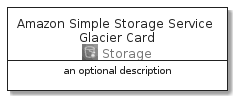

# AmazonSimpleStorageServiceGlacier


```text
aws-20210131/Architecture/Storage/AmazonSimpleStorageServiceGlacier
```

```text
include('aws-20210131/Architecture/Storage/AmazonSimpleStorageServiceGlacier')
```


| Illustration | AmazonSimpleStorageServiceGlacier | AmazonSimpleStorageServiceGlacierCard | AmazonSimpleStorageServiceGlacierGroup |
| :---: | :---: | :---: | :---: |
|  |  |  |  |


## AmazonSimpleStorageServiceGlacier

### Load remotely
```plantuml
@startuml
' configures the library
!global $LIB_BASE_LOCATION="https://github.com/tmorin/plantuml-libs/distribution"

' loads the library's bootstrap
!include $LIB_BASE_LOCATION/bootstrap.puml

' loads the package bootstrap
include('aws-20210131/bootstrap')

' loads the Item which embeds the element AmazonSimpleStorageServiceGlacier
include('aws-20210131/Architecture/Storage/AmazonSimpleStorageServiceGlacier')

' renders the element
AmazonSimpleStorageServiceGlacier('AmazonSimpleStorageServiceGlacier', 'Amazon Simple Storage Service Glacier', 'an optional tech label')
@enduml
```

### Load locally
```plantuml
@startuml
' configures the library
!global $INCLUSION_MODE="local"
!global $LIB_BASE_LOCATION="../../.."

' loads the library's bootstrap
!include $LIB_BASE_LOCATION/bootstrap.puml

' loads the package bootstrap
include('aws-20210131/bootstrap')

' loads the Item which embeds the element AmazonSimpleStorageServiceGlacier
include('aws-20210131/Architecture/Storage/AmazonSimpleStorageServiceGlacier')

' renders the element
AmazonSimpleStorageServiceGlacier('AmazonSimpleStorageServiceGlacier', 'Amazon Simple Storage Service Glacier', 'an optional tech label')
@enduml
```

## AmazonSimpleStorageServiceGlacierCard

### Load remotely
```plantuml
@startuml
' configures the library
!global $LIB_BASE_LOCATION="https://github.com/tmorin/plantuml-libs/distribution"

' loads the library's bootstrap
!include $LIB_BASE_LOCATION/bootstrap.puml

' loads the package bootstrap
include('aws-20210131/bootstrap')

' loads the Item which embeds the element AmazonSimpleStorageServiceGlacierCard
include('aws-20210131/Architecture/Storage/AmazonSimpleStorageServiceGlacier')

' renders the element
AmazonSimpleStorageServiceGlacierCard('AmazonSimpleStorageServiceGlacierCard', 'Amazon Simple Storage Service Glacier Card', 'an optional description')
@enduml
```

### Load locally
```plantuml
@startuml
' configures the library
!global $INCLUSION_MODE="local"
!global $LIB_BASE_LOCATION="../../.."

' loads the library's bootstrap
!include $LIB_BASE_LOCATION/bootstrap.puml

' loads the package bootstrap
include('aws-20210131/bootstrap')

' loads the Item which embeds the element AmazonSimpleStorageServiceGlacierCard
include('aws-20210131/Architecture/Storage/AmazonSimpleStorageServiceGlacier')

' renders the element
AmazonSimpleStorageServiceGlacierCard('AmazonSimpleStorageServiceGlacierCard', 'Amazon Simple Storage Service Glacier Card', 'an optional description')
@enduml
```

## AmazonSimpleStorageServiceGlacierGroup

### Load remotely
```plantuml
@startuml
' configures the library
!global $LIB_BASE_LOCATION="https://github.com/tmorin/plantuml-libs/distribution"

' loads the library's bootstrap
!include $LIB_BASE_LOCATION/bootstrap.puml

' loads the package bootstrap
include('aws-20210131/bootstrap')

' loads the Item which embeds the element AmazonSimpleStorageServiceGlacierGroup
include('aws-20210131/Architecture/Storage/AmazonSimpleStorageServiceGlacier')

' renders the element
AmazonSimpleStorageServiceGlacierGroup('AmazonSimpleStorageServiceGlacierGroup', 'Amazon Simple Storage Service Glacier Group', 'an optional tech label') {
    note as note
        the content of the group
    end note
}
@enduml
```

### Load locally
```plantuml
@startuml
' configures the library
!global $INCLUSION_MODE="local"
!global $LIB_BASE_LOCATION="../../.."

' loads the library's bootstrap
!include $LIB_BASE_LOCATION/bootstrap.puml

' loads the package bootstrap
include('aws-20210131/bootstrap')

' loads the Item which embeds the element AmazonSimpleStorageServiceGlacierGroup
include('aws-20210131/Architecture/Storage/AmazonSimpleStorageServiceGlacier')

' renders the element
AmazonSimpleStorageServiceGlacierGroup('AmazonSimpleStorageServiceGlacierGroup', 'Amazon Simple Storage Service Glacier Group', 'an optional tech label') {
    note as note
        the content of the group
    end note
}
@enduml
```

