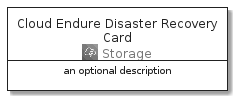
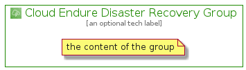

# CloudEndureDisasterRecovery


```text
aws-20210131/Architecture/Storage/CloudEndureDisasterRecovery
```

```text
include('aws-20210131/Architecture/Storage/CloudEndureDisasterRecovery')
```


| Illustration | CloudEndureDisasterRecovery | CloudEndureDisasterRecoveryCard | CloudEndureDisasterRecoveryGroup |
| :---: | :---: | :---: | :---: |
|  |  |  |  |


## CloudEndureDisasterRecovery

### Load remotely
```plantuml
@startuml
' configures the library
!global $LIB_BASE_LOCATION="https://github.com/tmorin/plantuml-libs/distribution"

' loads the library's bootstrap
!include $LIB_BASE_LOCATION/bootstrap.puml

' loads the package bootstrap
include('aws-20210131/bootstrap')

' loads the Item which embeds the element CloudEndureDisasterRecovery
include('aws-20210131/Architecture/Storage/CloudEndureDisasterRecovery')

' renders the element
CloudEndureDisasterRecovery('CloudEndureDisasterRecovery', 'Cloud Endure Disaster Recovery', 'an optional tech label')
@enduml
```

### Load locally
```plantuml
@startuml
' configures the library
!global $INCLUSION_MODE="local"
!global $LIB_BASE_LOCATION="../../.."

' loads the library's bootstrap
!include $LIB_BASE_LOCATION/bootstrap.puml

' loads the package bootstrap
include('aws-20210131/bootstrap')

' loads the Item which embeds the element CloudEndureDisasterRecovery
include('aws-20210131/Architecture/Storage/CloudEndureDisasterRecovery')

' renders the element
CloudEndureDisasterRecovery('CloudEndureDisasterRecovery', 'Cloud Endure Disaster Recovery', 'an optional tech label')
@enduml
```

## CloudEndureDisasterRecoveryCard

### Load remotely
```plantuml
@startuml
' configures the library
!global $LIB_BASE_LOCATION="https://github.com/tmorin/plantuml-libs/distribution"

' loads the library's bootstrap
!include $LIB_BASE_LOCATION/bootstrap.puml

' loads the package bootstrap
include('aws-20210131/bootstrap')

' loads the Item which embeds the element CloudEndureDisasterRecoveryCard
include('aws-20210131/Architecture/Storage/CloudEndureDisasterRecovery')

' renders the element
CloudEndureDisasterRecoveryCard('CloudEndureDisasterRecoveryCard', 'Cloud Endure Disaster Recovery Card', 'an optional description')
@enduml
```

### Load locally
```plantuml
@startuml
' configures the library
!global $INCLUSION_MODE="local"
!global $LIB_BASE_LOCATION="../../.."

' loads the library's bootstrap
!include $LIB_BASE_LOCATION/bootstrap.puml

' loads the package bootstrap
include('aws-20210131/bootstrap')

' loads the Item which embeds the element CloudEndureDisasterRecoveryCard
include('aws-20210131/Architecture/Storage/CloudEndureDisasterRecovery')

' renders the element
CloudEndureDisasterRecoveryCard('CloudEndureDisasterRecoveryCard', 'Cloud Endure Disaster Recovery Card', 'an optional description')
@enduml
```

## CloudEndureDisasterRecoveryGroup

### Load remotely
```plantuml
@startuml
' configures the library
!global $LIB_BASE_LOCATION="https://github.com/tmorin/plantuml-libs/distribution"

' loads the library's bootstrap
!include $LIB_BASE_LOCATION/bootstrap.puml

' loads the package bootstrap
include('aws-20210131/bootstrap')

' loads the Item which embeds the element CloudEndureDisasterRecoveryGroup
include('aws-20210131/Architecture/Storage/CloudEndureDisasterRecovery')

' renders the element
CloudEndureDisasterRecoveryGroup('CloudEndureDisasterRecoveryGroup', 'Cloud Endure Disaster Recovery Group', 'an optional tech label') {
    note as note
        the content of the group
    end note
}
@enduml
```

### Load locally
```plantuml
@startuml
' configures the library
!global $INCLUSION_MODE="local"
!global $LIB_BASE_LOCATION="../../.."

' loads the library's bootstrap
!include $LIB_BASE_LOCATION/bootstrap.puml

' loads the package bootstrap
include('aws-20210131/bootstrap')

' loads the Item which embeds the element CloudEndureDisasterRecoveryGroup
include('aws-20210131/Architecture/Storage/CloudEndureDisasterRecovery')

' renders the element
CloudEndureDisasterRecoveryGroup('CloudEndureDisasterRecoveryGroup', 'Cloud Endure Disaster Recovery Group', 'an optional tech label') {
    note as note
        the content of the group
    end note
}
@enduml
```

