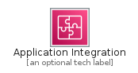
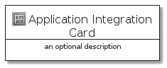
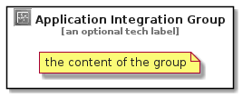

# ApplicationIntegration


```text
aws-20210131/Category/ApplicationIntegration
```

```text
include('aws-20210131/Category/ApplicationIntegration')
```


| Illustration | ApplicationIntegration | ApplicationIntegrationCard | ApplicationIntegrationGroup |
| :---: | :---: | :---: | :---: |
|  |  |  |  |


## ApplicationIntegration

### Load remotely
```plantuml
@startuml
' configures the library
!global $LIB_BASE_LOCATION="https://github.com/tmorin/plantuml-libs/distribution"

' loads the library's bootstrap
!include $LIB_BASE_LOCATION/bootstrap.puml

' loads the package bootstrap
include('aws-20210131/bootstrap')

' loads the Item which embeds the element ApplicationIntegration
include('aws-20210131/Category/ApplicationIntegration')

' renders the element
ApplicationIntegration('ApplicationIntegration', 'Application Integration', 'an optional tech label')
@enduml
```

### Load locally
```plantuml
@startuml
' configures the library
!global $INCLUSION_MODE="local"
!global $LIB_BASE_LOCATION="../.."

' loads the library's bootstrap
!include $LIB_BASE_LOCATION/bootstrap.puml

' loads the package bootstrap
include('aws-20210131/bootstrap')

' loads the Item which embeds the element ApplicationIntegration
include('aws-20210131/Category/ApplicationIntegration')

' renders the element
ApplicationIntegration('ApplicationIntegration', 'Application Integration', 'an optional tech label')
@enduml
```

## ApplicationIntegrationCard

### Load remotely
```plantuml
@startuml
' configures the library
!global $LIB_BASE_LOCATION="https://github.com/tmorin/plantuml-libs/distribution"

' loads the library's bootstrap
!include $LIB_BASE_LOCATION/bootstrap.puml

' loads the package bootstrap
include('aws-20210131/bootstrap')

' loads the Item which embeds the element ApplicationIntegrationCard
include('aws-20210131/Category/ApplicationIntegration')

' renders the element
ApplicationIntegrationCard('ApplicationIntegrationCard', 'Application Integration Card', 'an optional description')
@enduml
```

### Load locally
```plantuml
@startuml
' configures the library
!global $INCLUSION_MODE="local"
!global $LIB_BASE_LOCATION="../.."

' loads the library's bootstrap
!include $LIB_BASE_LOCATION/bootstrap.puml

' loads the package bootstrap
include('aws-20210131/bootstrap')

' loads the Item which embeds the element ApplicationIntegrationCard
include('aws-20210131/Category/ApplicationIntegration')

' renders the element
ApplicationIntegrationCard('ApplicationIntegrationCard', 'Application Integration Card', 'an optional description')
@enduml
```

## ApplicationIntegrationGroup

### Load remotely
```plantuml
@startuml
' configures the library
!global $LIB_BASE_LOCATION="https://github.com/tmorin/plantuml-libs/distribution"

' loads the library's bootstrap
!include $LIB_BASE_LOCATION/bootstrap.puml

' loads the package bootstrap
include('aws-20210131/bootstrap')

' loads the Item which embeds the element ApplicationIntegrationGroup
include('aws-20210131/Category/ApplicationIntegration')

' renders the element
ApplicationIntegrationGroup('ApplicationIntegrationGroup', 'Application Integration Group', 'an optional tech label') {
    note as note
        the content of the group
    end note
}
@enduml
```

### Load locally
```plantuml
@startuml
' configures the library
!global $INCLUSION_MODE="local"
!global $LIB_BASE_LOCATION="../.."

' loads the library's bootstrap
!include $LIB_BASE_LOCATION/bootstrap.puml

' loads the package bootstrap
include('aws-20210131/bootstrap')

' loads the Item which embeds the element ApplicationIntegrationGroup
include('aws-20210131/Category/ApplicationIntegration')

' renders the element
ApplicationIntegrationGroup('ApplicationIntegrationGroup', 'Application Integration Group', 'an optional tech label') {
    note as note
        the content of the group
    end note
}
@enduml
```

