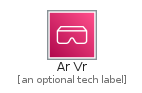
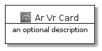
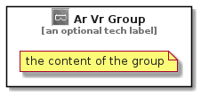

# ArVr


```text
aws-20210131/Category/ArVr
```

```text
include('aws-20210131/Category/ArVr')
```


| Illustration | ArVr | ArVrCard | ArVrGroup |
| :---: | :---: | :---: | :---: |
|  |  |  |  |


## ArVr

### Load remotely
```plantuml
@startuml
' configures the library
!global $LIB_BASE_LOCATION="https://github.com/tmorin/plantuml-libs/distribution"

' loads the library's bootstrap
!include $LIB_BASE_LOCATION/bootstrap.puml

' loads the package bootstrap
include('aws-20210131/bootstrap')

' loads the Item which embeds the element ArVr
include('aws-20210131/Category/ArVr')

' renders the element
ArVr('ArVr', 'Ar Vr', 'an optional tech label')
@enduml
```

### Load locally
```plantuml
@startuml
' configures the library
!global $INCLUSION_MODE="local"
!global $LIB_BASE_LOCATION="../.."

' loads the library's bootstrap
!include $LIB_BASE_LOCATION/bootstrap.puml

' loads the package bootstrap
include('aws-20210131/bootstrap')

' loads the Item which embeds the element ArVr
include('aws-20210131/Category/ArVr')

' renders the element
ArVr('ArVr', 'Ar Vr', 'an optional tech label')
@enduml
```

## ArVrCard

### Load remotely
```plantuml
@startuml
' configures the library
!global $LIB_BASE_LOCATION="https://github.com/tmorin/plantuml-libs/distribution"

' loads the library's bootstrap
!include $LIB_BASE_LOCATION/bootstrap.puml

' loads the package bootstrap
include('aws-20210131/bootstrap')

' loads the Item which embeds the element ArVrCard
include('aws-20210131/Category/ArVr')

' renders the element
ArVrCard('ArVrCard', 'Ar Vr Card', 'an optional description')
@enduml
```

### Load locally
```plantuml
@startuml
' configures the library
!global $INCLUSION_MODE="local"
!global $LIB_BASE_LOCATION="../.."

' loads the library's bootstrap
!include $LIB_BASE_LOCATION/bootstrap.puml

' loads the package bootstrap
include('aws-20210131/bootstrap')

' loads the Item which embeds the element ArVrCard
include('aws-20210131/Category/ArVr')

' renders the element
ArVrCard('ArVrCard', 'Ar Vr Card', 'an optional description')
@enduml
```

## ArVrGroup

### Load remotely
```plantuml
@startuml
' configures the library
!global $LIB_BASE_LOCATION="https://github.com/tmorin/plantuml-libs/distribution"

' loads the library's bootstrap
!include $LIB_BASE_LOCATION/bootstrap.puml

' loads the package bootstrap
include('aws-20210131/bootstrap')

' loads the Item which embeds the element ArVrGroup
include('aws-20210131/Category/ArVr')

' renders the element
ArVrGroup('ArVrGroup', 'Ar Vr Group', 'an optional tech label') {
    note as note
        the content of the group
    end note
}
@enduml
```

### Load locally
```plantuml
@startuml
' configures the library
!global $INCLUSION_MODE="local"
!global $LIB_BASE_LOCATION="../.."

' loads the library's bootstrap
!include $LIB_BASE_LOCATION/bootstrap.puml

' loads the package bootstrap
include('aws-20210131/bootstrap')

' loads the Item which embeds the element ArVrGroup
include('aws-20210131/Category/ArVr')

' renders the element
ArVrGroup('ArVrGroup', 'Ar Vr Group', 'an optional tech label') {
    note as note
        the content of the group
    end note
}
@enduml
```

