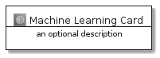
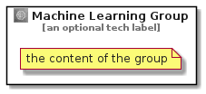

# MachineLearning


```text
aws-20210131/Category/MachineLearning
```

```text
include('aws-20210131/Category/MachineLearning')
```


| Illustration | MachineLearning | MachineLearningCard | MachineLearningGroup |
| :---: | :---: | :---: | :---: |
|  |  |  |  |


## MachineLearning

### Load remotely
```plantuml
@startuml
' configures the library
!global $LIB_BASE_LOCATION="https://github.com/tmorin/plantuml-libs/distribution"

' loads the library's bootstrap
!include $LIB_BASE_LOCATION/bootstrap.puml

' loads the package bootstrap
include('aws-20210131/bootstrap')

' loads the Item which embeds the element MachineLearning
include('aws-20210131/Category/MachineLearning')

' renders the element
MachineLearning('MachineLearning', 'Machine Learning', 'an optional tech label')
@enduml
```

### Load locally
```plantuml
@startuml
' configures the library
!global $INCLUSION_MODE="local"
!global $LIB_BASE_LOCATION="../.."

' loads the library's bootstrap
!include $LIB_BASE_LOCATION/bootstrap.puml

' loads the package bootstrap
include('aws-20210131/bootstrap')

' loads the Item which embeds the element MachineLearning
include('aws-20210131/Category/MachineLearning')

' renders the element
MachineLearning('MachineLearning', 'Machine Learning', 'an optional tech label')
@enduml
```

## MachineLearningCard

### Load remotely
```plantuml
@startuml
' configures the library
!global $LIB_BASE_LOCATION="https://github.com/tmorin/plantuml-libs/distribution"

' loads the library's bootstrap
!include $LIB_BASE_LOCATION/bootstrap.puml

' loads the package bootstrap
include('aws-20210131/bootstrap')

' loads the Item which embeds the element MachineLearningCard
include('aws-20210131/Category/MachineLearning')

' renders the element
MachineLearningCard('MachineLearningCard', 'Machine Learning Card', 'an optional description')
@enduml
```

### Load locally
```plantuml
@startuml
' configures the library
!global $INCLUSION_MODE="local"
!global $LIB_BASE_LOCATION="../.."

' loads the library's bootstrap
!include $LIB_BASE_LOCATION/bootstrap.puml

' loads the package bootstrap
include('aws-20210131/bootstrap')

' loads the Item which embeds the element MachineLearningCard
include('aws-20210131/Category/MachineLearning')

' renders the element
MachineLearningCard('MachineLearningCard', 'Machine Learning Card', 'an optional description')
@enduml
```

## MachineLearningGroup

### Load remotely
```plantuml
@startuml
' configures the library
!global $LIB_BASE_LOCATION="https://github.com/tmorin/plantuml-libs/distribution"

' loads the library's bootstrap
!include $LIB_BASE_LOCATION/bootstrap.puml

' loads the package bootstrap
include('aws-20210131/bootstrap')

' loads the Item which embeds the element MachineLearningGroup
include('aws-20210131/Category/MachineLearning')

' renders the element
MachineLearningGroup('MachineLearningGroup', 'Machine Learning Group', 'an optional tech label') {
    note as note
        the content of the group
    end note
}
@enduml
```

### Load locally
```plantuml
@startuml
' configures the library
!global $INCLUSION_MODE="local"
!global $LIB_BASE_LOCATION="../.."

' loads the library's bootstrap
!include $LIB_BASE_LOCATION/bootstrap.puml

' loads the package bootstrap
include('aws-20210131/bootstrap')

' loads the Item which embeds the element MachineLearningGroup
include('aws-20210131/Category/MachineLearning')

' renders the element
MachineLearningGroup('MachineLearningGroup', 'Machine Learning Group', 'an optional tech label') {
    note as note
        the content of the group
    end note
}
@enduml
```

