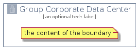

# GroupCorporateDataCenter


```text
aws-20210131/Group/GroupCorporateDataCenter
```

```text
include('aws-20210131/Group/GroupCorporateDataCenter')
```


| Illustration | GroupCorporateDataCenter |
| :---: | :---: |
|  |  |


## GroupCorporateDataCenter

### Load remotely
```plantuml
@startuml
' configures the library
!global $LIB_BASE_LOCATION="https://github.com/tmorin/plantuml-libs/distribution"

' loads the library's bootstrap
!include $LIB_BASE_LOCATION/bootstrap.puml

' loads the package bootstrap
include('aws-20210131/bootstrap')

' loads the Item which embeds the element GroupCorporateDataCenter
include('aws-20210131/Group/GroupCorporateDataCenter')

GroupCorporateDataCenter('GroupCorporateDataCenter', 'Group Corporate Data Center', 'an optional tech label') {
  note as note
  the content of the boundary
  end note
}
@enduml
```

### Load locally
```plantuml
@startuml
' configures the library
!global $INCLUSION_MODE="local"
!global $LIB_BASE_LOCATION="../.."

' loads the library's bootstrap
!include $LIB_BASE_LOCATION/bootstrap.puml

' loads the package bootstrap
include('aws-20210131/bootstrap')

' loads the Item which embeds the element GroupCorporateDataCenter
include('aws-20210131/Group/GroupCorporateDataCenter')

GroupCorporateDataCenter('GroupCorporateDataCenter', 'Group Corporate Data Center', 'an optional tech label') {
  note as note
  the content of the boundary
  end note
}
@enduml
```

