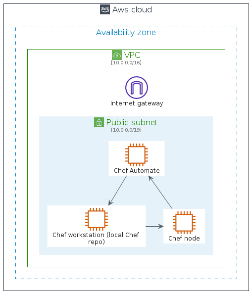
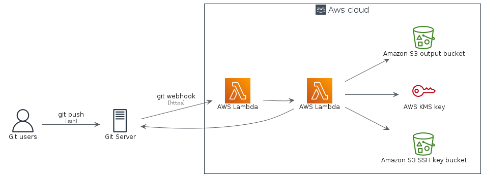

# aws-20210131

## Bootstrap

The bootstrap may provide PlantUML artifacts like constants, procedures or style statements.

```plantuml
' loads the aws-20210131 bootstrap
include('aws-20210131/bootstrap')
```


# Modules

The package provides 4 modules.

- [aws-20210131/Architecture](../aws-20210131/Architecture/README.md) with 262 items
- [aws-20210131/Category](../aws-20210131/Category/README.md) with 26 items
- [aws-20210131/Group](../aws-20210131/Group/README.md) with 17 items
- [aws-20210131/Resource](../aws-20210131/Resource/README.md) with 363 items


# Examples

The package provides 2 examples.

## Chef Automate Architecture on AWS

<br>
[The source file.](../aws-20210131/chef_automate_architecture_on_aws.puml)

## Git to S3 Webhooks

<br>
[The source file.](../aws-20210131/git_to_s3_webhooks.puml)


